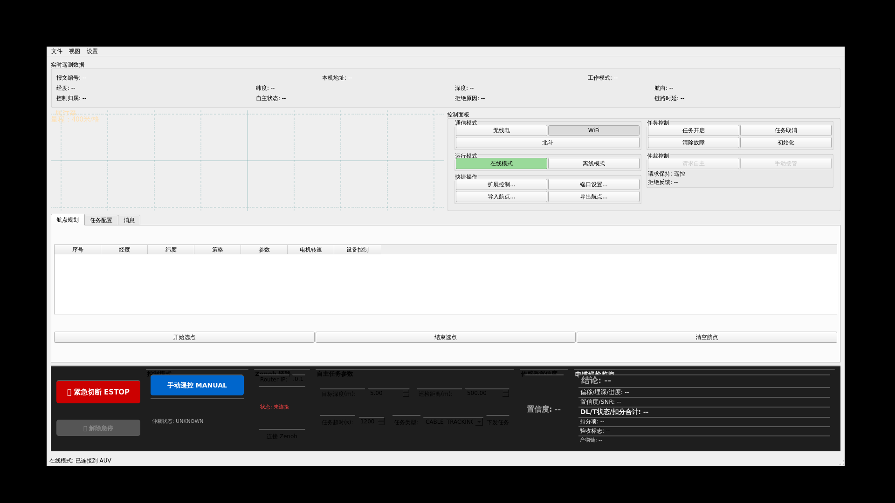
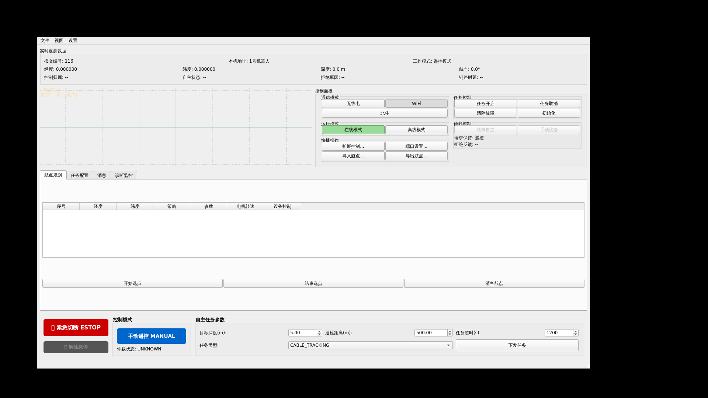

# PySide6 上位机 GUI 调试记录

> 目的: 在容器无物理桌面的条件下，用 `Xvfb + xdotool + import` 对 `console_soft/auv_console_pyside6/main.py` 做可复现 GUI 启动、窗口识别、截图和证据留存。
> 当前记录时间: 2026-07-16
> 当前仓库版本: `ccbc8fd`

---

## 0. 证据归档完整性

截至 2026-08-22，仓库中实际保留了各阶段 PNG 截图和 Stage 4 配置文件，但第 4、9、10、11 节列出的窗口识别、console、relay、端口、Telnet 与 Zenoh probe 等 `.txt/.log` 原始运行文件并未全部随版本控制保存。因此：

- 本文中的 Stage 2--4 包数量与 relay/probe 摘要属于受版本控制的调试记录，可用于说明分阶段验证过程，但不能当作可独立复算的完整原始日志归档。
- GUI-only 截图只证明无头启动、布局与文字渲染。
- GUI 按钮到真实 PC104 字段的可追溯原始证据以 `docs/experiment/assets/pc104_button_field_check/` 下的 fan-out、GUI 与 Telnet 日志为准。
- Zenoh Stage 4 只证明 72 字节原始 `$CKTH` 到达 probe；尚未证明 GUI ESTOP 在同一次运行中被生产 bridge/arbiter 消费并形成语义闭环。

---

## 1. 当前结论

本轮确认通过:

- `Xvfb` / `xvfb-run` 可用。
- `PySide6` 可导入并启动上位机主窗口。
- `xdotool` 可枚举窗口并读取主窗口几何信息。
- ImageMagick `import` 可从 Xvfb root window 截图。
- 中文显示正确，菜单、按钮、标签、表格列名和状态区均可读。
- PC104 `$AUV` 只读遥测可进入 GUI 并刷新关键字段。
- GUI 默认 `$CKTH` 下行已完成 capture-only 观察，确认 motor/fins 全零。
- 零执行器 `$CKTH` 已受控转发到 PC104，并通过 Telnet 确认 `UI_WIFI_Instruction` 收到。
- Zenoh 只连通验证通过，GUI side channel 可向 `rt/pc/cmd_raw` 发布 72 字节 `$CKTH`，本轮未接入 PC104 控制语义。

基准截图:



窗口识别结果:

```text
2097159 | AUV Console (Python/PySide6) | WINDOW=2097159 X=100 Y=100 WIDTH=1712 HEIGHT=900 SCREEN=0
```

截图文件:

```text
docs/experiment/assets/gui_debug/xvfb_dummy_console_1920x1080.png
```

截图尺寸:

```text
1920x1080 PNG
```

---

## 2. 本轮正在模拟什么

本轮使用的是 **dummy UDP 配置**，不是 PC104 实链路配置:

```yaml
zenoh.enabled: false
udp.local_ip: 127.0.0.1
udp.local_port: 59966
udp.amd_ip: 127.0.0.1
udp.amd_port: 59964
```

因此它模拟的是:

- GUI 程序能否启动。
- 主窗口能否渲染。
- 中文字体和控件布局是否正常。
- 无头环境下能否自动截图并留下证据。

它没有模拟:

- PC104 `$AUV` 遥测回包。
- fan-out 的 `52364/52366` 实链路。
- 上位机按钮对 PC104 的真实控制效果。
- Zenoh 路由连接。
- 任务下发、手动遥控、ESTOP 等实物动作。

截图中符合 dummy 模式预期的现象:

- 经度、纬度、深度、航向、DVL 状态等遥测字段仍为 `--`。
- 任务/状态区域存在 `UNKNOWN` 或未连接提示。
- 控件默认可见，但未证明其真实控制链路有效。

注意: 截图底部出现“在线模式”类状态，只表示 GUI 当前处于在线 UI 模式或默认状态，不等价于已经完成 PC104 实物闭环。

---

## 3. 安全边界

本轮没有使用 `console_config.pc104_fanout.yaml` 直接连接 fan-out。

原因:

- 当前 PC104 仍连接在线。
- 上位机 GUI 可能按配置周期性发送心跳或控制帧。
- 如果直接使用 `pc104_fanout` 配置，GUI 可能通过 `127.0.0.1:52364` 进入 fan-out，再到 PC104。

因此本轮只做 GUI 渲染和截图，不做实物控制。

---

## 4. Step-by-Step: Dummy GUI 截图确认

### 4.1 生成 dummy 配置

```bash
outdir=/tmp/auv_gui_probe_full_$(date +%Y%m%d_%H%M%S)
mkdir -p "$outdir"
tmpcfg="$outdir/console_dummy.yaml"

python3 - <<'PY' "$tmpcfg"
from pathlib import Path
import sys, yaml

src = Path('console_soft/auv_console_pyside6/console_config.pc104_fanout.yaml')
dst = Path(sys.argv[1])
data = yaml.safe_load(src.read_text())

data['zenoh']['enabled'] = False
data['udp']['local_ip'] = '127.0.0.1'
data['udp']['local_port'] = 59966
data['udp']['amd_ip'] = '127.0.0.1'
data['udp']['amd_port'] = 59964

dst.write_text(yaml.safe_dump(data, allow_unicode=True, sort_keys=False), encoding='utf-8')
PY
```

### 4.2 启动 GUI、识别窗口、截图

```bash
xvfb-run -a --server-args='-screen 0 1920x1080x24' bash -lc '
  export QT_X11_NO_MITSHM=1
  cd console_soft/auv_console_pyside6
  python3 main.py --config '"$tmpcfg"' > '"$outdir"'/console.log 2>&1 &
  pid=$!
  echo $pid > '"$outdir"'/console.pid

  sleep 5

  xdotool search --onlyvisible --name ".*" > '"$outdir"'/windows.ids 2>&1 || true
  : > '"$outdir"'/windows.txt
  while read wid; do
    [ -z "$wid" ] && continue
    name=$(xdotool getwindowname "$wid" 2>/dev/null || true)
    geom=$(xdotool getwindowgeometry --shell "$wid" 2>/dev/null | tr "\n" " ")
    echo "$wid | $name | $geom" >> '"$outdir"'/windows.txt
  done < '"$outdir"'/windows.ids

  main_wid=$(awk -F" | " "/AUV Console/ {print \$1; exit}" '"$outdir"'/windows.txt)
  if [ -n "$main_wid" ]; then
    xdotool windowactivate "$main_wid" 2>/dev/null || true
    xdotool getwindowgeometry --shell "$main_wid" > '"$outdir"'/main_window_geometry.txt 2>&1 || true
  fi

  import -window root '"$outdir"'/screenshot.png

  kill $pid 2>/dev/null || true
  wait $pid 2>/dev/null || true
'
```

### 4.3 将证据复制到仓库

```bash
mkdir -p docs/experiment/assets/gui_debug
cp "$outdir/screenshot.png" docs/experiment/assets/gui_debug/xvfb_dummy_console_1920x1080.png
cp "$outdir/windows.txt" docs/experiment/assets/gui_debug/xvfb_dummy_console_windows.txt
cp "$outdir/main_window_geometry.txt" docs/experiment/assets/gui_debug/xvfb_dummy_console_geometry.txt
cp "$outdir/console.log" docs/experiment/assets/gui_debug/xvfb_dummy_console.log
```

---

## 5. 通过判据

- [x] 主窗口标题包含 `AUV Console (Python/PySide6)`。
- [x] 主窗口几何信息可读。
- [x] 截图为有效 PNG。
- [x] 截图尺寸为 `1920x1080`。
- [x] 主窗口完整显示，未被右侧裁切。
- [x] 中文显示正确。
- [x] 未连接 PC104/fan-out 实物控制链路。

---

## 6. 后续 PC104 实链路 GUI 验证

当需要验证 GUI 与当前 PC104/fan-out 实链路时，使用:

```bash
xvfb-run -a --server-args='-screen 0 1920x1080x24' \
  python3 console_soft/auv_console_pyside6/main.py \
  --config console_soft/auv_console_pyside6/console_config.pc104_fanout.yaml
```

但执行前必须确认:

- fan-out 是 `21/udp` 的唯一 owner。
- GUI 使用 `127.0.0.1:52364` 作为命令入口。
- GUI 本地监听 `127.0.0.1:52366`。
- PC104 当前处于安全空板状态，执行机构断开或安全。
- 不自动点击任务下发、自主授权、ESTOP 以外的危险控制按钮。

建议实链路 GUI 验证分两步:

1. 只启动 GUI 并截图，确认遥测字段是否从 `--` 变为 `$AUV` 实时数据。
2. 再根据安全条件决定是否允许按钮级交互。

---

## 7. PC104 只读遥测 GUI 初测

本轮已在 PC104 仍在线的条件下做了一次 **只读** GUI 初测。

### 7.1 本轮拓扑

未使用完整下行 fan-out。本轮只做一条只读转发:

```text
PC104 $AUV -> container:21/udp -> readonly_relay.py -> 127.0.0.1:52366 -> PySide6 GUI
```

没有启动 `52364 -> PC104:21` 下行转发，因此 GUI 即使按配置尝试向 `127.0.0.1:52364` 发送控制包，也不会进入 PC104。

### 7.2 运行结果

relay 日志:

```text
[relay] bind 0.0.0.0:21 -> 127.0.0.1:52366
[relay] count=16 src=172.18.0.1:64526 ctrl=0x01 depth=0.0 sys=0x00002000
[relay] count=32 src=172.18.0.1:59527 ctrl=0x01 depth=0.0 sys=0x00002000
[relay] count=48 src=172.18.0.1:58222 ctrl=0x01 depth=0.0 sys=0x00002000
[relay] count=63 src=172.18.0.1:63458 ctrl=0x01 depth=0.0 sys=0x00002000
[relay] count=79 src=172.18.0.1:60282 ctrl=0x01 depth=0.0 sys=0x00002000
[relay] count=95 src=172.18.0.1:56321 ctrl=0x01 depth=0.0 sys=0x00002000
[relay] count=111 src=172.18.0.1:58618 ctrl=0x01 depth=0.0 sys=0x00002000
```

容器内端口:

```text
0.0.0.0:21        readonly_relay.py
127.0.0.1:52366   PySide6 GUI
```

截图:


截图中可见:

- `报文编号: 109`
- `本机地址: 1号机器人`
- `深度: 0.0 m`
- `航向: 0.0°`
- `工作模式: 遥控模式`
- 底部 `状态: 未连接`

其中底部 `状态: 未连接` 来自本轮禁用 Zenoh/未建立高层连接，不影响 UDP `$AUV` 遥测已进入 GUI 的判断。

### 7.3 是否符合预期

符合预期。

PC104 当前为空板/无 DVL 有效锁底，因此 relay 中 `sys=0x00002000` 与前面运行期验证一致，表示 Bit13 DVL 丢底降级状态。GUI 显示深度 `0.0 m`、遥控模式和机器人地址，说明 `$AUV` 145 字节上行帧已被 GUI 解析并刷新到界面。

### 7.4 本轮没有验证什么

本轮没有验证:

- GUI 下行控制到 PC104。
- fan-out 安全过滤。
- GUI 按钮动作。
- Zenoh 状态。
- 任务下发和自主模式授权。

这些必须另起一轮，并在确认执行机构安全后进行。

---

## 8. 下一阶段计划: GUI 下行、fan-out 与 Zenoh

### 8.1 当前阻断点

在 Mac `socat -> Docker publish -> container` 拓扑下，容器内看到的 `$AUV` 上行源地址是 Docker 网关:

```text
172.18.0.1:<ephemeral>
```

不是 PC104 实际 IP:

```text
192.168.0.101
```

因此现有 `scripts/pc104_udp_fanout.py` 如果直接运行并设置 `--pc104-host 192.168.0.101`，会在源地址过滤处误丢上行包；如果设置 `--pc104-host 172.18.0.1`，下行远端又会被错误发往 Docker 网关。

这不是 PC104 协议问题，而是 Docker Desktop/macOS UDP 转发后的源地址表现。

### 8.2 分阶段实验计划

Stage 2: GUI 下行观察但不转发

```text
PC104 $AUV -> container:21 -> relay -> GUI:52366
GUI $CKTH -> 127.0.0.1:52364 -> relay capture only -> drop
```

目标:

- 验证 GUI 是否会周期性发送 `$CKTH`。
- 解析 `$CKTH`，确认是否为零执行器安全包。
- 不向 PC104 转发任何 GUI 下行。

Stage 3: GUI 零执行器安全转发

```text
PC104 $AUV -> container:21 -> relay -> GUI:52366
GUI zero-actuator $CKTH -> 127.0.0.1:52364 -> relay safety check -> PC104:21
```

目标:

- 仅转发 motor/fins 全零的 `$CKTH`。
- 非零执行器包一律阻断并记录。
- 用 UDP/Telnet 观察 PC104 ctrl/mode 是否符合预期。

Stage 4: Zenoh 连接验证

目标:

- 只验证 GUI 的 Zenoh 状态显示和订阅/发布通道是否可建立。
- 不将 Zenoh 控制语义接入 PC104，除非另行确认安全边界。

### 8.3 fan-out 脚本兼容参数

`scripts/pc104_udp_fanout.py` 已补充 Docker Desktop/macOS UDP publish 兼容参数，默认行为保持不变。容器内运行时可以将真实 PC104 下行目标与容器看到的上行源地址拆开:

```text
--pc104-remote-host 192.168.0.101
--pc104-uplink-source-host 172.18.0.1
```

也可以使用等价短语义参数:

```text
--accept-uplink-source 172.18.0.1
```

示例:

```bash
sudo -n python3 scripts/pc104_udp_fanout.py \
  --listen-host 0.0.0.0 \
  --listen-port 21 \
  --pc104-remote-host 192.168.0.101 \
  --pc104-port 21 \
  --accept-uplink-source 172.18.0.1 \
  --cmd-host 127.0.0.1 \
  --cmd-port 52364 \
  --subscriber ros2=127.0.0.1:52365 \
  --subscriber pyside6=127.0.0.1:52366
```

这样可以兼容 macOS Docker Desktop 的 UDP publish 拓扑，同时下行仍发往真实 PC104。

---

## 9. Stage 2: GUI 下行观察但不转发

本轮已完成 capture-only 验证。拓扑为:

```text
PC104 $AUV -> container:21/udp -> relay -> 127.0.0.1:52366 -> PySide6 GUI
PySide6 GUI $CKTH -> 127.0.0.1:52364 -> relay capture only -> drop
```

其中 relay 监听 GUI 下行，但不向 PC104 转发任何 `$CKTH`。

### 9.1 运行结果

relay 摘要:

```text
[stage2] uplink 0.0.0.0:21 -> GUI 127.0.0.1:52366; GUI downlink 127.0.0.1:52364 capture-only
[stage2] GUI $CKTH #1 src=127.0.0.1:52366 zero=True obj=1 ctrl=0x01 work=0 motor=0/0 fins=(0.0,0.0,0.0,0.0) depth=(500, 29) bottom=(300, 200)
[stage2] uplink count=16 src=172.18.0.1:56119 ctrl=0x01 depth=0.0 sys=0x00002000
[stage2] summary uplink=181 gui_cmd=19 forwarded=0 blocked=19
```

截图:


证据文件:

```text
docs/experiment/assets/gui_debug/xvfb_pc104_stage2_observe_console.png
docs/experiment/assets/gui_debug/xvfb_pc104_stage2_observe_relay.log
docs/experiment/assets/gui_debug/xvfb_pc104_stage2_observe_console.log
docs/experiment/assets/gui_debug/xvfb_pc104_stage2_observe_ports.txt
docs/experiment/assets/gui_debug/xvfb_pc104_stage2_observe_windows.txt
```

### 9.2 判定

通过。

- GUI 在本轮窗口内发送了 19 个 `$CKTH`。
- 19 个 `$CKTH` 均解析为零执行器安全包。
- `motor1/motor2` 均为 0。
- 四个舵角均为 0.0。
- relay 未向 PC104 转发任何 GUI 下行。
- PC104 `$AUV` 上行仍能持续刷新 GUI，`sys=0x00002000` 符合空板 DVL 丢底预期。

---

## 10. Stage 3: GUI 零执行器安全转发

本轮已完成零执行器安全转发验证。拓扑为:

```text
PC104 $AUV -> container:21/udp -> relay -> 127.0.0.1:52366 -> PySide6 GUI
PySide6 GUI zero-actuator $CKTH -> 127.0.0.1:52364 -> relay safety check -> PC104:21
```

relay 仅在 `$CKTH` 满足 motor/fins 全零时转发到 PC104；否则阻断并记录。

### 10.1 运行结果

relay 摘要:

```text
[stage3] uplink 0.0.0.0:21 -> GUI 127.0.0.1:52366; GUI zero-actuator $CKTH -> PC104 192.168.0.101:21
[stage3] FORWARD GUI $CKTH #1 src=127.0.0.1:52366 obj=1 ctrl=0x01 work=0 motor=0/0 fins=(0.0,0.0,0.0,0.0) depth=(500, 29) bottom=(300, 200)
[stage3] uplink count=16 src=172.18.0.1:57393 ctrl=0x01 depth=0.0 sys=0x00002000
[stage3] summary uplink=152 gui_cmd=16 forwarded=16 blocked=0
```

Telnet 读取 PC104 内部状态:

```text
UI_WIFI=0x536b60 SysAddr=0x51724c NotJetson=0x51723e
UI.ctrl=0x01
UI.depth_para1=500 depth_para2=29
UI.work=0x00
UI.motor1=0 motor2=0
Sys=0x00002000 NotRecvJetson=36
```

截图:



证据文件:

```text
docs/experiment/assets/gui_debug/xvfb_pc104_stage3_zero_forward_console.png
docs/experiment/assets/gui_debug/xvfb_pc104_stage3_zero_forward_relay.log
docs/experiment/assets/gui_debug/xvfb_pc104_stage3_zero_forward_console.log
docs/experiment/assets/gui_debug/xvfb_pc104_stage3_zero_forward_ports.txt
docs/experiment/assets/gui_debug/xvfb_pc104_stage3_zero_forward_windows.txt
docs/experiment/assets/gui_debug/xvfb_pc104_stage3_zero_forward_telnet.txt
```

### 10.2 判定

通过。

- GUI 在本轮窗口内发送了 16 个 `$CKTH`。
- 16 个 `$CKTH` 均为零执行器安全包，全部转发到 PC104。
- relay 未发现非零执行器包，`blocked=0`。
- Telnet 证明 PC104 内部 `UI_WIFI_Instruction` 已收到 GUI 下行字段。
- `UI.ctrl=0x01`，`UI.work=0x00`，`UI.motor1=0`，`UI.motor2=0`。
- `Sys=0x00002000`，仍为预期的空板 DVL 丢底状态。

### 10.3 边界

本轮只验证 GUI 默认零执行器下行能够安全进入 PC104，并未验证:

- 非零电机/舵角指令。
- GUI 按钮触发的任务下发。
- 自主模式授权链路。
- ESTOP 或其他人工交互按钮。
- Zenoh 与 GUI 的高层状态联动。

---

## 11. Stage 4: Zenoh 连接验证

本轮已完成 Zenoh 只连通验证。该阶段不接入 PC104 控制语义，GUI 下行仍由 relay 抓取后丢弃。

### 11.1 本轮拓扑

```text
Python zenoh router -> tcp/127.0.0.1:7447
Zenoh probe -> subscribe rt/pc/cmd_raw
PC104 $AUV -> container:21/udp -> relay -> 127.0.0.1:52366 -> PySide6 GUI
PySide6 GUI $CKTH -> 127.0.0.1:52364 -> relay capture only -> drop
PySide6 GUI side channel -> rt/pc/cmd_raw -> Zenoh probe
```

本轮没有使用 `zenohd` 二进制。容器内未发现 `zenohd`，但 Python `zenoh` binding 可用，因此用 Python 临时启动 router session。

### 11.2 运行结果

router 日志:

```text
[stage4-router] listening tcp/127.0.0.1:7447
```

GUI 配置日志:

```text
[config] UDP 配置覆盖: 127.0.0.1:52366 -> 127.0.0.1:52364
[config] Zenoh 配置覆盖: enabled=True, router=127.0.0.1:7447, pc_cmd_raw_key=rt/pc/cmd_raw
[config] Packet 配置覆盖: obj_address=1, work_mode=1, depth_para1=500
```

Zenoh probe 摘要:

```text
[stage4-probe] subscribed rt/pc/cmd_raw
[stage4-probe] sample #1 key=rt/pc/cmd_raw len=72 head=b'$CKTH\x00\x01\x01'
[stage4-probe] sample #16 key=rt/pc/cmd_raw len=72 head=b'$CKTH\x0f\x01\x01'
[stage4-probe] summary samples=16
```

relay 摘要:

```text
[stage4] uplink 0.0.0.0:21 -> GUI 127.0.0.1:52366; GUI downlink capture-only/drop; zenoh enabled
[stage4] uplink count=1 src=172.18.0.1:60019 sys=0x00002000
[stage4] DROP GUI $CKTH #1 src=127.0.0.1:52366 len=72 motor=0/0 head=b'$CKTH\x00\x01\x01'
[stage4] summary uplink=241 gui_cmd=16 forwarded=0 dropped=16
```

端口快照:

```text
0.0.0.0:21        stage4 relay uplink
127.0.0.1:52364   stage4 relay GUI downlink capture
127.0.0.1:52366   PySide6 GUI UDP
127.0.0.1:7447    Python zenoh router
```

截图:


证据文件:

```text
docs/experiment/assets/gui_debug/xvfb_pc104_stage4_zenoh_console.png
docs/experiment/assets/gui_debug/xvfb_pc104_stage4_zenoh_config.yaml
docs/experiment/assets/gui_debug/xvfb_pc104_stage4_zenoh_console.log
docs/experiment/assets/gui_debug/xvfb_pc104_stage4_zenoh_router.log
docs/experiment/assets/gui_debug/xvfb_pc104_stage4_zenoh_probe.log
docs/experiment/assets/gui_debug/xvfb_pc104_stage4_zenoh_relay.log
docs/experiment/assets/gui_debug/xvfb_pc104_stage4_zenoh_ports.txt
docs/experiment/assets/gui_debug/xvfb_pc104_stage4_zenoh_windows.txt
```

### 11.3 判定

通过。

- GUI 能在 `zenoh.enabled=true` 且 `mode=client` 配置下启动。
- 本地 Zenoh router 能监听 `tcp/127.0.0.1:7447`。
- probe 能从 `rt/pc/cmd_raw` 收到 GUI side channel 发布的 72 字节 `$CKTH`。
- UDP `$AUV` 遥测仍持续进入 GUI，`sys=0x00002000` 符合空板 DVL 丢底预期。
- relay 抓到 16 个 GUI `$CKTH`，全部 `motor=0/0`，并全部丢弃，`forwarded=0`。

### 11.4 边界

本轮没有验证:

- Zenoh bridge 对 `rt/pc/cmd_raw` 的消费逻辑。
- `rt/auv/telemetry` 或 `rt/auv/viz/internal` 的上游发布。
- GUI 按钮触发的任务下发、自主授权、ESTOP。
- 非零执行器包。
- Zenoh 控制语义到 PC104 的闭环。

这些需要在 bridge/arbiter 侧接入后另起实验，并继续保留非零执行器阻断策略。

---

## 12. 与 Computer Use 的关系

当前推荐路线是:

```text
Xvfb -> xdotool -> import -> markdown evidence
```

不依赖 `/computer`。

原因:

- `/computer` 操作的是 Computer Use helper 所在的桌面会话。
- SSH/容器场景下，列举到的 app 和实际可投递鼠标键盘的桌面平面可能不一致。
- Xvfb 内的 GUI 默认不是宿主机可见窗口，Computer Use 不一定能直接操作。

如果后续需要让 `/computer` 直接操作这个 GUI，需要增加一层:

```text
Xvfb -> VNC/noVNC/xpra -> 宿主机可见窗口 -> Computer Use
```

当前阶段没有必要走这条路线。
