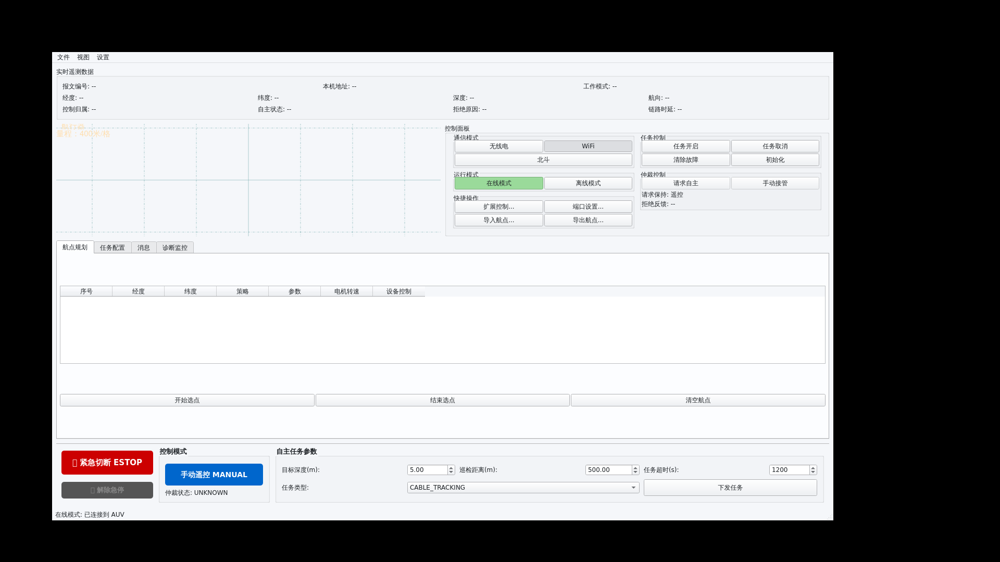
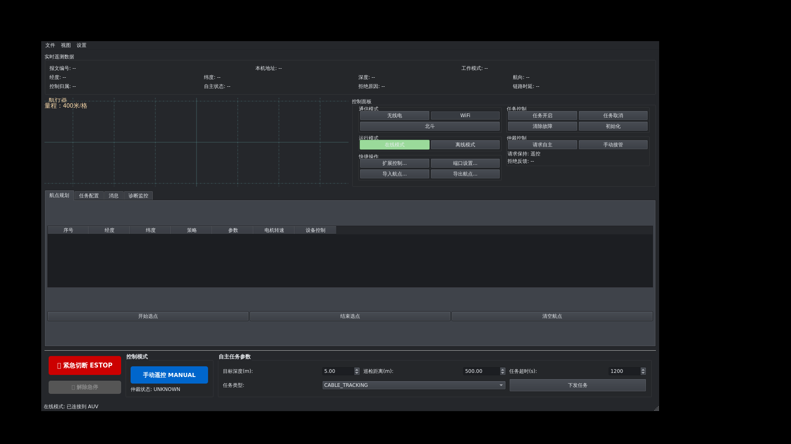
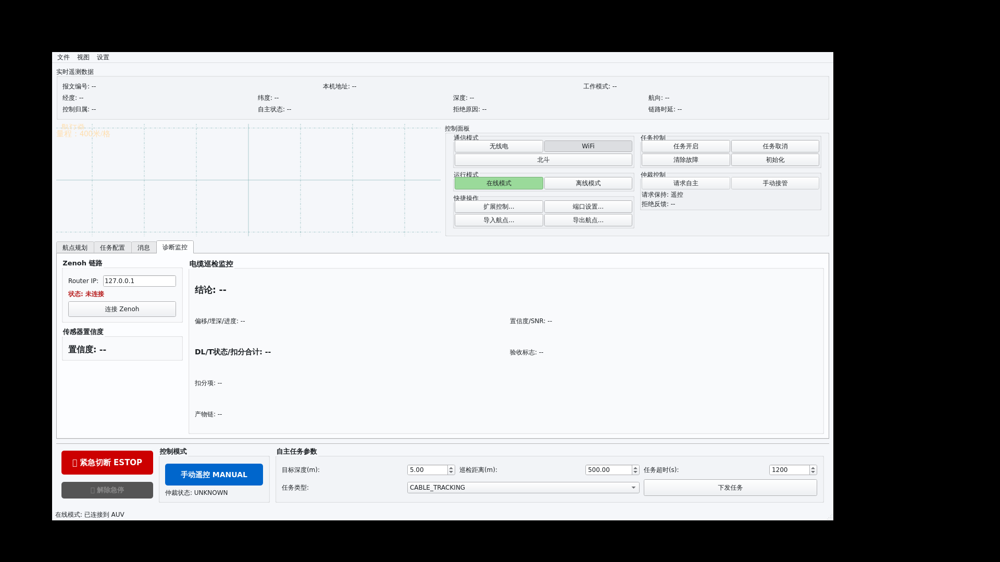
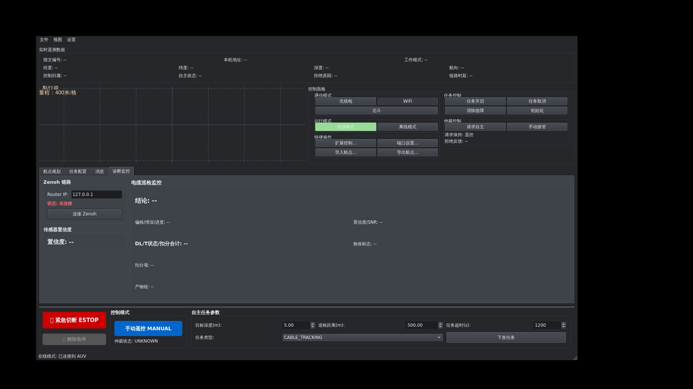
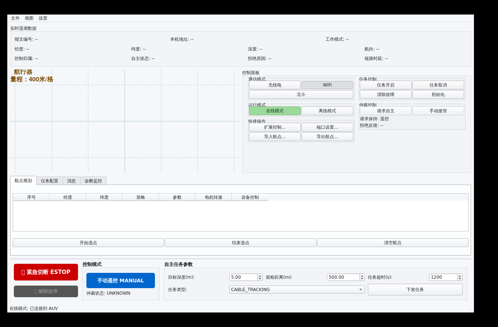
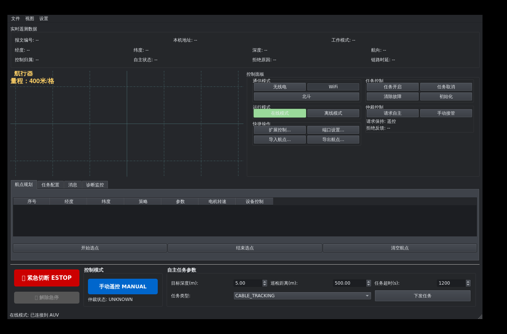
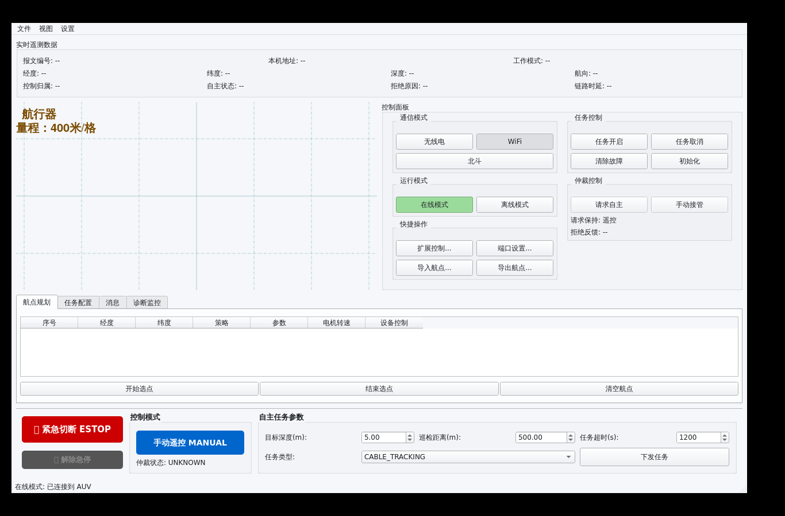

# AUV 上位机 GUI 布局改进记录

## 当前结论

本轮修改已完成两轮 Xvfb 截图收敛。浅色和深色模式下，主界面未观察到明显控件重叠；原先底部横向堆叠的 Zenoh、传感器置信度、电缆巡检监控已迁移到“诊断监控”页，主界面底部只保留急停、控制模式、自主任务参数三类高优先级操作。

根据补充示意图，第二轮进一步调整为：中部地图/控制面板区域适当增高，航点 tab 区域压扁，默认窗口收缩到 `1280x820` 并靠左上打开，确保在 `1366x900` Xvfb 屏幕内完整显示。

截图验证均使用 `console_config.gui_dummy.yaml`，Zenoh 关闭，UDP 指向 `127.0.0.1:59964/59966`，不触碰 PC104 实物链路。

## 修改内容

- 新增 `console_config.gui_dummy.yaml`：用于 GUI-only 截图验证，避免向 PC104 发送控制心跳。
- `main.py` 增加 `--theme system|light|dark`：便于在 Xvfb 下稳定复现浅色/深色 palette。
- `main_window.py` 调整主布局：
  - 默认窗口改为 `1280x820`，最小窗口 `1120x720`。
  - 地图/控制面板区域固定为更高的主工作区，航点 tab 区最大高度收缩到 `220px`。
  - tab 区增加“诊断监控”页。
  - 底部控制条固定为安全/模式/任务参数，不再把诊断信息横向塞入主界面。
- `map_widget.py` 微调地图左上角标签：
  - 浅色模式使用深棕色，避免原浅黄文字发虚。
  - 深色模式保留亮黄高对比显示。
- `main_window.py` 增加 palette-aware 语义色：
  - 浅色模式使用较深的红/绿/蓝/黄状态色。
  - 深色模式使用较亮的红/绿/蓝/黄状态色。

## 截图证据

### 浅色主界面



### 深色主界面



### 浅色诊断页



### 深色诊断页



### 浅色紧凑主界面（1366x900）



### 深色紧凑主界面（1366x900）



### 浅色最终间距收口（1366x900）



## 验证命令

```bash
xvfb-run -a --server-args='-screen 0 1366x900x24' \
  python3 console_soft/auv_console_pyside6/main.py \
  --config console_config.gui_dummy.yaml \
  --theme light
```

```bash
xvfb-run -a --server-args='-screen 0 1366x900x24' \
  python3 console_soft/auv_console_pyside6/main.py \
  --config console_config.gui_dummy.yaml \
  --theme dark
```

## 当前观察

- 浅色主界面：底部不再出现黑底/浅字混杂问题，任务参数区域清晰。
- 深色主界面：控件整体随 palette 变暗，按钮和状态文字可读。
- 紧凑窗口：`1366x900` 下窗口完整显示，未观察到右侧或底部裁切。
- 地图左上角：浅色模式下“航行器/量程”标签从浅黄改为深棕色，阅读性改善；深色模式下仍保持高对比亮黄。
- 控制面板：通信模式、运行模式、快捷操作等子面板标题与第一排按钮之间已增加 top padding；按钮高度也从旧紧凑布局放松，未观察到按钮裁切。
- 诊断页：Zenoh、置信度、电缆监控均有独立空间，未继续挤压航点表或底部急停区。
- 仍未验证：真实 PC104 上行遥测持续刷新后，长文本字段是否会让诊断页换行过多；该项需要接入实链路或回放包含长 `cable_monitor` 字段的数据后再确认。
