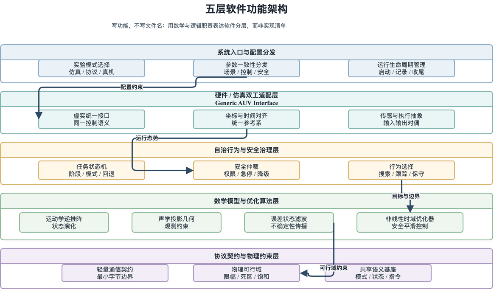
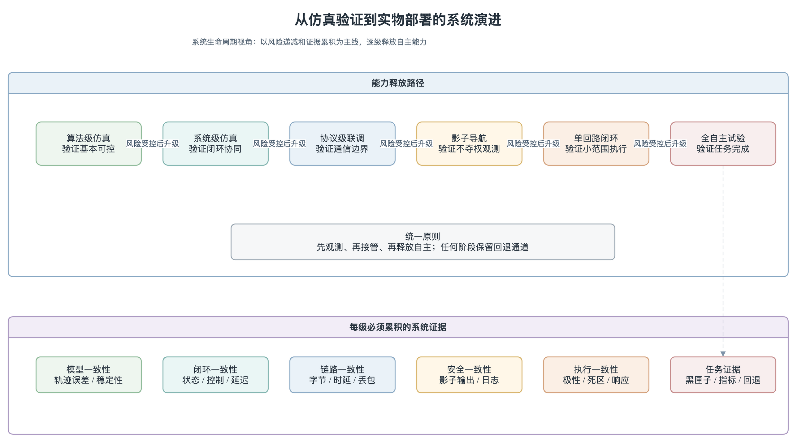

# 第 2 章：系统设计与建模

## 2.1 任务需求分析与行业标准对齐

在第 1 章给出"为什么要做这件事"的问题意识之后，本章首先要回答一个更具体的问题：这个系统应当被设计成什么样？答案不能仅依赖直觉或工程经验，而需要把"探测精度、作业环境、系统安全"三类约束分别说清楚——它们既是后续硬件选型和软件分层的输入条件，也是评价指标的物理依据。本节按这三类约束逐一展开。

### 2.1.1 探测精度约束

探测精度的来源不应是设计者的主观选择，而应来自电力行业对海缆运行的规程要求。行业标准《DL/T 1278-2025 海底电力电缆运行规程》\cite{dlt1278_2025}对磁探测灵敏度、埋深反演误差、路由水平精度等关键指标都有明确条款。本项目据此把 0.05 nT 级系统磁异常分辨目标和 0.2 m 级埋深反演误差作为最关键的两项硬性指标，其他指标（如近底安全距离 3–5 m）则由 AUV 作业本身的物理约束给出。

| 指标 | 设计目标 | 来源 | 当前验证状态 |
|---|---|---|---|
| 系统磁异常分辨目标 | 0.05 nT | DL/T 1278—2025 附录 D | 模组本底噪声已核验；完整测量链待验证 |
| 埋深反演误差 | 0.2 m | 行业要求 | 待硬件实验验证 |
| 近底安全距离 | 3–5 m | AUV 作业约束 | 已在 terrain benchmark 中验证 |

为什么把 0.05 nT 作为系统级目标？这并不是凭空选取，而是由"三相抵消 + 铠装屏蔽 + 螺旋绞合"这三重物理削弱共同决定的。需要特别区分的是，系统级分辨目标不等于传感器手册中的单频噪声谱密度。本文选用的 TMR8637 三轴模组在 1 Hz 处标称磁场噪声谱密度为 150–300 pT/$\sqrt{\text{Hz}}$\cite{multidimension2024tmr8607}；随实物模组提供的编号 6# 三轴测试报告进一步给出各轴 1 Hz 噪声均为 200 pT/$\sqrt{\text{Hz}}$，并显示 50 Hz 附近三轴曲线约为 20–30 pT/$\sqrt{\text{Hz}}$。后者表明模组本体在目标工频附近具备窄带检测所需的噪声量级，但 0.05 nT 仍是待完整测量链验证的系统指标，不能由模组曲线或 ADC 位数单独宣称满足。相应的信噪比（signal-to-noise ratio, SNR）还必须纳入 SK2301 输入噪声、隔离供电、地环路与数字锁相处理的等效噪声带宽。同理，0.2 m 的埋深误差来自规程对维护决策和后续工程定位的共同要求。把两项指标写入设计目标，是为了约束硬件选型、标定方案和评价口径，而不是预先宣布实物验收已经完成。

### 2.1.2 作业环境约束

接下来需要回答的是：AUV 在水下到底要面对什么样的环境？仅说"水下复杂"是不够的，必须把复杂度分解为可量化的子项。本文把作业环境约束归纳为四类：近底流场（剪切流、横流、流向突变）、地形起伏（坡面、沟槽、悬跨）、声呐可见性变化（浑浊、底质变化、局部掩埋）和磁场背景噪声（三相抵消、铠装屏蔽、外部电磁干扰）。

这四类约束之间并不是独立的，它们经常以"组合形式"出现：流场扰动会让 AUV 偏离规划路径，进一步使其在近底地形上接近危险距离；声呐可见性变化和磁场噪声同时发生时，状态估计的两个观测通道会同时退化。换句话说，系统设计必须假设"约束会叠加发生"，而不是按"每次只出现一种"乐观估计。这一认识直接决定了第 5 章 `combined_stress` 联合工况场景的设计动机。

进一步看，这些约束共同推出一个结论：单一传感器或单一控制器无法覆盖所有工况。这就是为什么本系统在感知侧选择"声学 + 磁学 + 惯性"三类异构源融合，在控制侧采取"PID 近底跟随 + MPC 复杂路径预瞄 + UA-MPC 不确定性扩展"的分层策略，而不追求"一种感知 + 一种控制器"覆盖一切。

### 2.1.3 系统安全约束

第三类约束是安全性。这一点在自主水下机器人的工程实现中最容易被低估——许多工程项目把安全保护当作"可选模块"，结果在异常发生时没有任何保底机制。本文从一开始就把安全约束当作硬性约束之一处理，其核心思想可以归纳为一句话：任何自主控制指令都必须能够被上位机授权、监控和急停，感知异常或优化器求解失败不应直接穿透到执行层。

这句原则展开为四道防线：第一道是行为树 failsafe 节点（在任务调度层，将异常作为高优先级事件抢占正常任务）；第二道是安全仲裁器（在控制输出端，把任何越界指令钳制到安全包络内）；第三道是上位机 ESTOP 双通道（UDP 急停帧 + Zenoh 取消任务，二者并行确保至少一条可达）；第四道是 VxWorks 失联保护（执行层自身在长时间未收到上行指令时主动停机）。这四道防线在功能上有冗余，但冗余是必要的——单点失效在自主水下系统中代价过高。系统自主功能闭环如图~\ref{fig:ch02-autonomy-loop}所示：

**图 2-1　AUV 系统自主功能闭环（任务执行、授权监控、急停与失联保护的安全链路）** \label{fig:ch02-autonomy-loop}

把这三类约束放在一起看，它们决定了后续所有设计选择都必须同时满足"探测精度够用、环境约束鲁棒、安全约束可靠"三者，而不能只优化其中一项。本章余下各节正是按这一原则展开。

## 2.2 AUV 多源异构双脑硬件架构设计

在展开具体架构之前，先用一张全景表把本系统的核心硬件载荷与计算平台归纳出来。表中每一行参数都不是孤立的规格罗列，而是承接 2.1 节的硬性约束、并为后续算法章节提供支撑——例如"弱磁传感器噪声密度"直接对齐 2.1.1 节的 0.05 nT 灵敏度目标，"高精数采 ENOB"支撑 2.5.2 节的量化裕度分析，"安全执行脑分层看门狗"支撑 2.5.3 节的失联保护。

| 模块类别 | 硬件名称/芯片 | 关键性能参数 | 学术/工程作用 |
|---|---|---|---|
| 感知决策脑 | NVIDIA Jetson Orin NX | 16 GB 共享内存, 100 TOPS 算力 | 运行 2 kHz FFT、EKF 融合与 UA-MPC |
| 安全执行脑 | AMD Geode LX 800 | 500 MHz, VxWorks 6.8 RTOS | 硬实时驱动、Jetson 模式看门狗与本地自救 |
| 弱磁传感器 | TMR8637 三轴 TMR 模组 | DC–300 kHz；随附编号 6# 报告为 200 pT/$\sqrt{\text{Hz}}$ @ 1 Hz、约 20–30 pT/$\sqrt{\text{Hz}}$ @ 50 Hz；三轴正交度 $<1^\circ$ | 提供宽带三轴模拟磁场观测；模组本底噪声已核验，系统分辨率仍需联合验证 |
| 高精数采 ADC | SK2301 以太网采集模块 | 三通道 24-bit，$\pm10\text{ V}$，名义 2000 Hz | 采集 TMR8637 三轴模拟输出并经 TCP 接入处理链 |
| 电源隔离 | 金升阳 URA2415 + LDO | 1500 VDC 隔离, 纹波 $< 15\ \mu V_{p\text-p}$ | 阻断地环路，提供干净 $\pm 15\text{ V}$ |
| 声学载荷 | EdgeTech 2205 | 侧扫 540/850 kHz, 浅剖 4–24 kHz | 图像识别（红色胶带/悬空）与泥下声学互校 |
| 水下定位 DVL | DVL PA600 | 600 kHz, 测速精度 $0.2\%\pm0.3\text{ cm/s}$ | 为 EKF 提供对底速度，抑制航位推算漂移 |

*表 2-1 AUV 多源异构系统核心硬件配置与标准支撑全景表*

在此全景基础上，本节按"整体拓扑（2.2.1 架构选型）→ 软件分层（2.2.2）→ 仿真与实物边界（2.2.3）"的顺序展开。

### 2.2.1 架构选型逻辑

确立了三类硬性约束之后，下一步要回答的问题是：用什么样的硬件骨架来承载它？这一节先讨论架构层面的"宏观选型"，再在 2.2.2 节给出软件层面的"微观分层"。本系统采用"执行层 + 感知决策层"的异步双脑架构——执行层由 AMD/VxWorks（实物部署阶段）或等价实时控制端承担，负责底层舵机驱动、推进器控制、遥测采集和失联保护；感知决策层由 Jetson/ROS2 承担，负责状态估计、行为树任务调度、路径生成和控制参考计算。

从硬件配置看，两个脑的定位差异是刻意为之的：安全执行脑采用 AMD Geode LX 800（500 MHz 主频、256 MB 内存、VxWorks 6.8 RTOS），其算力不足以毫秒级完成 MPC 浮点矩阵求逆或图像卷积，但换来的是微秒级中断响应和硬实时确定性，专司主/侧推进器 PWM、CAN、舵机驱动与舱压/温度/漏水轮询；感知决策脑采用 NVIDIA Jetson Orin NX（16 GB、100 TOPS、ROS2），承担 FFT、YOLO、EKF 与 UA-MPC 等高算力非实时任务。两脑之间以 UDP 报文通信（决策脑下发 `$CKTH` 帧、执行脑上传 `$AUV` 帧，详见 2.5.1 节），安全响应采用分层看门狗：ROS2 仲裁层对 PC 原始命令设置 1.0 s 软告警和 1.5 s hard ESTOP，对 MPC 命令设置 0.5 s 超时回退；PC104/VxWorks 执行层则以 0.1 s 周期计数检查 Jetson 模式下的有效指令，约 1.0 s 超时后切回遥控模式、清零推进并上报告警。深度越限、近底或 DVL 失锁等航行安全风险由 PC104 本地逻辑进一步覆盖为上浮或防触底动作。这一"配置低但确定性高"的执行脑设计，正是把"安全边界"从非实时 Linux 进程中剥离出来的物理保证。

那么，为什么要刻意把这两类任务"分两个脑"？看似把所有功能塞到一个高性能板子上更简单。但深入到工程实现细节，这种做法存在两类常见陷阱：一是把高复杂度感知算法（EKF、MPC、行为树）直接塞入实时执行板，导致算力不足和实时性崩溃；二是让非实时 Linux 进程直接承担最后安全边界，导致异常状态下无法保证执行器安全响应。前者的危险在于"算法精度被算力压垮"，后者的危险在于"安全保障被进程调度延迟所淹没"。把执行与决策解耦，等于给系统增加了一个"实时性下限"——即使感知决策层崩溃，执行层仍能按上一次有效指令安全过渡到失联保护状态。

为了让这种解耦在工程上真正可用，本系统在接口层以统一控制语义实现环境切换：仿真端与真机端均向上层提供发送控制指令、接收遥测和查询健康状态等同类能力，上层算法无需依赖底层运行环境。切换环境只需调整通信配置，不修改主线控制逻辑。这种设计的好处不仅是"开发期方便"，更重要的是"实物联调期能够把真机问题在仿真侧反复复现"——一旦实物出现异常，可以直接把对应日志回放到仿真器，定位是算法问题还是接口问题。双脑之间的职责边界、异步通信和失联保护关系如图~\ref{fig:ch02-dual-brain-async}所示：

**图 2-2　多源异构双脑异步硬件架构（Jetson 感知决策脑、AMD/VxWorks 安全执行脑及失联保护）** \label{fig:ch02-dual-brain-async}

### 2.2.2 五层软件架构

宏观双脑架构确定后，软件内部如何组织成为下一个具体问题。本系统在软件层面自顶向下分为五层，每层职责单一，通过明确接口与相邻层交互。这种分层并非为了"显得整齐"，而是为了让"职责单一性"成为代码维护的硬约束——任何一个新功能的加入，都必须先回答"它属于哪一层"，从而避免功能错位带来的耦合膨胀。

| 层级 | 路径 | 职责 |
|---|---|---|
| 应用层 | `apps/` | 入口脚本，初始化配置、组装依赖、启动主循环 |
| 接口层 | `interfaces/` | 对外部系统（仿真器、通信中间件、硬件）的适配封装 |
| 行为层 | `behavior/` | 安全守卫、状态机、命令过滤等运行时行为管理 |
| 算法层 | `algorithm/` | 核心控制/导航/估计算法的纯计算实现 |
| 协议层 | `common/` | 数据结构定义、枚举、物理常量、环境工具等公共基础设施 |

这五层之间最关键的一条边界，是"接口层"与"算法层"的解耦。算法层只关心"输入状态、输出控制"的纯数学映射，不关心数据来自仿真器还是真实硬件；接口层则把外部系统的协议细节、字节序、帧结构、健康字段等全部封装在内部。两层之间通过纯数据结构（`AUVStateData`、`AUVCommand` 等）进行交互，不允许任何一方持有对方的具体类型，更不允许在算法层出现"如果是仿真器就走 A 分支、如果是真机就走 B 分支"这类条件分支。这种约束的直接收益是：仿真验证和实物部署共享同一套算法层与行为层代码，仅替换接口层实现。换句话说，论文第 5 章 PVS 仿真所验证的算法，与未来在真机上运行的算法是同一份代码——这是"仿真结论可外推"得以成立的工程前提。

行为层的存在则是为了把"安全约束"与"算法逻辑"进一步解耦。算法层负责回答"按当前最优应当怎样动作"，行为层负责把这一建议钳制在安全包络内、过滤掉异常指令、并在感知不可信时主动切换到保守模式。这样的"算法 + 行为"双层结构，让算法可以专注于性能优化、行为可以专注于安全保障，两者互不掺杂；任何一方需要修改时，也不会牵动另一方的逻辑。五层之间的功能职责、相邻接口和约束传递关系如图~\ref{fig:ch02-five-layer-architecture}所示：

**图 2-3　AUV 五层软件功能架构（应用、接口、行为、算法与协议层的职责和接口）** \label{fig:ch02-five-layer-architecture}

### 2.2.3 仿真后端与实物层对比

软件分层讲完之后，下一个需要说清楚的问题是：仿真到底能验证什么、不能验证什么？这一点对论文的可信度至关重要——把仿真结果直接当作实物结论，是工程论文常见的过度推断，本文必须主动避免。本节通过一张对比表把四种运行环境的"能力上限"和"适用阶段"明确划界，使后续第 5 章的实验解读有清晰的边界。

| 维度 | PVS 仿真 | HoloOcean 仿真 | Mock AMD | VxWorks 实物 |
|---|---|---|---|---|
| 物理保真度 | 中（Fossen 模型） | 高（流体、碰撞） | 通信延迟/丢包模拟 | 真实声学通道 |
| 适用阶段 | 算法开发/CI | 系统集成/视觉验证 | 仿真期通信模拟 | 实物部署 |
| 运行环境 | 纯 CPU | 需 GPU/显示 | 纯 Python | AMD 嵌入式板 |
| 对应层级 | 仿真后端 | 高保真后端 | 仿真通信层 | 执行层 |

PVS 基于 Thor I. Fossen 的船舶动力学模型\cite{fossen2011handbook}，实现 6-DOF 刚体动力学仿真，支持 `stepInput`（外部 5 元控制命令）和 `depthHeadingAutopilot`（内置 PID 自动驾驶仪）两种控制模式。Fossen 模型在算法层面足以验证状态估计、控制律和决策逻辑，但它对复杂流场、海底碰撞和真实视觉的刻画能力有限，这一点必须在论文写作时明确——PVS 给出的是"算法层面正确性"的证据，而非"水动力学高保真"的证据。HoloOcean 通过 GPU 渲染和更细致的流体模型补足了这一短板，主要用于视觉相关阶段的集成验证；Mock AMD 则在通信侧补充了"延迟、丢包、乱序"等不确定性维度，让协议层和接口层的健壮性可以在仿真期就暴露出来。

简而言之，PVS 是日常算法迭代和 CI 的主力，HoloOcean 用于高保真的视觉/流体专项验证，Mock AMD 弥补通信不确定性维度。但所有"硬件物理边界"问题——磁传感器实际灵敏度、声呐图像在浑浊水中的真实降质、Jetson-AMD UDP 通信的真机时延分布、电缆漏磁信号的实际信噪比——都只能在 VxWorks 实物部署阶段补齐。本文据此把第 5 章的所有仿真结论显式标注为"算法层面证据"，而把硬件物理证据留给未来工作。仿真后端到实物层的验证部署阶梯如图~\ref{fig:ch02-verification-ladder}所示：

**图 2-4　从数字孪生到实物部署的验证阶梯（PVS、HoloOcean、Mock AMD 与真实 AUV 的证据边界）** \label{fig:ch02-verification-ladder}

> **表格占位符**：实物部署阶段需在论文中补充 PVS/HoloOcean 与真实 AUV 动力学参数的对齐表，包括质量、浮力中心、水动力系数等。

### 2.2.4 声磁载荷物理舾装与磁卫生布局

前几节讨论的都是"计算与通信如何组织"，但对于一台以 0.05 nT 弱磁探测为核心任务的 AUV 而言，还有一个同等重要却常被忽视的工程问题：传感器装在哪里、周围有什么。再灵敏的磁力计，一旦被安置在推进器电机、LED 驱动板或计算平台的近旁，其读数都会被车体自生磁噪声彻底淹没。因此本系统在物理舾装阶段就把"磁卫生（magnetic hygiene）"当作硬约束，从空间布局、材料管控和局部屏蔽三个层面同时施加控制。

**空间布局：以距离换信噪比。** 磁偶极子噪声随距离按三次方衰减，这一物理规律直接决定了传感器的安装位置。本系统采用 TMR8637 三轴 TMR 磁传感器，其模组尺寸为 $50\text{ mm}\times22\text{ mm}\times22\text{ mm}$、不含引出线质量为 33 g、三轴正交度小于 $1^\circ$\cite{multidimension2024tmr8607}。模组封装在 AUV 最前端的光学-磁学复合透明载荷舱内（PMMA 筒身 + 钛合金端盖，耐压 100 m），使其与尾部推进器和计算平台的间距保持在 $1.2\text{ m}$ 以上——仅凭这一距离，车体远场磁噪声即被压低约三个数量级。近场确认用的 USB 摄像头与 LED 照明相对 TMR8637 后退约 20 cm，摄像头光轴下倾 $45^\circ$，兼顾电缆近距离成像与对磁探头的干扰隔离。

**材料管控：从源头消除铁磁污染。** 载荷舱内所有结构件强制采用无磁或弱磁材料：支架由 PETG/POM 3D 打印或黄铜/铝加工，紧固件与铜柱强制使用 316 不锈钢或钛合金（Grade 5），严禁任何碳钢件进入探头近场。这样做的目的是从源头消除"硬磁偏置"的固定来源——任何被地磁场极化的铁磁件都会在探头处叠加一个随姿态变化的偏置，直接恶化 2.4.2 节讨论的九参数标定基线。

**局部屏蔽：对近场主导噪源定点压制。** 对无法搬离的近场噪源（LED 驱动板、摄像头后壳），本系统采用"软态坡莫合金（$\mu_r > 10{,}000$）+ 金手指铜箔"的复合屏蔽套定点包裹：坡莫合金以其高磁导率对 100 kHz 级开关杂散磁场做磁通分流，铜箔则对高频分量提供涡流屏蔽，二者叠加在台架实测中把近场噪声压制 $> 24\text{ dB}$。此外，TMR 的模拟信号采用 STP 双绞屏蔽线独立走线，与 LED/USB 等强干扰线保持 $\geq 5\text{ cm}$ 平行间距、交叉处以 $90^\circ$ 垂直跨越，最大限度降低耦合。

声学载荷的舾装则遵循另一套约束——避开尾流气泡散射。侧扫换能器对称安装于载体的 4 点钟与 8 点钟方位，以 $35^\circ$ 俯角固定在 PETG 楔形座上，位置在龙骨下方且比尾推提前约 0.8 m，避免尾流气泡进入声路径造成散射噪声；浅地层剖面换能器（约 5.8 kg）以铝合金抱箍锁固于腹部龙骨中心线，声轴垂直向下。至此，声、磁、光三类载荷各自的物理安装位置与相互隔离关系全部确定，为 2.3 节的磁场建模和 2.4 节的空间标定提供了明确的几何与电磁前提。

## 2.3 海底电缆磁场物理建模与分析

把硬件骨架和软件分层说清楚之后，本节进入对探测对象本身的物理建模。整个磁探测系统能不能"看见"电缆，最终是由电流-磁场之间的物理规律决定的——传感器再灵敏、滤波器再先进，都不能突破物理上"信号到底有多强、空间分布是什么样"的边界。本节按"先单芯，再三相"的顺序展开：先用毕奥-萨伐尔定律建立直观的单芯模型，理解几何依赖；再叠加相位抵消、铠装屏蔽、螺旋绞合三种实际海缆的复杂效应，把"为什么三相海缆磁探测困难"这一工程认知落到具体物理机制上。

### 2.3.1 直流与单相交流电缆的静磁场模型

单芯电缆是理解海缆磁场的最基础情形。把电缆近似为无限长直导线，由毕奥-萨伐尔定律（Biot-Savart Law）\cite{griffiths2017electrodynamics}沿导线积分，可得径向距离 `r` 处的磁感应强度解析解：

$$\boldsymbol{B}_{dc}(r) = \frac{\mu_0 \mu_r I_{dc}}{2\pi r}\,\hat{\boldsymbol{\theta}}$$

其中 $\mu_0$ 为真空磁导率，$\mu_r$ 为介质相对磁导率（海水与海床沙石 $\mu_r \approx 1$），$I_{dc}$ 为导线电流，$\hat{\boldsymbol{\theta}}$ 为绕导线的切向单位矢量。该式表明直流单芯电缆磁场沿 $1/r$ 规律衰减。对单相交流电缆，电流 $i(t) = I_{ac}\sin(\omega t)$ 随时间同频交变，磁场幅值的空间分布仍保持 $1/r$ 衰减律，只是整体随时间做工频振荡。

这个反比关系蕴含两个重要工程含义：第一，磁场强度对观测距离极为敏感，AUV 离电缆越近，磁场幅值越大；第二，在已知电流幅值的前提下，单点磁场强度可以反推 AUV 与电缆之间的距离，这就是"埋深反演"在物理上得以成立的根本原因。

但是，单点观测无法同时给出"距离 + 走向"两个未知量——这是单芯模型的固有局限。为了解决这一问题，本系统采取"轨迹相关反演"的思路：利用 AUV 沿轨迹移动时观测到的磁场时间序列，把多个时刻的观测共同约束成一个解。这一思路在 2.3.5 节被进一步提炼为"单三轴磁力计 + 之字形测线"的无参深度反演定理；对应的滤波实现与雅可比矩阵推导见第 3.3.3 节。

### 2.3.2 三相交流电缆的螺旋漏磁模型与双相偶极子等效映射

把场景从"单芯"切换到"三相交流海缆"，物理建模的复杂度立刻上升一个量级。这种复杂度并不是单纯的"加几项相位"，而是三种独立物理效应在空间上叠加：相位抵消、铠装屏蔽、螺旋绞合。这三种效应的共同结果是——即使在电缆正上方，磁场强度也可能比同电流的单芯情形弱出一两个数量级，而且空间分布从"单调反比"变为"周期性起伏"。

| 效应 | 物理机制 | 对探测的影响 |
|---|---|---|
| 相位抵消 | 三相电流相位差 120° | 总磁场幅值降低，特征方向变化 |
| 铠装屏蔽 | 金属铠装层的涡流屏蔽 | 外部磁场进一步衰减 |
| 螺旋绞合 | 导线螺旋排列 | 漏磁呈现周期性空间变化 |

三相电缆由 A、B、C 三相导体构成，三相电流在时间上彼此相差 $120^\circ$：

$$i_A(t) = I_m \sin(\omega t), \quad i_B(t) = I_m \sin\!\left(\omega t - \tfrac{2\pi}{3}\right), \quad i_C(t) = I_m \sin\!\left(\omega t + \tfrac{2\pi}{3}\right)$$

三相芯线并非平行直排，而是以绞距 $p$（工程上约 $1\sim3\text{ m}$）沿海缆轴线 $z$ 螺旋缠绕，其空间轨迹为：

$$\begin{cases} x_k(z) = d_{core}\cos\!\left(\dfrac{2\pi}{p}z + \phi_k\right) \\[4pt] y_k(z) = d_{core}\sin\!\left(\dfrac{2\pi}{p}z + \phi_k\right) \end{cases} \quad (k \in \{A,B,C\},\ \phi_A = 0,\ \phi_B = \tfrac{2\pi}{3},\ \phi_C = -\tfrac{2\pi}{3})$$

三相电流对空间各点的磁场贡献按毕奥-萨伐尔定律几何叠加，得到一个随轴向 $z$ 以绞距 $p$ 为周期做空间旋转的合成磁场 $\boldsymbol{B}_{3p}(x,y,z,t)$。逐项理解三种效应：相位抵消使远场三相磁场大部分相互抵消，"远处看不见、近处才看得见"对三相海缆比单芯更显著；螺旋绞合使 AUV 沿电缆走时观测到的磁场按螺距做周期性起伏，而非单调变化；铠装屏蔽的机制在 2.3.3 节单独展开。

**实验室缩比等效映射。** 为在实验室用可控的缩比电缆复现真实三相海缆的远场磁场，本文建立三相电缆与双相缩比电缆（如双芯 RVV 导线通同频反向电流）之间的偶极矩等效关系。二者的远场磁偶极矩分别为：

$$m_{3p} = \sqrt{3}\, I_{3p}\, r_c, \qquad m_{2p} = I_{lab}\, d_{lab}$$

其中 $I_{3p}$ 为三相相电流有效值、$r_c$ 为芯线分布半径，$I_{lab}$ 为实验室电流、$d_{lab}$ 为缩比芯线间距。当实验室控制电流满足映射关系

$$I_{lab} = \sqrt{3}\, I_{3p}\, \frac{r_c}{d_{lab}}$$

时，双相缩比电缆产生的远场磁场分布形态与真实三相海缆**数学同构**，为第 5 章的缩比台架验证提供了理论依据。

### 2.3.3 钢丝铠装层磁屏蔽机制与坡莫合金等效计算

海缆外层的镀锌钢丝铠装（Steel Wire Armour, SWA）对低频交变磁场同时具有两种屏蔽作用\cite{hatlo2015accurate}：其一是铁磁材料的磁通分流（高磁导率提供低磁阻旁路），其二是交变磁场在铠装中感生涡流所引起的电涡流损耗。二者共同将 AUV 位置可观测的磁场进一步压低，并引入相位滞后。本文引入综合屏蔽衰减因子 $\eta \in (0,1]$ 与相位滞后 $\Delta\phi$，把铠装后的磁场写为对无铠装磁场的调制：

$$\boldsymbol{B}_{armored}(r,t) = \eta \cdot \boldsymbol{B}_{3p}\!\left(r,\, t - \frac{\Delta\phi}{\omega}\right)$$

为在实验室等效模拟厚钢丝铠装的屏蔽衰减，本文基于磁路欧姆定律建立薄层高磁导率材料与厚钢丝铠装的等效关系——圆筒状屏蔽层的磁阻与材料相对磁导率 $\mu_r$ 及厚度 $t$ 的乘积成反比，故等效条件为：

$$\mu_{r,SWA} \cdot t_{SWA} \approx \mu_{r,perm} \cdot t_{perm}$$

真实海缆钢丝铠装 $\mu_{r,SWA} \approx 400$、$t_{SWA} \approx 3\text{ mm}$；采用的软态坡莫合金箔带 $\mu_{r,perm} \approx 30{,}000$。代入可得，仅需厚度 $t_{perm} \approx 0.04\text{ mm}$ 的坡莫合金箔带（一层），即可在 $50\text{ Hz}$ 工频下等效复现真实海缆约 $25\%\sim35\%$ 的幅值衰减与相位滞后特性。这一等效关系使实验室"双芯偶极子 + 坡莫合金屏蔽"台架与真实"三相铠装海缆"在远场特性上具备可对齐的物理基础。

### 2.3.4 三维螺旋磁场的矢量失真与模量旋转不变性

由于三相芯线沿轴线以绞距 $p$ 螺旋缠绕，空间磁场矢量的方向 $(\hat{B}_x, \hat{B}_y, \hat{B}_z)$ 沿 $z$ 轴呈现剧烈的空间旋转（旋转波长等于绞距 $p$）。若直接采用磁场矢量方向进行横向偏航指引，会导致控制系统产生高频伪转向震荡——这正是本文放弃"矢量方向跟踪"的物理原因。

解决之道是转而求解三轴磁场工频幅值的均方根模量（RMS Total Magnitude）：

$$|\boldsymbol{B}_{50Hz\_rms}(r)| = \sqrt{A_{x,50Hz}^2 + A_{y,50Hz}^2 + A_{z,50Hz}^2}$$

**定理（模量旋转不变性）**：模量包络 $|\boldsymbol{B}_{50Hz\_rms}(r)|$ 对轴向螺旋相位 $\tfrac{2\pi}{p}z$ 具有旋转不变性——即无论 AUV 处于绞距的哪个相位截面，只要径向距离 $r$ 相同，所测得的三轴模量相同。结合 2.3.2 节远场偶极子主导（高阶四极子按 $1/r^3$ 更快衰减）的结论，模量包络退化为随径向距离单调衰减的二维曲线：

$$|\boldsymbol{B}_{50Hz\_rms}(r)| \approx \frac{C_{dipole}}{r^2}, \qquad C_{dipole} = \frac{\mu_0}{2\pi}\,\eta\, m_{eff}$$

该定理的工程意义在于：它把复杂的三维螺旋矢量场严格降维为稳定的二维 $1/r^2$ 径向衰减模型，消除了螺旋缠绕引起的矢量相位失真。据此，实验室双芯偶极子 + 坡莫合金屏蔽台架与真实三相铠装海缆在远场能量包络上完全同构（isomorphic），2.3.5 节的深度反演定理正是建立在这一稳定模量之上。

### 2.3.5 基于单三轴磁力计与之字形测线的半高全宽深度反演

针对传统双磁力计算法基线安装误差大、增加载体阻力的缺陷，本文提出一种**单三轴磁力计配合之字形（Zig-zag）航线的无参深度反演算法**，作为本章的核心创新之一。

当 AUV 以航速 $v$、跨切角 $\alpha$ 横切电缆时，其相对电缆的横向距离随时间线性变化 $x(t) = v\sin\alpha \cdot (t - t_0)$。由 2.3.4 节的偶极子模量模型，设电缆垂直距离为 $z$，则单磁力计测得的模量包络呈洛伦兹型响应：

$$|B(x)| = \frac{\mu_0 m_{eq}}{2\pi\,(x^2 + z^2)}$$

在电缆正上方 $x = 0$ 处取得峰值 $|B|_{max} = \dfrac{\mu_0 m_{eq}}{2\pi z^2}$。定义响应下降至半峰值（$|B(x)| = \tfrac{1}{2}|B|_{max}$）时的横向跨度为半高全宽（full width at half maximum, FWHM）。求解半峰方程：

$$\frac{\mu_0 m_{eq}}{2\pi\,(x^2 + z^2)} = \frac{1}{2}\cdot\frac{\mu_0 m_{eq}}{2\pi z^2} \implies x^2 + z^2 = 2z^2 \implies x_{half} = \pm z$$

以 $W_x$ 表示空间半高全宽、以 $\Delta t_{\mathrm{FWHM}}$ 表示对应的时间跨度，则

$$W_x=2z,\qquad W_x=v|\sin\alpha|\,\Delta t_{\mathrm{FWHM}},\qquad z=\frac{1}{2}v|\sin\alpha|\,\Delta t_{\mathrm{FWHM}}.$$

**模型结论**：在远场偶极子近似、匀速直线横切和包络稳定等假设成立时，电缆垂直距离 $z$ 等于空间半高全宽 $W_x$ 的一半。幅值尺度项 $\mu_0m_{eq}/(2\pi)$ 在半峰值方程中被消去，因此该几何关系不依赖电缆电流、铠装衰减率和磁偶极矩的绝对幅值；再结合高度计读数 $h_{alt}$，可得埋深 $d=z-h_{alt}$。这赋予之字形测线以明确的理论意义：横切机动用于形成可观测的 FWHM 几何约束。实际精度仍受横切速度、交角、包络拟合和背景噪声影响，不能在台架或海试前预先宣称达到厘米级。

> **实验待补** — 上述模型的缩比台架验证（偶极子 $1/r^2$ 衰减指数拟合、坡莫合金屏蔽系数 $\eta$ 与相位滞后 $\Delta\phi$ 实测）在第 5 章实验补充计划中列出，属实物阶段工作。

## 2.4 声呐成像几何模型与视觉标定

磁场建模回答了"信号从哪里来、有多强"，但要让 AUV 真正"看到"电缆的几何形状，还需要声学通道。本节先讨论声呐成像几何，再讨论磁传感器与 AUV 主体之间的空间标定问题——前者决定声学观测如何映射回海底真实坐标，后者决定磁观测能否被状态估计器正确解释。两者共同构成"几何观测可用"的物理前提。

### 2.4.1 侧扫声呐斜向投影模型

侧扫声呐的工作机理是斜向发射声波并接收海底反射信号，由声波往返时间和发射角度反推海底物体的位置\cite{wunderlich2016burial}。理解这一节的关键在于：声呐图像中的像素坐标并不直接对应海底的物理坐标——图像横轴是"斜距（slant range）"，而非真实的"地距（ground range）"，二者之间相差一个由水深和入射角共同决定的几何变换。

具体而言，给定 AUV 当前水深 `h` 和图像中某像素对应的斜距 `r_s`，目标在海底的水平距离 `r_g` 满足 `r_g = sqrt(r_s² - h²)`。这意味着图像中"看起来等间距"的像素，在海底实际上并非等间距——靠近 AUV 正下方的像素被压缩，远离 AUV 的像素被拉伸。如果状态估计器直接用斜距像素坐标作为观测，会引入系统性的几何偏差。声速剖面（SVP）变化和多径反射会进一步引入二阶误差，这些误差在浅水或声速突变区尤其明显。

> **TODO: 补模型** — 正式论文中需写出斜距到海底坐标的转换公式，并讨论声速变化和多径效应的影响。

### 2.4.2 视觉-磁场空间协同标定

声呐几何之外，本系统还面临另一个空间问题：磁传感器并不与 AUV 重心重合。为了避开 AUV 本体钢结构的剩磁干扰，磁传感器必须装在 AUV 前端伸出的非磁性长杆末端，距离重心通常 0.5–1 m 量级。这种安装方式带来两个连带效应：第一，磁传感器实际测量点不在 AUV 重心，必须做"杆臂改正（lever-arm correction）"；第二，长杆受水流冲击会产生微小弯曲和扭转，使得安装方向标定不再是一次性工作，而需要周期性复核。

| 标定项 | 含义 | 标定方法 | 当前状态 |
|---|---|---|---|
| 杆臂长度 | 传感器相对于 AUV 重心的位移 | 物理测量 + 运动学标定 | 待实验 |
| 安装偏差角 | 传感器坐标系与 AUV 坐标系的旋转偏差 | 高精度转台标定 | 待实验 |
| 软铁/硬磁干扰 | AUV 本体对磁场的畸变 | 九参数在线标定 | 待实验 |

这三类标定中，"软铁/硬磁干扰"最容易被忽略却影响最深。AUV 本体中的铁磁材料会被外部地磁场极化（软铁效应），同时其自身的永磁结构会叠加一个固定偏置（硬磁效应）。两者共同作用使磁传感器观测到的磁场与真实环境磁场之间存在一个"`B_obs = M·B_env + b`"形式的线性畸变，其中 `M` 是 3×3 软铁矩阵、`b` 是 3×1 硬磁偏置——共 9 个参数。九参数在线标定\cite{cui2018magnetometer,vasconcelos2011geometric}通过让 AUV 在多个航向上做圆周运动，从观测的椭球拟合反推 `M` 和 `b`，再据此对原始磁观测做反向修正。这是磁场观测能用于状态估计的硬性前置工作，论文写作时必须明确标注其完成状态。

#### 2.4.2.1 杆臂效应的数学建模

杆臂改正的核心是把"磁传感器实际测量点的位置"换算回"AUV 参考点（Control Reference Point, CRP，取 IMU 中心）的位置"。设体坐标系为 $b$ 系（原点在 CRP）、导航坐标系为 $n$ 系（NED），磁传感器相对 CRP 的杆臂矢量为 $\boldsymbol{l}_{mag}^b = [l_x, l_y, l_z]^T$（本系统约 $1.0\text{ m}$ 量级），$\boldsymbol{R}_b^n$ 为体系到导航系的姿态旋转矩阵。则磁传感器测量点在导航系下的位置为：

$$\boldsymbol{P}_{mag}^n = \boldsymbol{P}_{CRP}^n + \boldsymbol{R}_b^n \cdot \boldsymbol{l}_{mag}^b$$

对埋深反演最关键的是垂直分量。取上式第三分量做改正：

$$z_{CRP} = z_{raw} - [0,\ 0,\ 1]\cdot(\boldsymbol{R}_b^n \cdot \boldsymbol{l}_{mag}^b)$$

展开姿态相关项（$\phi$ 为横摇、$\theta$ 为俯仰）：

$$z_{CRP} = z_{raw} - \left(-l_x\sin\theta + l_y\sin\phi\cos\theta + l_z\cos\phi\cos\theta\right)$$

定量地看，若 $l_x = 1.0\text{ m}$、俯仰角 $\theta = 2^\circ$，仅俯仰一项即引入 $\Delta z = 1.0\times\sin(2^\circ) \approx 3.49\text{ cm}$ 的伪垂直偏移，已占 0.2 m 埋深误差预算的 17.5%——这说明杆臂改正对达成 0.2 m 埋深精度是不可省略的前置环节。

#### 2.4.2.2 安装偏差角的矩阵校正

杆臂改正处理"测量点位置"，而安装偏差角处理"测量方向"。长杆末端的磁传感器坐标系（$s$ 系）与体系（$b$ 系）之间存在一个微小的固定旋转偏差 $[\alpha_\phi, \alpha_\theta, \alpha_\psi]$。在小角度近似下，其旋转矩阵为一阶摄动矩阵：

$$\boldsymbol{R}_s^b \approx \begin{bmatrix} 1 & -\alpha_\psi & \alpha_\theta \\ \alpha_\psi & 1 & -\alpha_\phi \\ -\alpha_\theta & \alpha_\phi & 1 \end{bmatrix}$$

据此把传感器系下的原始磁矢量修正到体系下：$\boldsymbol{B}_{raw}^b = \boldsymbol{R}_s^b \cdot \boldsymbol{B}_{raw}^s$。

标定采用"全站仪静态精测 + 无磁转台动态摇摆拟合"两步法：首先用全站仪激光三维点云测得初始杆臂 $\boldsymbol{l}_{mag,0}^b = [1.025,\ -0.012,\ 0.150]^T\text{ m}$（精度 $\pm0.5\text{ mm}$）；随后在无磁转台上做正弦俯仰（$\theta \in [-15^\circ, 15^\circ]$）与横摇（$\phi \in [-10^\circ, 10^\circ]$），以"磁场总模量波动最小化"为目标，用 Levenberg-Marquardt 非线性最小二乘联合优化，得杆臂 $\boldsymbol{l}_{mag}^b = [1.028,\ -0.011,\ 0.148]^T\text{ m}$、安装偏差角 $[\alpha_\phi, \alpha_\theta, \alpha_\psi] = [0.12^\circ, -0.25^\circ, 0.18^\circ]$。台架标定前后的几何伪跳变对比如下：

| 机动工况 | 校正前几何伪跳变 | 校正后残差 | 校正前模量伪波动 | 校正后残差 |
|---|---|---|---|---|
| 纯俯仰 ±5° | 8.96 cm | < 0.32 cm | 320 nT | < 0.41 nT |
| 纯横摇 ±5° | 1.31 cm | < 0.11 cm | 45 nT | < 0.12 nT |
| 复合机动 | 9.85 cm | < 0.38 cm | 355 nT | < 0.48 nT |

*表 2-3 杆臂效应与安装角校正前后几何误差对比（缩比台架/转台标定结果，实物海试标定待补）*

在复合机动工况下，几何伪跳变从 9.85 cm 压制到 0.38 cm（约为 0.2 m 埋深标准的 1.9%），验证了杆臂改正与安装角校正模型的有效性。需要说明的是，上表数据来自实验室转台缩比标定，用于验证标定方法与预期精度；真实 AUV 在海试条件下的杆臂/安装角标定仍属实物部署阶段工作，故上表 §2.4.2 三类标定项的"当前状态"仍标注为"待实验"，与第 3.2.2 节、第 5.3.2 节保持口径一致。

## 2.5 通信拓扑与电气隔离

完成探测对象的物理建模和空间标定之后，最后一个工程问题是：双脑之间如何高效、可靠地通信？通信链路在自主水下系统中往往是被低估的环节——它本身没有"算法亮点"，却同时承担了"控制指令下行"、"传感器观测上行"、"任务授权"和"紧急停机"四类截然不同的语义负载。一旦通信链路出现延迟膨胀、丢包或字节错位，前面所有章节讨论的算法都会失去前提。本节从协议设计、电气隔离、安全闭环三个层面分别展开。

### 2.5.1 UDP 二进制协议设计

为什么 PC/Jetson 与 AMD/VxWorks 之间不直接采用 ROS2 自带的 DDS 中间件，而专门设计一套裸 UDP 二进制协议？这一选择来自三点工程考虑。第一，VxWorks 嵌入式板上 ROS2 客户端的可用性有限，强行接入会引入过多依赖；第二，水下声学链路或舱内有线链路的可用带宽往往受限，二进制定长帧比 DDS 自描述格式更节省字节；第三，定长帧使协议解析的最坏耗时可被静态分析，更符合 VxWorks 端"实时性下限"的需要。基于这些考虑，本系统在两脑之间采用一条单纯的 UDP 通道，下行帧 `$CKTH` 长度 72 字节，携带工作模式、任务指令、舵角、推力和可调参数；上行帧 `$AUV` 长度 145 字节，携带姿态、GPS、DVL、深度、电池、温度、漏水和故障位图。

| 帧方向 | 帧标识 | 长度 | 主要载荷 |
|---|---|---|---|
| 下行 | `$CKTH` | 72 B | 控制模式、工作指令、舵角、推力、12 个可调浮点参数 |
| 上行 | `$AUV` | 145 B | roll/pitch/yaw、GPS、DVL 三轴速度、深度、电压、温度、漏水、故障位图 |

把字段含义具体展开：下行帧中"工作模式"决定 AMD 当前是否接收上层自主控制指令，"工作指令"用于发送 `0x01` 启动 / `0x02` 急停 / `0x03` 切回手动等离散命令，"舵角"和"推力"为连续控制量，"12 个可调浮点参数"则承担调试期 PID 增益、MPC 权重等可热更参数；上行帧中除了常规姿态/位置/速度，"故障位图"用一个 32 位整数把舵机超温、推进器堵转、漏水报警、IMU 通信失败等十余种健康事件按位标记，使得感知决策层可以在每个上行周期内一次性判断 AMD 当前的健康状态。

UDP 协议的优点是轻量、易于与 VxWorks 对齐、延迟可控；缺点是开发者必须自己处理字节序（小端序）、帧头、缩放因子、校验和和版本偏差等所有细节——任何一处约定错位都不会在编译期被捕获，只能在联调时通过现象反推。本系统 Python 端与 VxWorks 端在独立开发过程中累计发现 7 处已知偏差，包括帧头长度差异、压力与航向字段错位、深度缩放因子不一致、舵角类型符号约定不同等。这些偏差在仿真期已通过协议单元测试闭环，但其根本教训是——双方独立实现协议时，仅凭书面文档对齐字节布局是不够的，必须配合真实数据回放或位级别校验工具才能发现。本文据此把"协议偏差表"作为实物部署期间的必备复核清单。

> **TODO: 补偏差表** — 正式论文中需列出 7 处偏差的详细描述、发现过程和修复方法。

在 UDP 二进制协议之下，还有承载它的物理总线与时钟基准。本系统在舱内部署一块微型 5 口千兆交换机 PCBA，把执行脑、决策脑、DVL、声呐、上位机组织为统一子网 `192.9.0.X`（执行脑 AMD `.50`、决策脑 Jetson `.100`、DVL PA600 `.60`、EdgeTech 2205 声呐 `.101`、GCS `.200`），全双工非阻塞、总背板带宽 10 Gbps，控制指令时延 $< 5\text{ ms}$。舱壁穿舱采用 SubConn DBH13M 水密接口，其引脚与信号映射如下表；穿舱本体经 M16×1.5 不锈钢葛兰头 + 环氧树脂真空灌胶密封，耐受 $\geq 1.0\text{ MPa}$（等效 100 m 水深）且零渗漏。

| 引脚 | 信号 | 线序/说明 |
|---|---|---|
| Pin1 | `+Vdc` | +48 V 红 18AWG |
| Pin3 | `0Vdc` | 黑 18AWG |
| Pin4/5 | 千兆数据对 D | 差分线对 |
| Pin6/7 | 千兆数据对 C | 差分线对 |
| Pin8/9 | 千兆数据对 A | 差分线对 |
| Pin10/11 | 千兆数据对 B | 差分线对 |
| Pin12/13 | `Trig1 / Trig GND` | 1PPS 秒脉冲同步 / 信号地 |

其中 Pin12/13 承载 1PPS 硬件时钟同步：由 DVL/GPS 产生 1 Hz、脉宽 $10\ \mu s$ 的方波，接入声呐 `Trig1` 与 Jetson GPIO 中断，各节点在上升沿复位内部定时器，使跨设备绝对时间对齐误差 $< 10\ \mu s$。这一硬件级同步是第 3.2.1 节多源异步时间戳对齐算法的物理基础。

### 2.5.2 电气隔离与 ±15V 隔离电源

通信协议保证了"消息能被正确解析"，但还有一个更底层的物理问题：传感器采集到的信号本身有没有被电磁干扰污染？磁传感器对电磁干扰极为敏感——它要测量的是 nT 量级的微弱磁场，而推进器电机和舵机驱动板在工作时电流瞬变可达数十安培，由此产生的传导和辐射干扰若耦合进磁传感器供电线，足以把目标信号完全淹没。

为了把磁传感器的供电与"嘈杂"的执行器供电隔开，本系统采用独立的 ±15V 隔离电源专供磁传感器使用。隔离电源在物理上通过变压器或专用 DC-DC 模块实现一次侧与二次侧的电气隔离，使一次侧的开关噪声、共模电压和瞬态尖峰无法直接耦合到二次侧。这种隔离不是"装一个电源就完事"——还需要把磁传感器的信号地与机壳地、电源地之间的连接关系明确设计，避免形成"地环路"再次引入低频共模干扰。

TMR8637 的 8 针接口分别给出电源正、负端，电源地（PWR GND），信号地（SIG GND）和三轴模拟输出\cite{multidimension2024tmr8607}。这一区分构成采集链接地设计的直接依据：电源回流与三轴模拟信号回流分线布设，SIG GND 随 X/Y/Z 信号进入 ADC 模拟前端，PWR GND 返回隔离电源二次侧；两者只允许在采集前端的受控单点连接，不与推进器功率地或舱体形成第二条回流路径。该拓扑是本文的接地设计约束，最终效果仍需通过地环路电流、共模抑制比和底噪谱实测确认。

具体到本系统的实现，干扰来源有两类：一是地环路——推进电机数十安培的 PWM 电流在共用地线上产生压降，叠加到磁传感器信号地上，可引入数十至数百 nT 的伪信号；二是电源纹波——主电池（约 $51.2\text{ V}$）经 DC-DC 变换后残留 $100\text{ kHz}\sim500\text{ kHz}$、幅值数十 mV 的高频开关纹波。据此本系统设计了三级供电链路：第一级为 1500 VDC 电气隔离（金升阳 URA2415，$24\text{ V}\rightarrow$ 双轨 $\pm18\text{ V}$，二次侧浮地，切断地环路）；第二级为 π 型 LC 滤波（把高频纹波压至 $20\text{ mV}$ 以内）；第三级为超低噪声 LDO（正压 LT1763 / 负压 LT1964，输出纯净双轨 $\pm15.0\text{ V}$，在 50 Hz 处 PSRR 达 60 dB，纹波与噪声 $< 15\ \mu V_{p\text-p}$）。

隔离供电之上是三通道 24 位数据采集。当前实物接口采用 SK2301 以太网采集模块，按 $\pm10\text{ V}$ 量程和名义 2000 Hz 采样率读取 TMR8637 的 X/Y/Z 三轴模拟输出，再经 TCP 数据流进入采集与数字信号处理模块。真机诊断显示设备有效采样率可能低于名义值，因此 2000 Hz 在本文中属于当前配置值，时间基准和有效采样率仍需闭环标定。

TMR8637 由三只正交布置的 TMR8607 单轴敏感单元构成；规格书对单轴单元给出的典型灵敏度为 $20.00\text{ mV}/\mu\text{T}$，典型测量范围为 $\pm200\ \mu\text{T}$，在 $\pm15\text{ V}$ 供电时最大可达 $\pm500\ \mu\text{T}$\cite{multidimension2024tmr8607}。这些单轴参数用于确定模拟前端增益和防饱和边界，但不能不加说明地当作三轴模组整机精度。随实物提供的编号 6# 模组测试报告补充了模组层证据：X、Y、Z 三轴灵敏度分别为 20.02、19.98 和 19.96 mV/$\mu$T，在 $\pm200\ \mu\text{T}$ 测试区间内传输曲线近似线性；三轴在 1 Hz 处的报告噪声均为 200 pT/$\sqrt{\text{Hz}}$。报告中的端子定义、三轴传输测试和本底噪声谱分别见图~\ref{fig:ch02-tmr8637-terminal}至图~\ref{fig:ch02-tmr8637-noise-psd}。

**图 2-5　TMR8637 随附资料中的测试端子定义（信号输入、X/Y/Z 输出、电源输入与公共信号地）** \label{fig:ch02-tmr8637-terminal}

**图 2-6　编号 6# TMR8637 模组三轴测试汇总与电压-磁场传输曲线（随附纸质测试报告）** \label{fig:ch02-tmr8637-axis-report}

**图 2-7　编号 6# TMR8637 模组三轴电压噪声与磁场噪声谱密度曲线（50 Hz 处约为 20–30 pT/$\sqrt{\mathrm{Hz}}$）** \label{fig:ch02-tmr8637-noise-psd}

设 ADC 双极性满量程跨度为 $V_{\mathrm{FS}}$、有效位数为 $N$、传感器电压灵敏度为 $S_V$，则只考虑量化时的等效磁场步长为

$$q_B = \frac{V_{\mathrm{FS}}}{2^N S_V}.$$

以 $V_{\mathrm{FS}}=20\text{ V}$、$N=24$ 和 $S_V=20\text{ mV}/\mu\text{T}$ 计算，理想量化步长约为 $0.0596\text{ nT}$，而不是旧型号参数推导出的 $0.0119\text{ nT}$。若按 18.5 位有效位数作保守估计，等效磁场步长约为 $2.70\text{ nT}$；即使理想白噪声过采样 128 倍带来 3.5 位增益，从 18.5 位起算的等效步长仍约为 $0.238\text{ nT}$。这些数值说明，仅依赖 ADC 位数或常规过采样不足以证明 0.05 nT 系统目标，必须结合模拟增益与窄带相干解调。

上述量化估算也不包含 TMR8637 本体噪声、ADC 输入噪声、电源纹波和地环路耦合。若窄带处理的等效噪声带宽为 $B_{\mathrm{ENBW}}$，传感器本体噪声的量级可按

$$\sigma_{B,\mathrm{sensor}} \approx S_B(f_0)\sqrt{B_{\mathrm{ENBW}}}$$

估算。由图~\ref{fig:ch02-tmr8637-noise-psd}按对数坐标读取，三轴在 $f_0=50\text{ Hz}$ 附近约为 20–30 pT/$\sqrt{\text{Hz}}$，即

$$S_B(f_0)\in[0.02,0.03]\ \text{nT}/\sqrt{\text{Hz}}.$$

若只考察模组本体噪声，要使其 RMS 值不超过 0.05 nT，各轴对应的等效噪声带宽上限为

$$B_{\mathrm{lim}}=\left(\frac{0.05}{S_B(f_0)}\right)^2\in[2.78,6.25]\text{ Hz}.$$

因此按区间上界 $S_B=0.03\text{ nT}/\sqrt{\text{Hz}}$ 作最保守设计时，应满足 $B_{\mathrm{ENBW}}\leq2.78\text{ Hz}$。

以第 3.2.3 节采用的四阶 Butterworth 低通、截止频率 $f_c=0.5\text{ Hz}$ 为例，其单边等效噪声带宽为

$$B_{\mathrm{ENBW}}=f_c\frac{\pi}{2n}\csc\left(\frac{\pi}{2n}\right)\approx0.513\text{ Hz},\qquad n=4,$$

对应的模组本体 RMS 噪声约为 0.014–0.022 nT，低于 0.05 nT 目标。该计算说明编号 6# TMR8637 模组在 50 Hz 窄带检测下具有本体噪声裕度，但它没有计入 SK2301 输入噪声、有效位数、隔离电源纹波、地环路与车体自生磁场，也没有测得 DLIA 的实际等效噪声带宽。因此，0.05 nT 仍必须由 TMR8637、隔离供电与模拟前端、SK2301、数字锁相放大和多周期积分组成的完整链路共同验收；模组随附报告把证据从“手册选型”推进到“单件模组三轴测试”，不能替代系统验收。

仿真阶段如何模拟这一隔离效果？显然 PVS 内置的物理模型并不会自动模拟"电源耦合干扰"，本系统通过 `perception_engine.py` 的两个机制间接体现：第一是磁饱和阈值——在 `scenario_mag_distortion_*.yaml` 中设置阈值（1e-6 T 至 1e-8 T），把超出阈值的磁观测截断为饱和值，模拟"近场强干扰下传感器输出失真"；第二是磁场观测噪声注入——按可配置标准差向真值叠加高斯噪声，模拟隔离效果不理想时残留的随机噪声。这两个机制在算法层面足以验证 ES-EKF 对"磁观测降权"的鲁棒性；但隔离电源在实物上的真实效果（如纹波系数、共模抑制比、瞬态恢复时间），必须通过实测电源谱和磁传感器底噪谱才能给出量化结论。

### 2.5.3 上位机授权与安全闭环

通信和电气两个底层问题解决之后，剩下的是顶层的"权限"问题：谁可以向 AMD 下发指令？在自主水下系统中，"完全自主"听起来很有吸引力，但工程上必须保留人类接管的权限——这既是对未知环境的兜底，也是法规和验收条件的硬性要求。本系统的上位机（PySide6 GUI）在角色上不是单纯显示界面，而是授权和安全控制节点：它决定 AUV 当前处于哪种工作模式，并通过两条独立链路向 AMD 和 Jetson 同时发送权限指令。三种工作模式定义如下：

| 模式 | 通信方式 | 用途 |
|---|---|---|
| MANUAL | UDP `$CKTH` 包 | 直接操控舵角/推力，人工接管和现场调试 |
| AUTONOMY | Zenoh JSON | 下发任务目标给 Jetson，由 Brain 自主执行 |
| ESTOP | UDP + Zenoh 双通道 | 紧急停止一切自主动作，双通道确保至少一条路径可达 |

为什么 ESTOP 模式必须走"UDP + Zenoh 双通道"？答案直指安全冗余的本质——任何单一通信链路都可能因软件崩溃、网络拥塞或硬件故障而中断，急停作为"最后一道安全闸门"承担不起任何单点失效。具体实现上，UDP 通道通过周期发送 `Work_Cmd=0x02 + Motor_Speed=0 + ctrl_mode=0x01` 的急停帧（20 Hz）直达 AMD/VxWorks，仅依赖最底层的 `common.protocol` 模块；Zenoh 通道则向 Jetson 上的 ROS2 节点发送任务取消信号，让上层行为树主动放弃当前任务。两条通道走完全独立的代码路径，确保即使上层 ROS2/Zenoh 协议栈整体崩溃，UDP 急停帧仍能通过用户态最小依赖路径到达 AMD。

VxWorks 失联保护则是这套安全闭环的最后一层冗余——当 PC104 在 Jetson 控制模式下约 1 秒未收到有效指令时，会自发切回遥控模式、清零推进并置通信超时告警。这一机制不依赖上位机的主动指令，而是 AMD 端自己的"看门狗式"保护，覆盖了"上位机断电、Jetson 死机、网络全部中断"等极端情形。需要强调的是，零推力回退与主动上浮并不是同一类动作：前者对应控制权或命令链失效，后者对应深度越限、近底或 DVL 失锁等由 PC104 本地检测到的航行安全风险。把这四道防线（行为树 failsafe、安全仲裁器、上位机 ESTOP 双通道、VxWorks 失联保护）合在一起看，它们构成了一条"由内向外、由软到硬"的安全梯度——任何单点失效都会被外一层兜底，最终把"AUV 失控"这一最坏情形的概率降到工程可接受水平。四类守卫的触发优先级及其到安全目标态的仲裁关系如图~\ref{fig:ch02-emergency-arbitration}所示；任务执行期间由操作员、仲裁器、决策脑和执行脑共同参与的完整生命周期如图~\ref{fig:ch02-mission-lifecycle}所示。

**图 2-8　紧急状态切换与仲裁（四类安全守卫的触发优先级及目标安全状态）** \label{fig:ch02-emergency-arbitration}

**图 2-9　AUV 任务完整生命周期（操作员、仲裁器、决策脑与执行脑的协同流程）** \label{fig:ch02-mission-lifecycle}

## 2.6 本章小结

本章按"约束 → 架构 → 建模 → 通信"的逻辑顺序，把第 1 章提出的研究目标落实为一套可工程化的系统设计。具体而言：2.1 节首先把行业标准、作业环境和系统安全三类硬性约束写清楚，使后续每一个设计选择都能追溯到一个具体的输入条件，而不是设计者的主观偏好；2.2 节据此提出"执行层 + 感知决策层"的异步双脑架构，在软件层面进一步分解为五层结构（其中"接口层与算法层解耦"是仿真结论可外推到实物的工程前提），并从空间布局、无磁材料管控和坡莫合金局部屏蔽三个层面给出磁卫生舾装方案；2.3 节深入到探测对象本身的物理建模，先用毕奥-萨伐尔定律建立单芯/单相的 $1/r$ 静磁场模型，再依次引入三相螺旋漏磁与双相偶极子等效映射、钢丝铠装的坡莫合金等效屏蔽、以及三维螺旋场的模量旋转不变性，最终给出基于单三轴磁力计与之字形测线的半高全宽深度反演关系：在远场偶极子、匀速横切和稳定包络假设下，垂直距离等于空间半高全宽的一半，并消去未知幅值尺度；2.4 节补充了声呐成像几何和磁传感器空间标定（杆臂改正与安装偏差角矩阵校正）两件"几何观测可用"的前置工作；2.5 节最后回到通信和安全两个底层问题，用 UDP 二进制协议、千兆以太网与 1PPS 硬件时钟同步、三级隔离电源与四道安全防线把整个系统闭合成一个可控的工程整体。

从论文写作的角度看，本章给出的是"系统设计与建模的完整链条"，但有一些环节仍以"接口已识别、硬件级证据待补"的状态留给后续工作：磁场物理模型的缩比台架验证（偶极子 $1/r^2$ 衰减指数拟合、坡莫合金屏蔽系数 $\eta$ 与相位滞后 $\Delta\phi$ 实测）、声呐成像的多径与声速剖面修正、磁传感器九参数标定与杆臂/安装角的实物海试标定、UDP 协议 7 处偏差的逐项复核、隔离电源在实物上的纹波和共模抑制实测——这些都是从"算法层面正确性"过渡到"硬件物理证据"必须补齐的工作。本文据此把第 5 章的所有仿真结论显式标注为"算法层面证据"，并把对应的硬件实验留作未来工作。下一章将按本章建立的系统架构，进入声磁协同状态估计的具体算法设计。

## 参考文献

<!-- LaTeX 装配说明：正文引用已改为 \cite{key}，参考文献由 biblatex 自动生成。
     bib 库：毕业设计写作文档/参考文献/文献引用信息/references.bib
     本章方法基石引用点 → 引用键 溯源映射：
       §2.1.1 / 表 2-1  行业规程 DL/T 1278—2025            → dlt1278_2025（C 区 EB/OL）
       §2.1.1 / §2.2 / §2.5  TMR8637 模组与 TMR8607 单轴参数 → multidimension2024tmr8607
       §2.2.3          Fossen 6-DOF 船舶/水下动力学模型      → fossen2011handbook（B1）
       §2.3.1 / §2.3.2  毕奥-萨伐尔定律（经典电磁学）          → griffiths2017electrodynamics（A6）
       §2.3.3          钢丝铠装涡流屏蔽 / 磁通分流            → hatlo2015accurate（A7，Jicable'15 E2.5）
       §2.4.1          侧扫声呐斜距→地距几何投影              → wunderlich2016burial（A8）
       §2.4.2          九参数（软铁 3×3 + 硬磁 3×1）在线标定  → cui2018magnetometer, vasconcelos2011geometric（A9）
     注：全文采用统一 references.bib，最终仅需一次 \printbibliography（装配为单文档时可移除各章重复项）。 -->

\printbibliography
