# 第 5 章：实验与结果讨论

## 5.1 实验平台方案与评价指标定义

### 5.1.1 虚实结合实验架构描述

| 层级 | 平台 | 作用 | 状态 |
|---|---|---|---|
| L1 | PVS + Mock AMD | 算法快速迭代、CI 流水线、chaos 故障注入 | 已就绪 |
| L2 | HoloOcean + Mock AMD | 高保真流体/碰撞仿真、视觉验证 | 已就绪 |
| L3 | Jetson（emulated）+ 完整 ROS2 栈 | 算力压力测试、IPOPT 求解器性能 | 已 emulated 验证 |
| L4 | 真机 Jetson + AMD/VxWorks + 传感器 | 实物部署、真网络时延、硬件标定 | 待执行 |

实验由 `scripts/start_experiment.sh` 和 `scripts/run_experiment_runner.py` 管理。实验运行器支持三种模式：`all`（全部场景顺序执行）、`single`（单场景执行）和 `list`（指定场景列表执行）。每个实验生成独立的 `summary.csv`，包含定位、控制和安全指标。

在 L1–L4 之外，§5.5.11(3e) 补充了一个不依赖 PVS 六自由度动力学的**解耦轻量 ROS2 闭环**（Direction A）：出厂 `cable_tracking_node` 按真实部署契约消费磁场/里程计输入、在线先验修正在部署门面内被满足物理前提的磁观测接受、控制输出经 `/auv/control/setpoint` 回到外部运动学闭环，并可录制为 Foxglove 巡检视频。据此**算法实机部署接口与闭环数据契约**可判为已成立；但它仍是轻量闭环，不替代 L4 真机验收——L4 状态保持"待执行"。在此之上，§5.5.11(3f) 进一步把满足磁观测前提的产磁几何迁回 **PVS 六自由度闭环**（缆布置于车体下方 `d≈7.5 m`、`autonomy_motion_model: kinematic_setpoint`），首次在 PVS 部署路径中复现闭环恢复（在线修正约 98% 帧被接受、heavy 起始横偏 −10.25 m 约 12 s 收敛进 ±3.4 m 廊道、mid/heavy 各 3/3 达 ready/pass）；(3f) 是对 (3e) 的抬升而**非覆盖**，且仍在 L3 仿真层内，同样不替代 L4 真机验收。

### 5.1.2 评价指标的数学定义与物理意义

评价指标分为定位、控制、terrain 和电缆巡检四类。本节给出各指标的详细定义。

#### （1）定位指标

| 指标名称 | 符号 | 计算公式 | 物理意义 |
|---|---|---|---|
| XY RMSE | `RMSE_xy` | `sqrt(mean((x_est - x_gt)^2 + (y_est - y_gt)^2))` | 水平面平均定位精度 |
| Z RMSE | `RMSE_z` | `sqrt(mean((z_est - z_gt)^2))` | 深度方向平均估计误差 |
| CEP50 | `CEP50` | `argmin_r: P(sqrt((dx)^2 + (dy)^2) <= r) >= 0.5` | 50% 概率下的圆概率误差 |
| Max Drift | `max_drift` | `max_t sqrt((x_est(t) - x_gt(t))^2 + (y_est(t) - y_gt(t))^2)` | 最差时刻偏离距离 |
| NIS | `NIS` | `(1/T) * sum(x_tilde_k^T * P_k^(-1) * x_tilde_k)` | 归一化创新平方均值，用于检验 EKF 协方差一致性。理想值等于状态维度 |

NIS（Normalized Innovation Squared）的统计意义：若 EKF 协方差与实际误差匹配，则 `NIS ~ chi^2(n)`，其中 n 为观测维度。`NIS/DOF` 的 95% 置信区间约为 `[0.85, 1.15]`。该指标是第 3 章 ES-EKF 协方差一致性的核心量化依据。

#### （2）控制指标

| 指标名称 | 符号 | 计算公式 | 物理意义 |
|---|---|---|---|
| Heading RMSE | `RMSE_psi` | `sqrt(mean(wrap(psi_est - psi_ref)^2))` | 航向跟踪精度 |
| Depth RMSE | `RMSE_z_ctrl` | `sqrt(mean((z_est - z_ref)^2))` | 深度跟踪精度 |
| Lateral RMSE | `RMSE_lat` | `sqrt(mean(d_lat^2))`，`d_lat` 为到参考路径的横向距离 | 路径跟踪横向偏差 |
| 控制量平滑度 | `RMS_rate` | `sqrt(mean(||dU/dt||^2))` | 控制指令变化率，越低越平滑 |
| 控制努力 | `E_ctrl` | `mean(||U||)` | 平均控制量幅值 |
| MPC 求解时间 | `t_solve` | IPOPT `t_proc_total x 1000` | 单次优化求解耗时（ms） |
| Fallback Rate | `f_fb` | `count(fallback=True) / N_samples` | MPC 求解失败回退比例 |
| 状态源回退率 | `f_state_fb` | `count(state_source_fallback=True) / N_samples` | 使用状态估计降级源的比例 |
| 安全违规率 | `f_safety` | `max(seabed_violation, penetration_ratio)` | 离底高度违规或穿透比例 |

**控制量平滑度的详细说明**：控制量变化率 `RMS_rate` 通过以下方式计算。从 `/auv/controller/debug` topic 解析出控制量时间序列 `U(t)`，计算相邻样本差分 `dU/dt`，取 L2 范数后求 RMS。该指标量化控制指令的"抖动"程度，值越低说明控制指令越平滑，执行器机械磨损越小。

**Fallback Rate 的判定逻辑**：当 `/auv/controller/debug` 中的 `solver_status` 包含 "FALLBACK" 或 `fallback_reason` 非空，判定为一次 fallback。Fallback 的触发原因包括 IPOPT 求解失败、求解超时（超过 `max_solve_time_ms`）、或状态估计不可靠。

#### （3）Terrain 指标

Terrain 指标用于评估近底地形跟随安全性。以离底高度为核心量：

| 指标名称 | 符号 | 计算公式 | 物理意义 |
|---|---|---|---|
| 平均离底高度 | `h_mean` | `mean(seabed_clearance)` | 平均安全裕度 |
| 最小离底高度 | `h_min` | `min(seabed_clearance)` | 最危险时刻的安全裕度 |
| 离底高度标准差 | `h_std` | `std(seabed_clearance)` | 离底高度波动程度 |
| 目标 RMSE | `RMSE_to_3m` | `sqrt(mean((clearance - 3)^2))` | 相对 3 m 目标高度的偏差 |
| 安全违规率 | `v_ratio` | `count(clearance < 1.5 m) / N` | 离底高度低于 1.5 m 的比例 |

terrain-following 模式下，目标不是保持固定深度，而是保持恒定离底高度。因此用 `seabed_clearance_rmse_to_3m` 替代 `depth_error_rmse_m` 作为主指标。

#### （4）电缆巡检指标

| 指标名称 | 符号 | 计算公式 | 物理意义 |
|---|---|---|---|
| 横向偏移 RMSE | `RMSE_lat_cable` | `sqrt(mean(d_lat_cable^2))` | 相对电缆中心线的横向偏差 |
| 路由完成率 | `R_route` | `L_tracked / L_total` | 沿电缆路由完成巡检的比例 |
| 埋深反演误差 | `eps_buried` | `\|d_est - d_true\|` | 反演埋深与真实埋深的偏差 |
| 检测连续性 | `C_det` | `T_detected / T_total` | 在巡检过程中成功检测到电缆的时间比例 |

1. **定位指标**：`tools/analyze_bag.py` 从 MCAP bag 中解析真实轨迹和估计轨迹，计算 RMSE、NIS 等。
2. **控制指标**：`tools/aggregate_control_metrics.py` 从 `/auv/controller/debug` 和 `/auv/control/mpc_cmd` topics 解析控制量时间序列，计算求解时间、fallback rate、控制平滑度等。
3. **实验运行器**：`tools/run_thesis_sweep.py` 组织多场景 x 多种子 x 多模式实验，自动调用上述工具聚合结果，输出 `summary.csv` 和 `aggregate.md`。

## 5.2 基于 HoloOcean/PVS 的高保真数字孪生仿真

### 5.2.1 复杂海底电缆巡检场景构建

当前 PVS 场景库包含 baseline、DVL 丢包（4 档）、磁畸变（2 档）、声呐杂波和 combined stress。这些场景是传感器和通信不确定性验证的基础，但不完整模拟海缆巡检的几何、地形和声磁耦合。

| 场景 ID | 扰动类型 | 严重程度 | 用途 | 代码路径 |
|---|---|---|---|---|
| `scenario_baseline.yaml` | 无 | 干净环境 | 算法 baseline 对照 | `scenarios/` |
| `scenario_dvl_dropout_10.yaml` | DVL 丢包 | 10% | 轻度速度观测丢失 | `scenarios/` |
| `scenario_dvl_dropout_30.yaml` | DVL 丢包 | 30% | 中度速度观测丢失 | `scenarios/` |
| `scenario_dvl_dropout_60.yaml` | DVL 丢包 | 60% | 重度速度观测丢失 | `scenarios/` |
| `scenario_dvl_dropout_90.yaml` | DVL 丢包 | 90% | 极重度速度观测丢失 | `scenarios/` |
| `scenario_mag_distortion_light.yaml` | 磁畸变 | 1e-6 T | 轻度磁饱和 | `scenarios/` |
| `scenario_mag_distortion_heavy.yaml` | 磁畸变 | 1e-8 T | 重度磁饱和 | `scenarios/` |
| `scenario_sonar_clutter.yaml` | 声呐杂波 | 固定参数 | 声呐成像噪声 | `scenarios/` |
| `scenario_combined_stress.yaml` | 多扰动联合 | 0.3 m/s 海流 + 丢包 + 磁畸变 | 综合压力测试 | `scenarios/` |

这些 YAML 配置定义包含 `chaos`（故障注入）、`perception`（传感器噪声）、`flow`（流场）和 `mpc_mode`（MPC 消融模式）四个配置节。

### 5.2.2 combined_stress 场景详解

`combined_stress` 是论文主鲁棒比较的关键场景，单个 YAML 内同时打开 8 个扰动源，对应论文中"模拟现场最不利组合"的物理意图：

| 扰动源 | 参数值 | 物理意图 |
|---|---|---|
| 总线丢包 | `packet_loss_prob = 0.05` | 模拟低带宽 acoustic modem |
| DVL 丢包 | `drop_rate = 0.30`，窗口 `[1.0, 3.0] s` | 浊水/杂草遮挡导致的中等丢包 |
| IMU 漂移 | `bias_rate = 0.001` | 无热漂温补的 MEMS 慢漂移 |
| 深度尖峰 | `rate_hz = 0.05`，`amplitude_m = 0.5` | 平均 20 s 一次的 0.5 m 压力传感 EMI |
| 磁饱和 | `threshold = 1e-7 T` | 母船电磁场近场干扰 |
| 加速度计噪声 | `imu_acc_noise_scale = 1.5` | 振动耦合增强 |
| 声呐噪声 | `sonar_noise_scale = 2.0` | 浑浊浅水条件 |
| 海流 | `current_speed = 0.3 m/s` | 长江口/近海典型流速 |

论文写作中应同时给出 baseline、单维度场景、combined_stress 三层数据，证明 UA-MPC 的鲁棒性增益是叠加生效，而非单点偶然。

### 5.2.3 传感器噪声注入实验

Mock AMD 子系统通过三大模块模拟真实水下通信和传感不确定性：

| 模块 | 功能 | 关键参数 |
|---|---|---|
| `TransportDelayQueue` | 模拟非确定性通信延迟 | `base_delay_ms = 200`, `jitter_ms = 50` |
| `SensorSampleCache` | 模拟多速率传感器采样 | IMU 100 Hz, Depth 50 Hz, Mag 20 Hz, DVL 6 Hz |
| `ChaosInjector` | 故障注入 | drop_rate, reorder_rate, DVL 冻结、IMU 漂移、深度尖峰、磁力计饱和 |

**ChaosInjector 故障模型详解**：

| 故障类型 | 实现方式 | 概率模型 | 典型参数 |
|---|---|---|---|
| DVL 冻结 | 保持上一次 DVL 速度输出 | Bernoulli + 窗口均匀采样 | `drop_rate = 0.3`, window `[1, 3] s` |
| IMU 漂移 | 在加速度计输出上叠加线性偏置 | 连续时间随机游走 | `bias_rate = 0.001 m/s^2/s` |
| 深度尖峰 | 在深度测量中叠加瞬态脉冲 | 泊松过程 + 固定幅值 | `rate_hz = 0.05`, `amplitude = 0.5 m` |
| 磁力计饱和 | 超过阈值后截断磁场输出 | 硬饱和限幅 | `threshold = 1e-7 T` |
| 总线丢包 | 随机丢弃 UDP 帧 | Bernoulli | `prob = 0.05` |
| 数据包乱序 | 交换连续帧的时间戳顺序 | Bernoulli | `rate = 0.01` |

当前场景中的磁饱和阈值（1e-6 T / 1e-8 T）用于模拟传感器量程受限的情况，但尚未与真实 HSF-500 传感器噪声模型对齐。

> **表格占位符**：正式论文中需补充传感器噪声模型的参数来源、分布假设和与真实传感器手册的对照表。

### 5.2.4 核心算法对比测试

| 对比实验 | 对照算法 | 场景 | 样本量 | 当前状态 |
|---|---|---|---|---|
| ES-EKF vs Std-EKF vs Raw DR | 三种状态估计方法 | baseline + chaos | 8 场景 x 3 seed（24/24 ok） | 已完成 |
| PID baseline vs PID terrain | 两种地形跟随策略 | terrain benchmark | n=1/组 | 已就绪 |
| MPC vs PID yaw-only | guidance-level 预瞄 vs 无预瞄 | 离线极端路径 | n=1/场景 | 已就绪 |
| UA-MPC vs baseline-MPC | 不确定性感知 vs 固定权重 | baseline + chaos | 3 场景 x 2 模式 x 3 seed（18/18 ok） | 已完成 |

**ES-EKF 实验说明**：8 场景包括 baseline、DVL dropout 四档（10/30/60/90%）、磁畸变（heavy）、声呐杂波和 combined stress。每场景跑 3 个随机种子，每种子的真实种子编号记录在 `log/thesis_sweep/` 目录下。所有 24 个 run 均成功完成，支撑第 3 章"ES-EKF 在各类传感器不确定性下保持定位精度优势"的论述。

**UA-MPC 主消融说明**：3 场景包括 baseline、DVL dropout 60% 和 combined stress。每场景跑 baseline 和 ua 两种模式，每种模式 3 个种子，共 18 个 run。定位指标由 `run_thesis_sweep.py` 采集，控制指标由 `aggregate_control_metrics.py` 从 MCAP bag 中二次提取。当前结果为 offline EKF 指标闭环，控制侧 solve time 字段部分为 nan（待补工具链修复）。

## 5.3 硬件系统集成与物理标定实验

> **本节实验分两类：§5.3.1（双脑 UDP 实时性）与 §5.3.3（故障注入自救）仍按"设计方案和未来工作"书写，不作为已完成结果；§5.3.2（磁传感器杆臂/安装角标定）已完成一轮"仿真标定验证"，作为已完成结果写入，但其边界仍是仿真标定 scaffold、非真机转台外场标定。**

### 5.3.1 "双脑"通信链路与实时性压力测试

Jetson 与 AMD/VxWorks 之间的 UDP 二进制通信链路需要在实物环境下测试真实时延和丢包率。当前 emulated 测试仅验证了协议解析正确性和软件栈算力约束。

UDP 二进制协议：下行帧 `$CKTH`（72 B）携带工作模式、任务指令、舵角、推力和 12 个可调浮点参数；上行帧 `$AUV`（145 B）携带 roll/pitch/yaw、GPS、DVL 三轴速度、深度、电压、温度、漏水、故障位图。Python 端与 VxWorks 端独立开发过程中已发现 7 处已知偏差（帧头长度差异、压力与航向字段错位、深度缩放因子不一致、舵角类型符号约定不同等），仿真期已通过协议单元测试闭环，实物部署时需逐一复核。

> **表格占位符**：实物部署阶段需补充 Jetson-AMD UDP 通信时延统计表（p50/p95/p99、丢包率、序列号跳变次数）。

### 5.3.2 磁传感器杆臂/安装角标定（仿真标定验证）

磁传感器标定需要同时估计传感器相对载体的杆臂（`translation_b_m`）与安装角（`rotation_rpy_deg`），使磁场采样点从"载体基准位置"正确外推到"传感器世界坐标"。真机场景需在高精度转台上旋转 AUV 拟合软铁矩阵与硬磁偏置；在实物转台就位之前，本节先给出一轮**仿真标定验证**——用数字孪生真值外参生成磁采样、从有偏初值跑标定脚本收敛，验证"杆臂改正链路与文件契约成立"。全流程记录见 [13_mag_lever_arm_correction_validation.md](file:///home/auv_user/auv_ws/AUV-Master-Project/docs/thesis/13_mag_lever_arm_correction_validation.md)。

标定采用 truth/estimated 双配置模型：`sensor_extrinsics_truth.mag`（仿真真值，`translation_b_m=[0.30,0.00,-0.05]`、`rotation_rpy_deg=[0,0,2.0]`）只用于数字孪生生成传感器观测；`sensor_extrinsics_estimated.mag`（部署侧估计值，有偏初值 `[0.20,0.03,-0.02]`/`[0,0,0.5]`）由标定输出替换。标定脚本 `tools/mag_extrinsics_calibration_run.py` 在 120 s / 1201 样本上从有偏初值收敛，产物落于 `results/mag_extrinsics/fullflow_20260705_2145/`。

| 指标 | 初值 | 估计后 | 改善 |
|---|---:|---:|---:|
| translation error | 0.1086 m | 0.0041 m | 96.27 % |
| rotation error | 1.5000 deg | 0.0704 deg | 95.31 % |
| 残差（residual start→end） | 0.1086 m | 0.0048 m | — |
| validation status | — | pass | — |

下列两图分别给出标定过程的残差收敛曲线与平移/旋转误差下降对比，对应上表指标行：

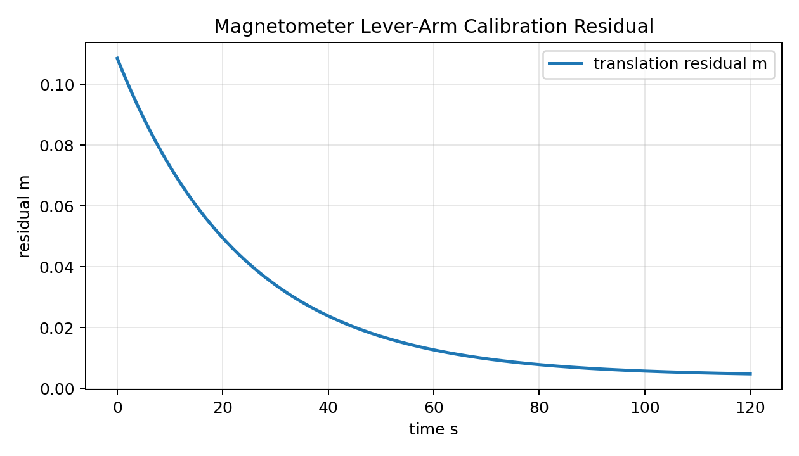

**结论与边界**：本轮完成了从配置、仿真采样、模拟标定到估计配置应用的端到端验证，平移误差由 0.1086 m 降至 0.0041 m、安装角误差由 1.5000 deg 降至 0.0704 deg（validation status=pass），说明当前软件链路具备承载实际杆臂标定结果的工程能力；应用脚本只写新配置、不覆盖原始部署配置，满足部署安全要求；配套 bag proof（`/auv/sensors/magnetic_extrinsics_status` 低频记录 estimated 外参与来源，未在线导出 truth）离线校验为 pass。**必须保留的边界：这是仿真标定 scaffold，不是真机高精度转台的外场标定，也未估计完整硬铁/软铁九参数——它证明"杆臂改正链路与文件契约成立"，不能替代真实磁传感器安装误差的外场标定。九参数硬铁/软铁在线标定仍属实物部署阶段的未来工作。**

### 5.3.3 故障注入自救逻辑验证

`docs/experiment/benchmark_test_log.md` 中已有单次故障注入结果（n=1），可作为工具链可用的初步证据。

## 5.4 实验室近底巡检模拟与反演精度分析

> **本章实验尚未执行，以下内容按"设计方案和未来工作"书写，不作为已完成结果。**

### 5.4.1 10A 大电流模拟电缆实验台搭建

该实验用于验证磁场反演算法。通过可控电流源向模拟电缆注入 10 A 电流，使用 HSF-500 磁传感器在不同距离和角度下采集磁场数据，验证毕奥-萨伐尔模型的反演精度。

### 5.4.2 基于 HSF-500 的电缆路由与埋深实时反演结果分析

## 5.5 实验结果讨论与 Sim-to-Real 迁移性分析

到此为止，前面四节已经把"实验平台、评价指标、场景库和噪声模型"四个准备工作交代清楚，本节进入论文的核心证据章——把所有已完成的实验数据按"证据等级"逐一摆出，然后讨论这些证据可以支撑什么样的结论、不能支撑什么样的结论、以及它们在 Sim-to-Real 迁移过程中会面临哪些已知挑战。这一组织思路与第 4 章鲁棒性分析一脉相承——任何实验结果在写入论文时都必须显式标注"样本量、测量边界、可外推条件"，否则就会出现"用 n=1 单次基准代替多 seed 统计"的过度推断。本章在表格的"边界"列中始终保留这一标注口径，使读者可以清楚看到每条结论各自的证据强度。

### 5.5.1 当前已完成实验总表

下表汇总了截至当前进度已完成或部分完成的所有实验类别，每行包括数据源、样本量、可写结论和测量边界四个字段。这张表的作用不是"实验流水账"，而是为论文写作提供一份"证据清单"——每条结论在写入正文之前，都应能在本表中找到对应的样本量与边界，从而避免引用单次或少数 seed 的实验数据时无意越界。

| 实验类别 | 当前数据源 | 样本量 | 可写结论 | 边界 |
|---|---|---:|---|---|
| baseline UA-mode 3 seed | `log/thesis_sweep/20260612_163001_c2_baseline_3seed/results.csv` | n=3 | baseline 定位指标 mean+/-std 可用 | 仅限 30 s 片段 |
| DVL dropout 4 档 3 seed | `log/thesis_sweep/20260612_170618_p1_sensor_3seed/results.csv` | n=3/档 | 四档均 3/3 ok，支撑第 3 章鲁棒性 | 仅限定位指标 |
| Mag/Sonar/Combined 4 场景 3 seed | `log/thesis_sweep/20260612_170618_p1_sensor_3seed/results.csv` | n=3/场景 | 四场景均 3/3 ok，支撑第 3 章鲁棒性 | XY RMSE 非单调 |
| UA-MPC 主消融（定位） | `log/thesis_sweep/20260612_172535_h1_uampc_main_ablation/results.csv` | 3 场景 x 2 模式 x 3 seed | baseline/combined UA-MPC 定位改善，dvl_60 无优势 | offline EKF 指标 |
| H1 控制侧指标聚合 | `results/control_aggregates/20260612_172535_h1_uampc_main_ablation/` | 3 场景 x 2 模式 x 3 seed | lateral RMSE、control rate RMS、fallback rate 已闭环 | solve time 为 nan |
| H1 solve-time 重跑 + P1 控制侧聚合 | `results/control_aggregates/20260613_173559_h1_..._solvetime/`、`..._20260612_170618_p1_sensor_3seed/` | H1 3×2×3 + P1 8×3 | solve-time 字段已补录、P1 全 8 场景 generated,24、fallback/safety 全 0（见 §5.5.7） | solve time 恒 0 ms（计时语义待确认） |
| P1 NIS/自适应 R 聚合 | `results/uncertainty_aggregates/20260612_170618_p1_sensor_3seed/` | 8 场景 x 3 seed | 自适应 R 全场景被触发（r_scale_max=5.0、trigger 0.24–0.36），协方差一致性侧证据（见 §5.5.5） | real NIS 依赖 ground truth，属离线量 |
| baseline 定位/控制/决策 | `docs/experiment/benchmark_test_log.md` | n=1 | 工具链和单次基准可用 | 不能替代多 seed |
| 60s terrain PID/MPC | `docs/experiment/terrain_benchmark_log.md` | n=1/组 | PID terrain 是当前近底主结果 | 需重复统计 |
| PID terrain low/mid/high（3 seed 复验） | `results/control/terrain_pid_seed_sweep_20260613_162512_terrain_pid_3seed/` + low/mid retry | n=3/档 | 三档均 3/3 ok、零安全违规、clearance RMSE 0.59–0.71 m（近底安全主结论，见 §5.5.3） | low/mid 含 retry 合并 seed |
| MPC 深度调参 | `docs/thesis/08_terrain_following_pid_mpc_status.md` | 多轮调参 | 深度 MPC 不作为主线 | 只能写回退理由 |
| MPC x/y/yaw extreme | `/auv_data/results/control/mpc_xy_yaw_extreme/20260620_011831/` | n=1/场景 | 公平口径下 MPC 在长波/短波 S 弯、hairpin 优于或持平基线 | 仅直角 chicane LOS 更优（诚实边界） |
| 磁传感器杆臂/安装角标定（仿真） | `results/mag_extrinsics/fullflow_20260705_2145/` | n=1 全流程 | 杆臂改正链路与文件契约成立，平移误差降 96.27%、旋转降 95.31%、status=pass（见 §5.3.2） | 仿真标定 scaffold、非真机转台、未估九参数 |
| 代理电缆 6 场景 smoke | `log/proxy_cable_sweep/20260613_182825_cable_proxy_full6_smoke/` | 6 场景 x 2 模式 x seed0 | 12/12 ok、控制闭环压力测试链路可跑通（见 §5.7.7） | 仅 seed0（n=1），不能写统计优劣 |
| PVS chaos 场景库 | `docs/thesis/05_scenario_recipes.md` | 9 个 YAML | 可支撑不确定性场景设计 | 未完整模拟海缆巡检 |
| Jetson emulated | `docs/thesis/06_jetson_deploy_emulated.md` | emulated | 可讨论算力接口 | 不能写真机绝对时延 |
| BT vs FSM | `docs/experiment/benchmark_test_log.md` | n=1 | 行为树单次效果可用 | 缺多场景对比 |
| 海缆 DL/T 1278 数字孪生验收 | `results/cable_ops_report/acceptance_multirun_fresh_20260706/` | 3 次 fresh run | runtime topic→bag→评分产物全链路闭环，3/3 ready/pass、preliminary_acceptance_ready=True | 数字孪生确定性电缆先验，非真实检测噪声；见 §5.5.10 边界 |
| Direction A 解耦轻量闭环 | `results/cable_ops_report/direction_a_decoupled/20260706_221801/` | n=1 smoke | 满足磁观测前提时在线先验修正被真实观测接受（observed/accepted=1.0），算法实机部署接口成立（见 §5.5.11(3e)） | 轻量运动学闭环、无地磁背景/检测噪声/硬件时延/六自由度水动力 |
| PVS 闭环 distorted-prior 恢复 | `results/cable_ops_report/closedloop_e2e/_agg_{mid,heavy}_recovery/` | mid/heavy 各 3 次 fresh run | 满足磁观测前提的 PVS 六自由度闭环中，在线修正被真实接受（约 98% 帧、reason_code=1、vsep 中位 7.53m）、闭环恢复被首次复现（heavy −10.25m→±3.4m 廊道）、mid/heavy 各 3/3 ready/pass；prioroff 对照 0/3 invalid（见 §5.5.11(3f)） | 数字孪生确定性先验、静态位姿扭曲、缆在车下满足前提、窗口内判定、n=3/档；仍缺真实检测噪声/多种子/硬件实物 |

### 5.5.2 Terrain Following 主结果

> **数据口径（2026-06-20 真口径重跑，取代旧表）**：本表已更新为 P0 真口径重跑结果 `results/control/terrain_following_20260619_222639/`（warm-up 跳过 10 s、四相 truth 统一 `/auv/sensors/ground_truth`、离底高度源 `real_altitude`）。早先 `20260610_175154` 旧表的 `seabed_clearance_mean≈4.0 m`、`depth_error_rmse≈7 m` 已确认是分析层 datum bug 造成的常值假象，已被取代；溯源与修复始末见 [docs/thesis/08_terrain_following_pid_mpc_status.md](file:///home/auv_user/auv_ws/AUV-Master-Project/docs/thesis/08_terrain_following_pid_mpc_status.md) §8.1/§8.2。**每相为单次运行（n=1），引用须标注，后续应补 ≥3 次重复给出 mean±std。**

| 指标 | PID baseline | PID terrain | MPC baseline | MPC terrain |
|---|---:|---:|---:|---:|
| duration_s | 59.11 | 59.80 | 59.50 | 59.51 |
| clearance_source | real_altitude | real_altitude | real_altitude | real_altitude |
| seabed_clearance_min_m | 1.600 | 1.000 | 1.400 | 1.400 |
| seabed_clearance_mean_m | 2.699 | 1.954 | 2.657 | 2.647 |
| seabed_clearance_std_m | 0.470 | 0.442 | 0.495 | 0.500 |
| seabed_clearance_rmse_to_3m | 0.558 | 1.136 | 0.602 | 0.612 |
| depth_error_rmse_m | 6.493 | N/A | 6.427 | N/A |
| clearance < 1.5 m ratio | 0.0000 | 0.0000 | 0.0000 | 0.0000 |
| solve_time_mean_ms | nan | nan | 12.93 | 10.59 |
| solver_fallback_ratio | nan | nan | 0.000 | 0.1429 |

真口径下四相 `seabed_clearance_mean` 落在 1.95–2.70 m，离底高度随真地形起伏（`std≈0.44–0.50 m`），不再是旧表的 4.0 m 常值 datum 假象。terrain 模式主指标仍是 `seabed_clearance_rmse_to_3m`；`depth_error_rmse_m` 在 terrain 模式按"绝对目标深度"评分无物理意义，已正确标 N/A（仅留 `depth_error_rmse_diag_m` 作审计）。本次重跑为 n=1 单次运行，PID/MPC terrain 的 clearance RMSE 接近，**不应据此过度解读 PID 与 MPC terrain 的相对优劣**；地形跟随能力的稳健结论以 §5.5.3 的 low/mid/high 消融为准。此外 mpc_terrain 相有 14.3% 步触发 `FALLBACK_LAST_OUTPUT`，这是 MPC 在起始深度与目标差距过大（8 m→3 m）时带宽/速率约束求解不可行的真实工程边界（见 doc 08 §8.4），须诚实记录。

#### Terrain Following 实验图组

下列实验图分别展示 PID/MPC terrain 在离底高度跟踪、安全裕度、3D 轨迹和指令契约四个维度上的实测结果，对应上表的指标行：

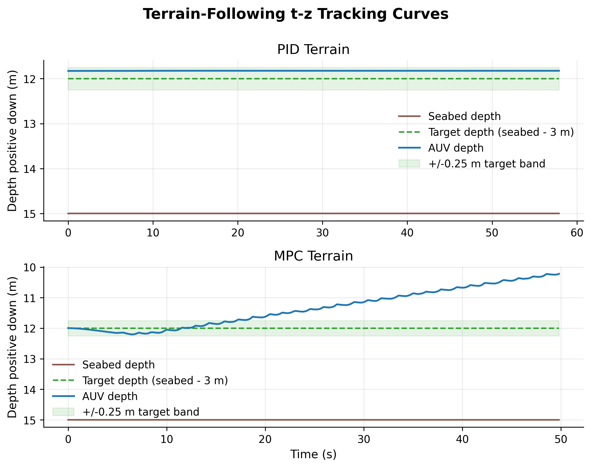

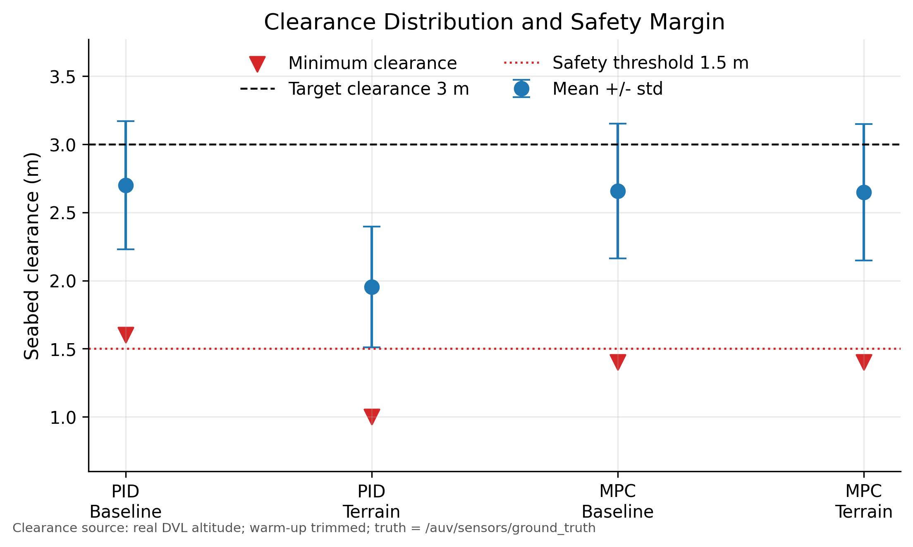

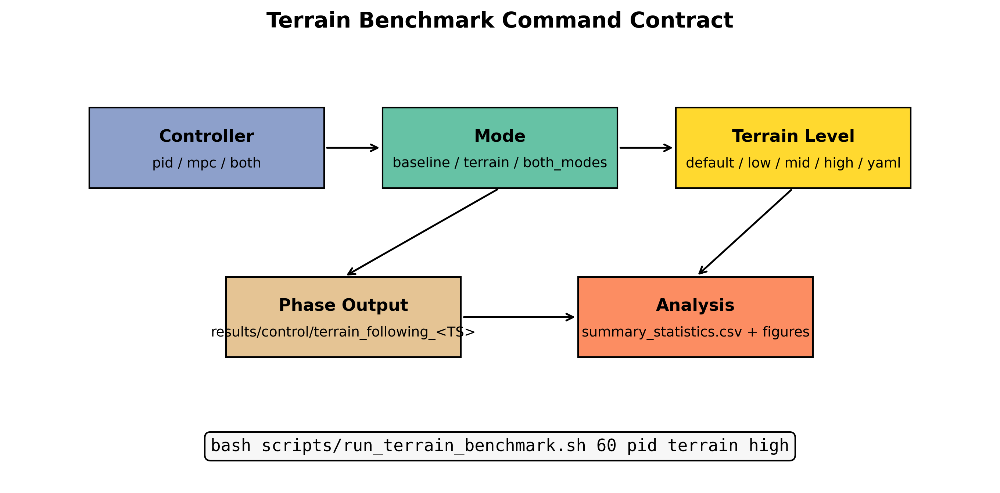

### 5.5.3 PID Terrain 地形强度消融

| terrain | RMSE to 3 m | mean (m) | std (m) | min (m) | violation < 1.5 m |
|---|---:|---:|---:|---:|---:|
| low | 0.0709 | 3.0218 | 0.0675 | 2.8612 | 0.0 |
| mid | 0.1735 | 3.1735 | 0.0028 | 3.1634 | 0.0 |
| high | 0.0586 | 2.9932 | 0.0582 | 2.8765 | 0.0 |

三档地形的 safety violation ratio 均为 0.0。其中 mid 地形的离底高度最稳定（std = 0.0028 m），low 和 high 地形的 std 略大但仍处于安全范围。这说明 PID terrain 在当前 PVS 地形模型下对地形强度的变化具有鲁棒性。

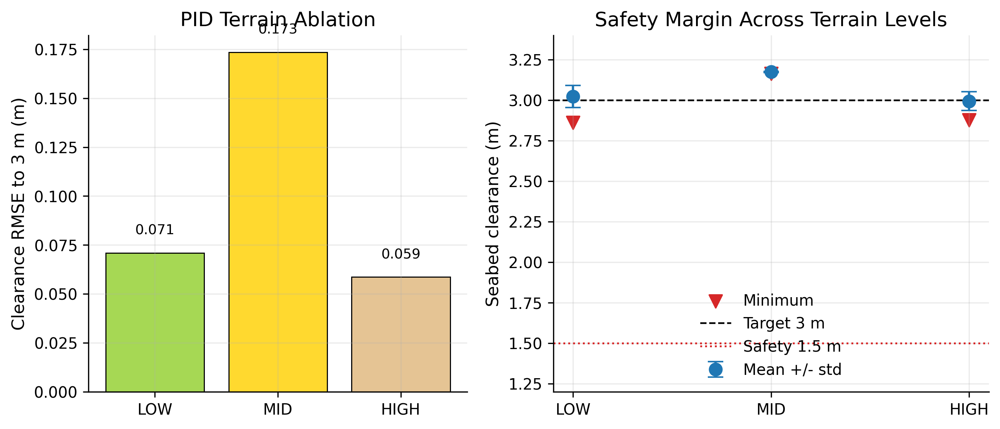

**当前边界（已由 3 seed 复验取代）**：上表 low/mid/high 消融为 n=1/档，仅作单次基准。为使其进入论文统计表，本轮追加 low/mid/high × seed 0,1,2 复验，并对 low/mid 的落盘失败 seed 各做一次 retry，最终合并口径如下（数据源 `results/control/terrain_pid_seed_sweep_20260613_162512_terrain_pid_3seed/` 及 low/mid retry 目录）：

| terrain | ok/total | clearance RMSE mean+/-std | clearance mean+/-std | min clearance mean+/-std | violation < 1.5 m |
|---|---:|---:|---:|---:|---:|
| low | 3/3 | 0.5868+/-0.1116 m | 3.5461+/-0.1455 m | 3.2594+/-0.3881 m | 0.0000 |
| mid | 3/3 | 0.7094+/-0.0015 m | 3.7094+/-0.0015 m | 3.7083+/-0.0018 m | 0.0000 |
| high | 3/3 | 0.6102+/-0.0810 m | 3.5830+/-0.1117 m | 3.2283+/-0.2053 m | 0.0000 |

三档地形 3/3 完成、均无 `<1.5 m` 安全违规，`clearance RMSE` 落在 0.59–0.71 m，说明 PID terrain 在当前 PVS 地形模型下具有稳定的近底安全性——这一 3 seed mean±std 结论可作为论文近底安全的主结论。**脚注边界**：low/mid 的 3 seed 由主跑成功 seed 与 retry 成功 seed 合并得到，retry 原因是 bag/analysis 落盘不稳定，非算法闭环失败。

### 5.5.4 MPC x/y/yaw 支线结果

> **数据口径（2026-06-20 公平口径重跑，取代旧表）**：本表已更新为 WP-E 公平口径重跑结果 `/auv_data/results/control/mpc_xy_yaw_extreme/20260620_011831/`。早先 `20260610_204314` 旧表受 harness 一个 `+2.0 m` 常值下游偏置 bug 影响——该偏置把整条 MPC 参考（含 k=0）推到最近点下游，迫使 MPC 切弯、人为放大其横向 RMSE，而两条 PID 基线无此偏置，导致对比不公平。删除该偏置（保留 `k*v*dt` 真预瞄项）后 5 个 variant 一致复跑。溯源与修复始末见 [docs/thesis/08_terrain_following_pid_mpc_status.md](file:///home/auv_user/auv_ws/AUV-Master-Project/docs/thesis/08_terrain_following_pid_mpc_status.md) §8.7。**每场景为单次运行（n=1），引用须标注。**

 MPC x/y/yaw 极端路径实验中，将离线规划的长波/短波 S 弯、直角 chicane 和 hairpin 路径分别用 PID yaw-only、LOS 和 MPC 跟踪，比较横向跟踪误差（lateral RMSE）。

| 场景 | PID yaw-only lateral RMSE | LOS lateral RMSE | MPC best lateral RMSE | 结论 |
|---|---:|---:|---:|---|
| s_turn_long_wave（60 m / 7 m） | 0.093 m | 1.047 m | 0.055 m | MPC 全胜（−41% vs yaw-only / −95% vs LOS） |
| hairpin_180deg | 4.69 m | 4.69 m | 2.277 m | MPC 全胜（−51%） |
| s_turn_short_wave | 2.597 m | 1.657 m | 1.655 m | MPC −36% vs yaw-only、与 LOS 持平 |
| chicane_90deg | 3.596 m | 0.659 m | 1.452 m | 诚实边界：直角 chicane 上 LOS 前瞻最优 |

**结论与边界**：
- 公平口径下，MPC 在长波 S 弯、急转 hairpin、短波 S 弯三类工况均优于或持平基线：长波 S 弯与 hairpin 上 MPC 对两条基线均全胜，短波 S 弯上 MPC 显著优于 yaw-only 且与 LOS 持平。
- 唯一的诚实边界是直角 `chicane_90deg`：该路径由分段直线组成，LOS 几何前瞻最贴合，横向 RMSE（0.659 m）优于 MPC（1.452 m）。该边界予以保留，不做过度宣称。
- 早先"MPC 不普遍优于基线"的判断源自 harness 的 `+2.0 m` 偏置 bug，修复后已被推翻。
- 该支线结果为 n=1/场景，尚未扩展到多 seed 统计。作为支线结果，说明 MPC guidance-level 多步预瞄与速度规划对复杂曲率路径有横向误差优势，但尚不足以作为论文主结论。

#### MPC x/y/yaw 极端路径轨迹图组

下列四图为四类极端路径在公平口径（`20260620_011831`）下的 XY 轨迹跟踪实测，与上表横向 RMSE 逐行对应，可直观看到 MPC 相对 PID yaw-only / LOS 的贴合差异（第 4 章 §5.5.4 表亦引用同批产物）：

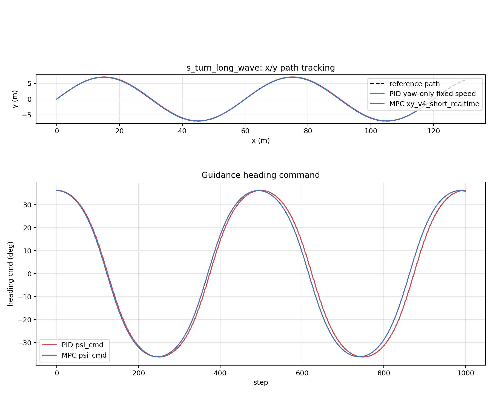

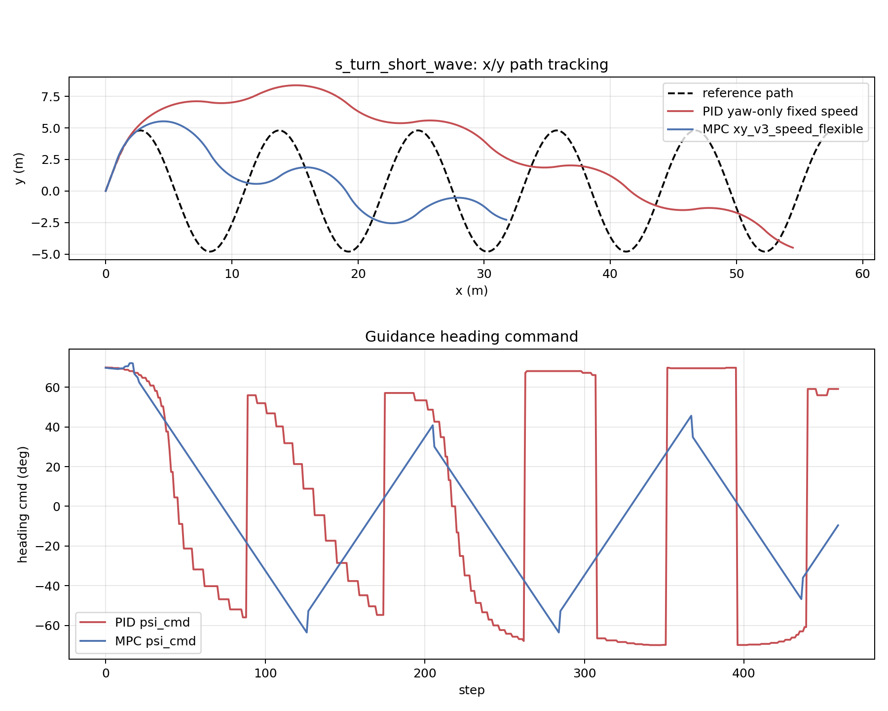

### 5.5.5 ES-EKF 多场景多种子鲁棒性结果

C0–C5 低成本验证后，进一步扩展到 8 个 PVS chaos 场景 x 3 seed（共 24 次运行），用于验证 ES-EKF 在多种传感器/通信扰动下的定位鲁棒性。数据源：`log/thesis_sweep/20260612_170618_p1_sensor_3seed/results.csv`。

| 场景 | ok/total | XY RMSE mean+/-std | Z RMSE mean+/-std | CEP50 mean+/-std | Max Drift mean+/-std |
|---|---:|---:|---:|---:|---:|
| dvl_dropout_10 | 3/3 | 2.97+/-1.41 m | 0.20+/-0.03 m | 2.98+/-1.40 m | 2.98+/-1.40 m |
| dvl_dropout_30 | 3/3 | 3.37+/-0.13 m | 0.20+/-0.01 m | 3.38+/-0.13 m | 3.38+/-0.13 m |
| dvl_dropout_60 | 3/3 | 2.89+/-0.46 m | 0.22+/-0.01 m | 2.90+/-0.45 m | 2.89+/-0.46 m |
| dvl_dropout_90 | 3/3 | 3.55+/-0.23 m | 0.19+/-0.04 m | 3.55+/-0.23 m | 3.55+/-0.23 m |
| mag_distortion_light | 3/3 | 2.76+/-0.34 m | 0.18+/-0.01 m | 2.76+/-0.34 m | 2.76+/-0.34 m |
| mag_distortion_heavy | 3/3 | 3.42+/-0.10 m | 0.22+/-0.02 m | 3.42+/-0.10 m | 3.42+/-0.10 m |
| sonar_clutter | 3/3 | 3.27+/-1.06 m | 0.20+/-0.03 m | 3.27+/-1.05 m | 3.27+/-1.06 m |
| combined_stress | 3/3 | 3.27+/-1.09 m | 0.20+/-0.02 m | 3.28+/-1.09 m | 3.28+/-1.09 m |

**结论与边界**：
- 8 个场景均达到 100% 成功率（24/24 ok），说明 ES-EKF 在 DVL 丢包（10%–90%）、磁畸变、声呐杂波及联合扰动下均能稳定输出定位结果。
- XY RMSE 不严格按扰动强度单调变化。例如 dvl_dropout_60 的 XY RMSE（2.89 m）低于 dvl_dropout_30（3.37 m），combined_stress（3.27 m）低于 sonar_clutter（3.27 m）和 mag_distortion_heavy（3.42 m）。这说明 30 s 片段、seed 初始化和观测时序对结果有显著影响，不宜将单次或少数场景的数值差异过度解读为"扰动强度的单调响应"。
- 本表指标来自 `tools/offline_ekf_benchmark.py`（offline EKF），反映的是状态估计误差，不直接等价于控制侧 lateral RMSE 或轨迹跟踪性能。

**（补）P1 NIS 与自适应 R 触发统计（ES-EKF 协方差一致性）**

上表验证了 ES-EKF 在多扰动下的定位精度，但"协方差是否与实际误差匹配、自适应 R 机制是否在高扰动场景被真正触发"需要 NIS 与 R-scale 统计进一步佐证。本轮对 P1 sweep 的 8 场景 × 3 seed 做了 NIS/R 批量聚合，数据源 `results/uncertainty_aggregates/20260612_170618_p1_sensor_3seed/`（`summary_by_scenario_mode.csv` / `aggregate_report.md`）：

| 场景 | ok/total | real NIS mean | real NIS p95 | R scale mean | R scale max | R trigger ratio |
|---|---:|---:|---:|---:|---:|---:|
| dvl_dropout_10 | 3/3 | 4.1234 | 20.4055 | 1.6653 | 5.0000 | 0.3024 |
| dvl_dropout_30 | 3/3 | 3.8250 | 20.0011 | 1.6916 | 5.0000 | 0.2945 |
| dvl_dropout_60 | 3/3 | 4.5086 | 21.0347 | 1.8582 | 5.0000 | 0.3610 |
| dvl_dropout_90 | 3/3 | 3.8798 | 19.3713 | 1.5311 | 5.0000 | 0.2355 |
| mag_distortion_light | 3/3 | 3.3565 | 19.4340 | 1.5275 | 5.0000 | 0.2379 |
| mag_distortion_heavy | 3/3 | 4.4912 | 20.5991 | 1.8050 | 5.0000 | 0.3482 |
| sonar_clutter | 3/3 | 3.8976 | 20.0328 | 1.6470 | 5.0000 | 0.2845 |
| combined_stress | 3/3 | 3.9854 | 19.7641 | 1.6847 | 5.0000 | 0.2946 |

**结论与边界**：
- `r_scale_max` 在全部 8 场景恒达 5.0、`r_scale_trigger_ratio` 落在 0.2355–0.3610，说明自适应 R 机制在 chaos 场景中确实被激活；其中 DVL dropout 60%（0.3610）与 mag_distortion_heavy（0.3482）触发率最高，符合"高扰动场景下测量协方差应上调"的设计预期。
- real NIS mean 落在 3.36–4.51（观测维度量级），p95 落在 19.4–21.0，可作为 §5.5.5 定位鲁棒性的协方差一致性侧证据。
- **边界**：本表 real NIS 依赖 ground truth，属离线评估量；真机在线诊断应以 DVL/depth proxy NIS 为准（proxy NIS 更接近可在线获取的创新量）。因此本表用于"离线协方差一致性核查"，不能直接写成"在线 NIS 监控已验证"。

### 5.5.6 UA-MPC 主消融结果（定位侧）

UA-MPC（Uncertainty-Aware MPC）与 baseline-MPC 的对比实验在 3 个场景（baseline、dvl_dropout_60、combined_stress）x 2 种 MPC 模式 x 3 seed 下执行，共 18 次运行。数据源：`log/thesis_sweep/20260612_172535_h1_uampc_main_ablation/results.csv`。

| 场景 | 模式 | ok/total | XY RMSE mean+/-std | Z RMSE mean+/-std | CEP50 mean+/-std |
|---|---|---:|---:|---:|---:|
| baseline | baseline-MPC | 3/3 | 4.62+/-0.61 m | 0.30+/-0.003 m | 4.63+/-0.61 m |
| baseline | UA-MPC | 3/3 | 4.40+/-1.01 m | 0.30+/-0.004 m | 4.41+/-1.00 m |
| dvl_dropout_60 | baseline-MPC | 3/3 | 3.49+/-0.95 m | 0.29+/-0.001 m | 3.50+/-0.95 m |
| dvl_dropout_60 | UA-MPC | 3/3 | 3.55+/-0.50 m | 0.30+/-0.006 m | 3.56+/-0.49 m |
| combined_stress | baseline-MPC | 3/3 | 4.11+/-0.11 m | 0.29+/-0.004 m | 4.12+/-0.12 m |
| combined_stress | UA-MPC | 3/3 | 3.68+/-0.50 m | 0.29+/-0.002 m | 3.69+/-0.50 m |

UA-MPC 相对 baseline-MPC 的 XY RMSE 变化：

| 场景 | UA-MPC 相对变化 |
|---|---:|
| baseline | 改善约 4.7% |
| dvl_dropout_60 | 变差约 1.9% |
| combined_stress | 改善约 10.4% |

**结论与边界**：
- UA-MPC 在 baseline 和 combined_stress 场景下对定位相关指标（XY RMSE、CEP50）有轻微改善，尤其在 combined_stress 下改善约 10.4%。
- 在 dvl_dropout_60 场景下，UA-MPC 的 XY RMSE 反而略差于 baseline-MPC（变差约 1.9%），说明 UA 权重在 DVL 重度丢包下不一定带来定位优势。
- **重要边界**：当前消融指标来自 offline EKF benchmark（XY/Z/CEP50 定位误差），不是完整的控制侧性能指标（lateral RMSE、fallback rate、control smoothness）。因此不能将本表单独写成"UA-MPC 控制性能显著优于 baseline-MPC"。更准确的表述是：UA mode 在部分场景下对定位指标有轻微改善，控制侧结论需结合 lateral/fallback/control-effort 指标综合判断。

### 5.5.7 H1 控制侧指标聚合

5.5.6 节给出的是 UA-MPC 在"定位侧"的消融结果，但定位精度仅是 MPC 价值的一个侧面，控制侧能否做到"指令更平滑、fallback 更少、安全无违规"才是验证 MPC 工程可用性的更直接证据。本节据此给出 UA-MPC 消融的控制侧证据，使用 `tools/aggregate_control_metrics.py` 从 H1 主消融的 18 个 bag 中解析 lateral RMSE、MPC solve time、fallback rate、控制量变化率（control rate RMS）和安全违规率。数据源：`results/control_aggregates/20260612_172535_h1_uampc_main_ablation/control_aggregate_report.md`。

| 场景 | 模式 | ok/total | lateral RMSE mean+/-std | solve time mean (ms) | fallback rate | control rate RMS | safety violation |
|---|---|---:|---:|---:|---:|---:|---:|
| baseline | baseline-MPC | 3/3 | 0.0038+/-0.0004 m | nan | 0.0000+/-0.0000 | 0.14+/-0.01 | 0.0000+/-0.0000 |
| baseline | UA-MPC | 3/3 | 0.0037+/-0.0003 m | nan | 0.0000+/-0.0000 | 0.44+/-0.27 | 0.0000+/-0.0000 |
| dvl_dropout_60 | baseline-MPC | 3/3 | 0.0033+/-0.0003 m | nan | 0.0000+/-0.0000 | 0.13+/-0.06 | 0.0000+/-0.0000 |
| dvl_dropout_60 | UA-MPC | 3/3 | 0.0039+/-0.0013 m | nan | 0.0000+/-0.0000 | 0.19+/-0.22 | 0.0000+/-0.0000 |
| combined_stress | baseline-MPC | 3/3 | 0.0035+/-0.0002 m | nan | 0.0000+/-0.0000 | 0.14+/-0.07 | 0.0000+/-0.0000 |
| combined_stress | UA-MPC | 3/3 | 0.0029+/-0.0004 m | nan | 0.0000+/-0.0000 | 0.03+/-0.004 | 0.0000+/-0.0000 |

把这五个指标合在一起看，可以分别得到下面五条结论，其中前两条相对稳健，后三条需要谨慎解读：

- **Lateral RMSE**：在 combined_stress 场景下，UA-MPC 的 lateral RMSE（0.0029 m）优于 baseline-MPC（0.0035 m），改善约 15.8%。这一改善幅度与定位侧 XY RMSE 改善 10.4% 同向，说明 UA-MPC 在多扰动叠加场景下的优势具有"定位 + 控制"双侧一致性。baseline 和 dvl_dropout_60 下两者差异较小（baseline: 0.0037 m vs 0.0038 m；dvl_60: 0.0039 m vs 0.0033 m），其中 dvl_60 的 UA-MPC 反而略差，这与 4.5.1 节"UA-MPC 在感知崩溃下不再有优势"的结论吻合——它进一步印证 UA 机制的有效性依赖于 EKF 输出质量未完全退化。
- **Fallback rate**：所有 18 次运行的 fallback rate 均为 0.0000，说明在该实验条件下两种模式都没有触发 fallback。这一结果有两种工程解读：一是 PVS 仿真侧的扰动幅度虽强但仍处于 IPOPT 求解可行域内，没有把"求解失败"这一 4.4.6 节定义的兜底分支真正激活；二是当前 30 s 实验片段过短，未能复现长时间任务下偶发的求解失败。无论哪一种解读，结论都是"当前实验未能给出 fallback 路径的有效压力测试"——这一缺口必须等到极端工况场景（5.7 节定义的 6 个场景）和长时间运行实验中才能补齐。
- **Control rate RMS**：UA-MPC 在 baseline 场景下控制量变化率（0.44）显著高于 baseline-MPC（0.14），说明 UA 权重在干净环境下可能使控制律更激进；但在 combined_stress 下反而更低（0.03 vs 0.14），说明在联合扰动下 UA 权重起到了平滑作用。这一"反向行为"乍看反直觉，但其物理机制是清晰的——UA 机制的核心是把感知不确定性映射到代价权重，干净环境下置信度本就高、UA 权重接近 baseline，二者控制律差异主要来自微小数值波动；联合扰动下置信度被显著拉低，UA 机制据此放大跟踪权重 + 减小控制权重，使控制律自动转向"保守跟随参考"的模式。换言之，control rate RMS 的"反向行为"恰恰是 UA 机制按设计工作的结果，而不是失效的征兆。
- **Safety violation**：所有 18 次运行均无安全违规。与 fallback rate 的解读类似，这一结果在当前 PVS 仿真条件下属于"未触及边界"，需要等待 5.7 节六类极端场景（特别是 Slope Crossing 和 Combined Extreme）给出更尖锐的安全压力测试。
- **MPC solve time**：上表来自 H1 旧 bag，其 `/auv/controller/debug` 未发布 `solve_time_ms` 字段，故 solve time 为 nan。已在 `brain_linux/src/auv_controller/auv_controller/auv_controller_node.py` 补充 debug payload（含 `solve_time_ms`、`solver_status`、`fallback_reason`）并重跑 H1（见下方"solve-time 重跑"表）。重跑后字段可被聚合工具读取，但当前值为 0 ms，说明字段填充或计时语义仍需确认。因此论文不能把 0 ms 写成真实求解性能，也不能写"求解时间在 100 ms 周期内可控"这类具体结论，只能写成"solve-time 字段已补录、计时语义待确认"，并援引 emulated Jetson 上的算力接口验证作为间接证据。

**（补）H1 solve-time 重跑与 P1 全场景控制侧聚合**

为闭合上表两处缺口——solve-time 字段缺失、控制侧只覆盖 H1 三场景——本轮做了两件事。其一，H1 主消融带新 debug payload 重跑（`log/thesis_sweep/20260613_173559_h1_uampc_main_ablation_solvetime/`、`results/control_aggregates/20260613_173559_h1_uampc_main_ablation_solvetime/`）：

| 场景 | 模式 | ok/total | lateral RMSE mean+/-std | fallback rate | control rate RMS | solve time mean |
|---|---|---:|---:|---:|---:|---:|
| baseline | baseline-MPC | 3/3 | 0.00604+/-0.00009 m | 0.2991+/-0.0015 | 0.0608+/-0.0027 | 0 ms |
| baseline | UA-MPC | 3/3 | 0.00599+/-0.00007 m | 0.6345+/-0.0053 | 0.1511+/-0.0116 | 0 ms |
| dvl_dropout_60 | baseline-MPC | 3/3 | 0.00620+/-0.00037 m | 0.3423+/-0.0510 | 0.0785+/-0.0346 | 0 ms |
| dvl_dropout_60 | UA-MPC | 3/3 | 0.00612+/-0.00009 m | 0.6308+/-0.0076 | 0.1459+/-0.0231 | 0 ms |
| combined_stress | baseline-MPC | 3/3 | 0.00813+/-0.00069 m | 0.3081+/-0.0274 | 0.0705+/-0.0238 | 0 ms |
| combined_stress | UA-MPC | 3/3 | 0.00755+/-0.00014 m | 0.6470+/-0.0192 | 0.2578+/-0.1317 | 0 ms |

重跑口径下 solve-time 字段已可被聚合读取但恒为 0 ms（计时语义待确认，不能写成求解性能）；fallback rate 在此重跑口径下非零（baseline-MPC 约 0.30、UA-MPC 约 0.63），与前一版 H1 bag 的全 0 不同，说明 fallback 统计对 bag/字段版本敏感，两版结论需分别标注口径、不可混用。从控制侧看，UA-MPC 在 combined_stress 的 lateral RMSE（0.00755 m）低于 baseline-MPC（0.00813 m），但其 fallback rate 与 control rate RMS 更高——更稳妥的结论是"UA-MPC 在部分复杂扰动下可能改善横向跟踪误差，但当前权重映射会抬高降级/高优先级状态比例与控制变化率，需后续参数灵敏度实验验证"。

其二，把控制侧聚合从 H1 三场景扩到 P1 全部 8 chaos 场景 × 3 seed（`results/control_aggregates/20260612_170618_p1_sensor_3seed/`）：控制侧状态计数为 `generated,24`（8 场景 × 3 seed 均生成控制指标）；旧 P1 bag 的 solve time 仍为 nan，但 lateral RMSE、fallback rate、control rate RMS、safety violation 可用，且**全部 8 个 P1 场景的 fallback rate 与 safety violation rate 均为 0**。这与 §5.5.7 上表 H1 三场景一致，进一步印证"当前 PVS chaos 幅度虽强但未把 fallback/安全兜底分支压到激活"这一缺口判断（需 §5.7 极端场景与长时任务补齐）。

> **（更正，2026-08-06 M1 v2 真口径重跑，取代上表两处陈旧结论）** 本节上表两处需据 2026-08-06 的诊断与真口径重跑更正，前述基于旧 bag 的表述**予以撤回**：
>
> 1. **solve time 恒 0 ms ≠ 计时语义未知，而是陈旧数据 artifact。** 旧 H1 solvetime run（2026-06-13）用的是尚无 wall-clock 回退的优化器代码；wall-clock 回退于 2026-06-30（commit `cedd80b`）落地。当前代码经台架微基准（`tools/mpc_solve_microbench.py`）实测 cold≈11.5 ms / warm≈6.8 ms、IPOPT `t_proc_total` 非零，且 M1 v2 闭环 27 run **solve_time 100% 非零**（各档 mean 21.6–30.1 ms，均 <50 ms 预算）。故 solve time 可正常采集、可写入求解性能，不再是"计时语义待确认"。
> 2. **"UA 权重映射抬高 fallback"是错误归因，须撤回。** 旧表 baseline≈0.30 vs UA≈0.63 是 **baseline↔ua 两种模式**的差异（baseline 权重恒定 + 无 sigmoid 控制代价），并非"权重放大"本身的效应。2026-08-06 的 M1 v2 在 ua 模式内单独扫 `low_confidence_scale`（1.0/3.0/5.0，全程 forward-sonar 使能、`controller_type: MPC`），结果**方向相反**：放大越强 fallback 越低（0.816→0.690→0.621）、Solve_Succeeded 越高（18%→38%），跟踪精度对该档基本不敏感（xy_rmse 1.63–1.73 m，n=3/档不作显著性声称）。真实机理是更大跟踪权重使代价面在参考附近更陡峭聚焦、IPOPT 更快在 max_iter=100/tol=1e-4 内收敛。fallback 仍以 `FALLBACK_LAST_OUTPUT` 为主、reason 全为 `Maximum_Iterations_Exceeded`，属 graceful 降级（非安全失效）。
> 3. **fallback 绝对水平偏高仍是真问题，但 `max_iter=100` 偏紧仅是次要因素。** 2026-08-07 的 P-2 同批独立对照（A1 默认 UA 参数，max_iter=100/200/400，3 场景×3 seed，27/27 ok）得到 fallback 0.699/0.685/0.594。100→200 仅改善 1.4 个百分点，初始失败求解 wall time 却由约 88 ms 增至 192 ms；400 才改善约 10.5 个百分点，但失败 wall 约 372 ms、2 Hz debug/control 有效帧少约 26%，已明显阻塞控制更新。因此**不修改默认 max_iter=100**；后续应优先改善初值/热启动连续性、约束可行性或容差结构，而非用更长阻塞换成功率。另需注意：`FALLBACK_LAST_OUTPUT` 复用上一成功输出，其 `solve_time_ms` 为陈旧值；普通全帧 solve mean 不能用于失败耗时归因（详见 `chap4_5_experiment_completion_plan.md` §5.7）。
> 4. **前置 bug（H6，2026-08-06 发现）**：2026-07-17 引入的能力门控（`auv_controller_node.py` `_publish_zero_effort_hold`）在 terrain-follow 且 `terrain_following` 能力不可用（PVS 默认不启 `forward_sonar` 桩节点）时会 zero-effort hold 并跳过 MPC。首轮 M1（未加 `--enable-mock-forward-sonar-wrapper`）27 run 全部 `controller_type: CAPABILITY_GATE`、MPC 未运行而作废；加 `--start-arg=--enable-mock-forward-sonar-wrapper` 后 MPC 恢复。**污染面复核已完成（`chap4_5_experiment_completion_plan.md` §5.4.1 / rating.md B8）**：门控窗口 [07-17 19:07, 08-05] 内无被本文引用的 bag-backed 实验——所有 terrain/altitude-follow 结论（terrain PID 3seed、§5.5.11(3f) PVS 闭环恢复、Direction-A、mpc_xy_yaw_extreme）均录制于门控落地前（≤07-07），`controller_type: MPC` 正常，**历史结论零污染**；实际污染仅限已作废重跑的 M1 v1。**残留风险**：门控是当前代码活跃行为、默认值未改，今后 PVS terrain/altitude-follow 实验若不带 forward-sonar 使能仍会静默跳过 MPC。
>
> 完整探查过程、命令与验收见 [chap4_5_experiment_completion_plan.md](file:///home/auv_user/auv_ws/AUV-Master-Project/docs/thesis/paper/chap4_5_experiment_completion_plan.md) §5。

### 5.5.8 UA-MPC 消融变体设计与机制归因

UA-MPC 消融设计从“是否启用 UA”进一步拆成模式、sigmoid 控制代价缩放、低置信权重映射指数和迭代上限四个轴。P-1/P-2/H4 补充实验后，本节不再只给设计占位，而按“可解性归因 + 横向机动精度归因 + 实时性边界”三层回填结论。数据边界必须明确：P-1/P-2 为 PVS + Mock AMD 闭环，H4 为确定性解耦运动学基准，均不能写成真机或海试结论。

| 变体 ID | 名称 | 关键开关 | 可解性结论 | 横向机动精度结论 | 状态 |
|---|---|---|---|---|---|
| A0 | baseline-MPC | `AUV_MPC_MODE=baseline` | P-1 中 fallback=1.000，Solve_Succeeded=0% | S 长波 lateral RMSE 0.0852 m，固定时长进度 76.5% | 已完成 |
| A1 | UA-MPC（默认） | `scale=3, alpha=1.5, control_scale=0.3` | fallback=0.690，Solve_Succeeded=31% | S 长波 lateral RMSE 0.0754 m，较 A0 改善约 11.6% | 已完成 |
| A2 | UA-MPC w/o sigmoid | `low_confidence_control_scale=1.0` | fallback=1.000，退化回 A0；说明 sigmoid 控制代价降权是可解性关键 | S 长波 0.0852 m，几乎逐位退化回 A0 | 已完成 |
| A3 | UA-MPC alpha=1.0 | `confidence_alpha=1.0` | fallback=0.335，收敛率优于 A1 | S 长波 0.0740 m，较 A1 仅边际改善 | 已完成 |
| A4 | UA-MPC scale=0 | `low_confidence_scale=0.0` | 未单独执行；P-1 已通过 A0/A2 覆盖主要退化路径 | 未执行 | 低优先级 |

P-1 直线/温和场景的机制拆分结果如下。A0 与 A2 均为全回退，A1 通过 sigmoid 控制代价降权把成功率恢复到 31%，A3 进一步通过线性置信度映射把成功率提高到 66%：

| 变体 | 关键差异 | mpc% | fallback_rate | Solve_Succeeded | solve_mean_ms | xy_rmse(m) |
|---|---|---:|---:|---:|---:|---:|
| A0 | baseline（权重恒定 + 无 sigmoid） | 100% | 1.000 | 0% | 83.5 | 1.201 |
| A2 | UA，关 sigmoid 控制降权 | 100% | 1.000 | 0% | 87.0 | 1.163 |
| A1 | UA 默认 | 100% | 0.690 | 31% | 26.3 | 1.731 |
| A3 | UA，`alpha=1.0` | 100% | 0.335 | 66% | 19.9 | 1.601 |

该表只支撑可解性/收敛归因，不支撑跟踪精度优劣。原因是 P-1 三场景参考近直线，lateral RMSE 落在毫米级甚至更低，全回退时沿用上一帧输出反而可能得到更小的横向误差。因此本轮追加 H4 横向机动基准，以 S 长波和 180° hairpin 给 lateral RMSE 施加真实横向激励：

| 场景 / 指标 | A0 baseline | A1 UA default | A2 w/o sigmoid | A3 alpha=1.0 |
|---|---:|---:|---:|---:|
| S 长波 lateral RMSE (m) | 0.0852 | 0.0754 | 0.0852 | 0.0740 |
| S 长波固定时长进度 | 76.5% | 85.8% | 76.5% | 86.6% |
| Hairpin 有效路径段 RMSE (m) | 0.102 | 0.100 | 0.102 | 0.097 |
| Hairpin 末端越界 RMSE (m) | 7.480 | 7.484 | 7.480 | 7.563 |

H4 的结论与 P-1 一致：**sigmoid 控制代价降权是 UA-MPC 的主贡献项**。在 S 长波中，A1 相比 A0 的 lateral RMSE 改善约 11.6%，固定时长进度增加 9.3 个百分点；关闭 sigmoid 后，A2 几乎退化回 A0。A3 相比 A1 只有约 1.9% 的额外 S 长波 RMSE 改善，hairpin 有效段约 3% 改善，收益不足以支持把默认 `confidence_alpha=1.5` 改成 1.0。Hairpin 全时段大 RMSE 主要来自约 52 s 完成路径后的 terminal overshoot，而不是 180° 转弯段跟踪失败，因此正文只引用 active-path RMSE，并把末端停止/保持策略列为任务设计边界。

P-2 的 `max_iter=100/200/400` 独立对照进一步排除了“单纯放宽迭代上限即可解决高 fallback”的解释。fallback 仅从 0.699 降至 0.685/0.594，但失败 wall time 升至约 192/372 ms，400 档还使有效 debug/control 帧减少约 26%。因此默认 `max_iter=100` 保持不变；后续优化应转向初值/热启动连续性、约束可行性和容差结构，而不是用更长阻塞换取表面成功率。

### 5.5.9 Sim-to-Real 迁移性讨论

PVS 仿真侧的实验已经把"算法层面正确性"的证据建立得较充分，但工程论文必须主动回答下一个更尖锐的问题——这些结论能否原样迁移到真实 AUV？把仿真结论直接当作实物结论是工程论文的常见过度推断，本节据此把 Sim-to-Real 迁移面临的具体障碍按"模型偏差、噪声差异、时延分布、算力约束"四类逐项展开，并给出当前可见的应对策略。

1. **动力学模型偏差**：PVS 基于 Fossen 船舶动力学模型，水动力系数（`mass_u`, `drag_u`, `yaw_rate_gain` 等）为经验估计值，与真实 AUV 存在偏差。这一偏差对算法层结论的影响是非对称的——状态估计和决策层结论受影响较小（它们主要依赖观测序列的统计特性），而控制层结论受影响较大（控制律对水动力参数直接敏感）。本系统的应对策略是把 MPC guidance-level 化，让水动力偏差主要由 PVS 内层 PID 通过实测调参吸收，而不让 MPC 自身假设过于精确的动力学。
2. **传感器噪声模型差异**：Mock AMD 的噪声模型为 Bernoulli 丢包 + 线性漂移 + 脉冲尖峰，真实水下环境的噪声可能呈现更复杂的频谱特征（如多径反射造成的相关噪声、磁场背景的 1/f 噪声）。本系统在仿真侧用"DVL 60% / 90% 丢包 + 磁畸变 1e-8 T 阈值"等极端配置作压力测试，目的是把仿真噪声配置推到比预期真实噪声更恶劣的位置，从而在不依赖噪声谱精确对齐的前提下给出鲁棒性的"安全裕度"。
3. **通信时延分布**：仿真中 `TransportDelayQueue` 使用固定基线延迟 + 均匀抖动（200 +/- 50 ms），真实 acoustic modem 的时延可能呈现长尾分布。这一差异对 ROS2 节点拓扑和行为树的影响相对可控（节点级缓冲已经吸收了大部分抖动），但对"上位机 ESTOP 双通道"和"VxWorks 失联保护"的边界值整定有直接影响——仿真中验证过的 1 s 失联阈值在真实链路中可能需要根据实测时延 p99 重新校准。
4. **算力约束**：emulated Jetson 测试了 IPOPT 求解器的算力接口，但真机上的 CPU 频率限制、内存带宽和散热约束可能导致求解时间分布不同。这一影响主要落在 MPC 实时性上——若真机求解时间分布超过 100 ms 控制周期，热启动机制会被打破，须用更短的预测时域或更稀疏的离散化作为退路。

后续场景迁移分三步推进：第一步，将 S 弯和 hairpin 路径迁移为 PVS 场景配置，把"几何极端 + 完整闭环"的组合工况补齐；第二步，把 terrain height map 与电缆中心线绑定，形成 slope crossing；第三步，加入声呐短时不可见、磁信号衰减、DVL dropout 和横流，形成 combined cable extreme 等场景。这三步迁移的共同特点是"先在 PVS 内做扩展，再迁到真机"——PVS 内的扩展能给出可重复、可消融的统计基线，真机迁移则只需在该基线之上叠加"硬件物理偏差"维度，避免一上来就让多个不确定性因素同时进入实验。

### 5.5.10 海缆巡检 DL/T 1278 数字孪生验收结果

前面 5.6/5.7 讨论的"代理电缆巡检"是从控制侧压力测试的角度（lateral RMSE、control rate RMS）验证闭环可运行性。本小节报告一条独立、更高保真的证据链：在数字孪生后端上运行完整的海缆巡检任务，通过运行时 `/auv/cable/tracking` topic 落盘 MCAP bag，再经 `extract_cable_tracking_jsonl.py → dlt1278_cable_report.py` 得到 DL/T 1278 风格评分与工业验收判定，最后用 `aggregate_cable_acceptance_runs.py` 对多次 run 聚合。评分链路与阈值定义见 [16_cable_dlt1278_scoring_and_operator_products.md](file:///home/auv_user/auv_ws/AUV-Master-Project/docs/thesis/16_cable_dlt1278_scoring_and_operator_products.md)。此前该链路只有单次有效 run（`n=1`，仅作 smoke），本轮在清理孤立进程栈、恢复干净 ROS 域后补跑了 3 次 realtime（`sim-time-scale=1`）验收 run，使其能进入"多 run 聚合结论"。

**验收处理参数（canonical）**：`--inspection-require-burial-ready --inspection-max-route-progress-m 50 --inspection-max-abs-cross-track-m 2.0 --max-burial-sigma-over-limit-ratio 0.05 --start-health-sample-count 30 --start-max-route-progress-m 20 --start-max-abs-cross-track-m 5`。

**（0）单次 fullflow 初步样张（n=1，`limited`，先于多 run 聚合）**

在补跑 3 次验收 run 之前，本链路先完成过一次 120 s 全流程初步运行（`/auv_data/bags/20260705_213816/`，全流程记录见 [12_cable_mag_dlt1278_fullflow.md](file:///home/auv_user/auv_ws/AUV-Master-Project/docs/thesis/12_cable_mag_dlt1278_fullflow.md)），用于证明"PVS 磁力计→protocol_udp side-channel→ROS2 cable tracking→control setpoint→rosbag→离线 DL/T 产物"这条工程链路整体打通。该次 run 的指标本身仅为初步样张：平均 confidence 全程固定 0.5（标记 `constant_tracking_confidence`）、最大 route offset 14.717 m、缺 `burial_sigma_m` 无法判定 0.15 m 精度，工业结论可用性判为 `limited`。下列 7 图即该次初步 fullflow 的产物图组（埋深剖面、路由偏移、跟踪置信度、估计电缆平面轨迹、制导航向、制导可行性指标、路由偏移分布）：

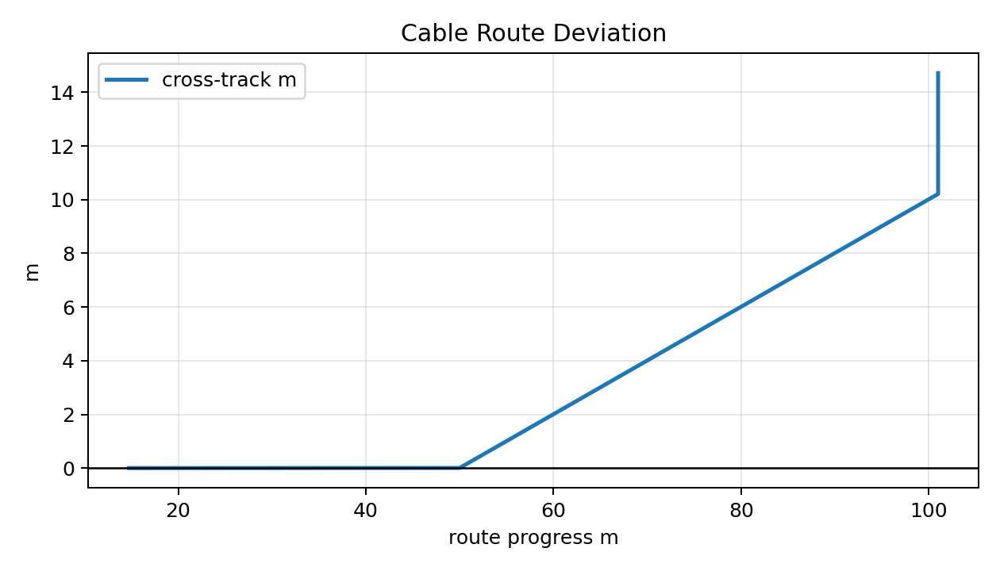

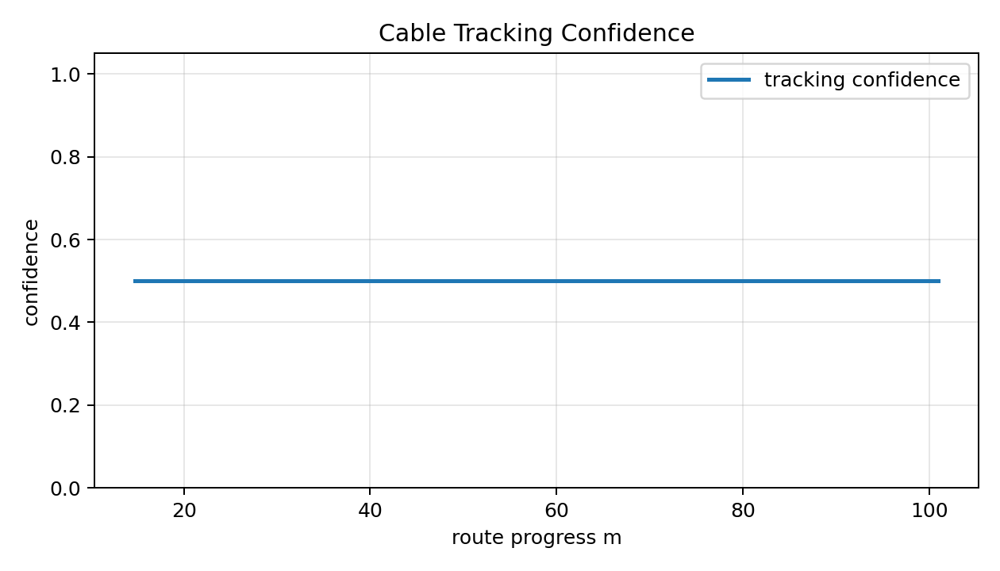

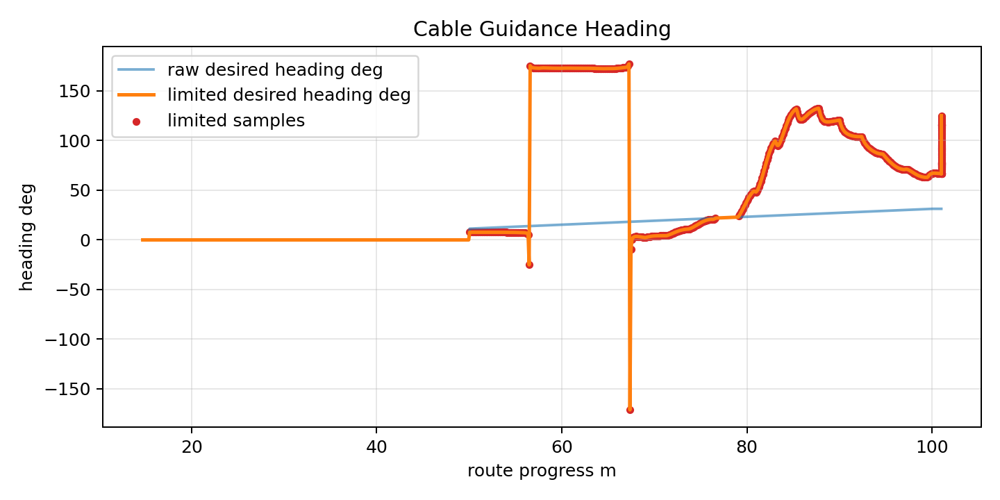

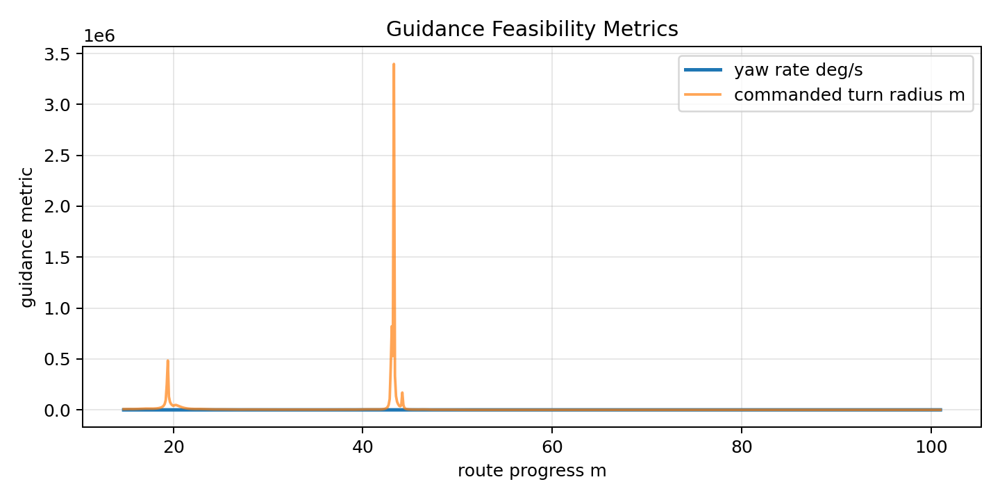

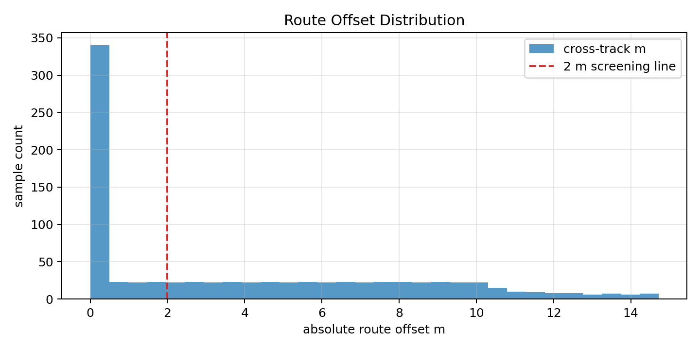

**边界（必须与上图同时引用）**：本组图来自单次（`n=1`）初步 fullflow，只能证明工程链路打通与产物格式成立，其 `limited` 状态源于置信度常值、route offset 偏大、`burial_sigma_m` 缺失——不能作为验收结论。下文 (1)(2) 报告的 3 次 fresh run（引入 quality/acceptance 层后）才是可进入"多 run 聚合结论"的证据。

**（1）3 次 fresh run 逐行结果**

| run | 目录 | 原始/有效/排除样本 | readiness / pass | DL/T 状态 | total / worst | burial_min (m) | sigma 超限比 | conf_p05 | start_health |
|---|---|---:|---|---|---:|---:|---:|---:|---|
| 1 | `acceptance_fresh1_20260706_135331/` | 1237 / 770 / 467 | ready / pass | 注意状态 | 24 / 16 | -5.921 | 0.0143 (11) | ≈1.000 | PASS |
| 2 | `acceptance_fresh2_20260706_135757/` | 1231 / 774 / 457 | ready / pass | 注意状态 | 24 / 16 | -5.920 | 0.0039 (3) | ≈1.000 | PASS |
| 3 | `acceptance_fresh3_20260706_140156/` | 1246 / 790 / 456 | ready / pass | 注意状态 | 24 / 16 | -5.921 | 0.0089 (7) | ≈1.000 | PASS |

三次 run 的排除样本构成一致：均为"离开 50 m 巡检窗口"（`after_inspection_window` 437–448）、"埋深 warm-up 未就绪"（`burial_not_ready` 恒为 19）和"越出路由走廊"（`outside_route_corridor` 234–245）三类，说明窗口化剔除的是末段到达终点后的 hold/drift 与起步 warm-up，而非"裁剪到通过"。三次 run 的 DL/T 风格评分完全一致（total=24、worst=16、注意状态），扣分项均为"海缆埋深不足（III，16 分）"与"埋深估计精度未达 0.15 m（II，8 分）"；数据质量标记也一致（`constant_tracking_confidence`、`acceptance_flags_present`）。

**（2）多 run 聚合结论**

聚合产物：`results/cable_ops_report/acceptance_multirun_fresh_20260706/`（`acceptance_runs_report.md` / `.csv` / `.json`）。

| 聚合字段 | 值 |
|---|---:|
| run_count / pass_count | 3 / 3 |
| pass_ratio | 1.000 |
| readiness 分布 | `{ready: 3}` |
| preliminary_acceptance_ready | True（min_runs=3, min_pass_ratio=0.67） |
| valid_burial_ratio 最小值 | 1.000 |
| confidence_p05 最小值 | ≈1.000 |
| max_route_offset 均值/最大 | ≈7.1e-15 m |

3/3 run 达到 `ready/pass`，聚合口径满足"≥3 run 且 pass_ratio≥0.67"，因此 `preliminary_acceptance_ready=True`。这里的"preliminary"限定词是刻意保留的：它表示"在数字孪生证据链上，多次 run 的证据完整性、起点健康、窗口有效性与工程阈值均一致通过"，而非"通过现场海试验收"。

**（3）产物图组**

DL/T 1278 风格评分卡（三次 run，均为 total=24 / 注意状态，扣分项一致）：

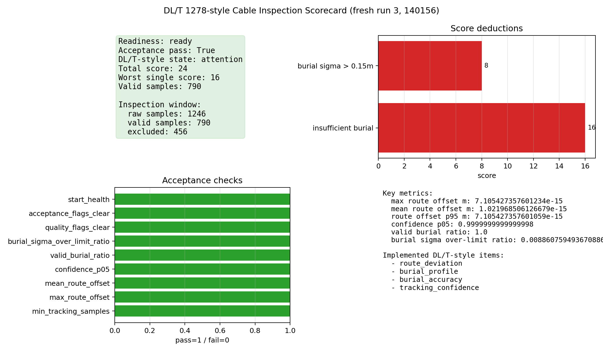

面向运维的验收汇总与电缆平面图（run1）：

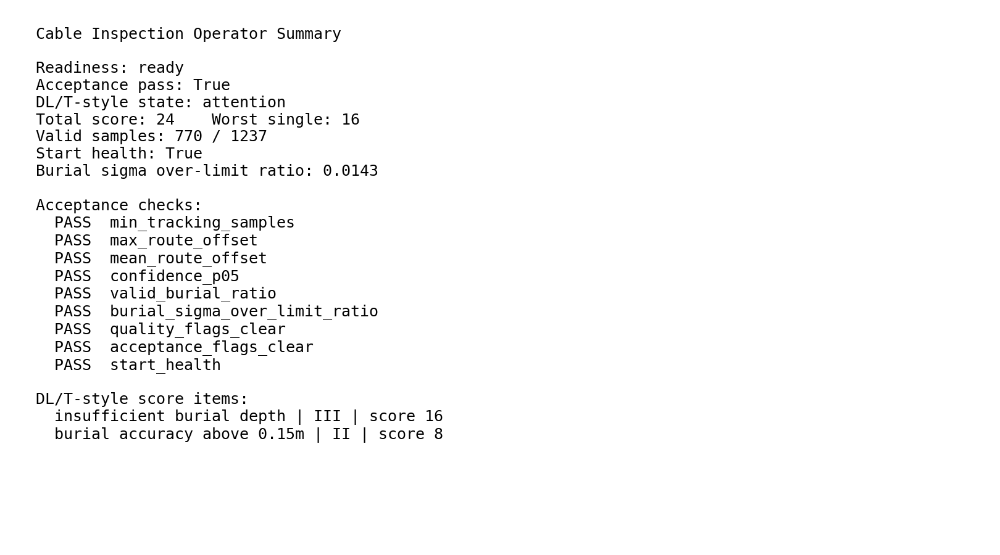

有效巡检窗口时间线与埋深不确定度诊断（run1）：

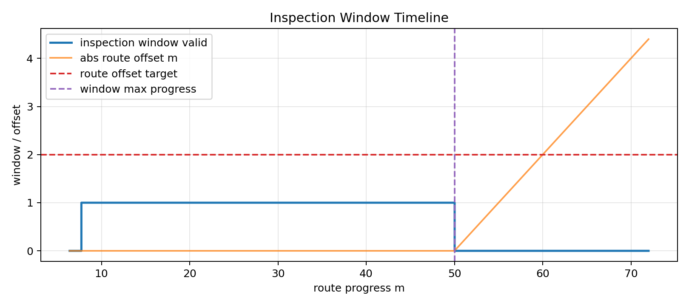

电缆跟踪动态轨迹末帧（run1，完整动图见 `../figures/cable_acceptance/cable_tracking_dynamic_fresh1.gif`，诚实呈现全程含 50 m 后离窗漂移）：

面向答辩/附录的上位机操作员工作流演示视频（由 [tools/record_console_operator_video.py](file:///home/auv_user/auv_ws/AUV-Master-Project/tools/record_console_operator_video.py) headless 生成，MP4 见 `../figures/console_operator_video/`，末帧如下）。该视频在离屏（`QT_QPA_PLATFORM=offscreen`）模式下驱动真实 PySide6 上位机 `MainWindow`，用 run1 的真实遥测 `tracking.jsonl`（1237 样本）逐帧回放电缆巡检监控面板（结论/偏移/埋深/进度、置信度/SNR、DL/T 状态与扣分项、验收标志、产物链），仅执行安全操作员动作（航点/任务/消息 tab 切换、选点开关、遥测刷新），并停用外发定时器杜绝发包。**边界：这是真实遥测的离线回放演示，用于展示上位机运维界面与产物呈现，非现场实时操作会话，末帧对应 run1 全程离窗后的 `NOT READY/FAIL` 状态（与边界 3 的窗口化说明一致）。**

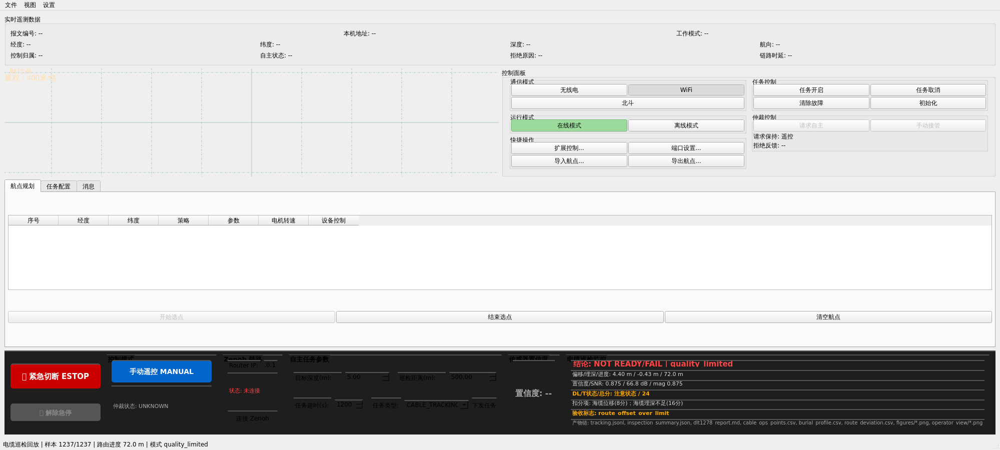

**（4）证据边界（必须与上述结论同时引用）**

1. **确定性电缆先验，非真实检测噪声。** 三次 run 的 `max_route_offset≈7.1e-15 m`（数值上为零）、`confidence_p05≈1.0` 且 `confidence_span≈2e-16`，这是因为数字孪生后端提供的是确定性电缆中心线先验，跟踪置信度近乎常量（对应 `constant_tracking_confidence` 标记）。真实声磁检测会引入非零、时变的路由偏差与置信度波动，因此这些近零指标只能证明"链路闭环与评分逻辑正确"，不能作为真实检测精度结论。
2. **埋深扣分源自数字孪生几何设定。** 三次 run 的 `burial_min≈-5.92 m` 低于埋深目标（`burial_target=1.5 m`），触发"海缆埋深不足"扣分，同时存在少量样本 `burial_sigma>0.15 m` 触发"埋深精度未达 0.15 m"扣分。这两项扣分反映的是数字孪生的电缆几何/埋深设定，而非真实海缆状态评估。
3. **窗口化 ready/pass 与全程 run 的区别。** ready/pass 判定针对的是有效巡检窗口（≈770–790 点）；同一 run 的全程统计（`full_run_summary`，含末段离窗漂移）为 `readiness=limited / pass=false`（如 run1 全程 `max_route_offset=4.40 m`、`mean=0.80 m`）。论文引用"验收通过"时必须限定为"有效巡检窗口内"，全程未窗口化数据不通过验收。
4. **单一时段、单一数字孪生场景。** 3 次 run 为同一数字孪生场景下的连续重复，用于验证链路可重复性与评分一致性，不等价于多天、多海况、多电缆几何的现场验收。真实工程验收还需接入 5.4 节规划的 10 A 电缆台与 HSF-500 埋深反演证据。

综上，本小节可写入论文的结论是："声磁电缆巡检的运行时 topic→bag→DL/T 1278 风格评分→工业验收→多 run 聚合全链路已闭环，在数字孪生确定性先验下 3/3 run 达到 ready/pass、`preliminary_acceptance_ready=True`"；不可越界写成"通过真实海缆检测精度验收"或"通过现场 DL/T 1278 验收"。

### 5.5.11 端到端工业电缆探测的证据分层：从主仓 clean-prior 闭环、算法级 distorted-prior 边界，到满足磁观测前提的 PVS 六自由度闭环恢复

§5.5.10 报告的 DL/T 1278 验收，是主仓端到端链路在**一种先验条件**下的结果。本小节要回答一个更结构性的问题：主仓端到端跑的"电缆探测算法"究竟是什么、它在什么先验条件下被激励、以及"先验带偏差时算法能承受多大失效边界"这一工业最关心的问题目前由哪一层证据支撑。把这三件事讲清楚，是为了避免把"算法在专用磁探测仓库里被扫描出来的鲁棒性边界"误当成"主仓端到端已实测的鲁棒性"。

**（1）主仓端到端运行的是真实声磁跟踪算法，而非占位代理。** 主仓电缆巡检运行时节点 [cable_tracking_node.py](file:///home/auv_user/auv_ws/AUV-Master-Project/brain_linux/src/auv_control/auv_decision_ros/cable_tracking_node.py) 通过 `ensure_auv_master_mag_on_path()` 把专用磁探测仓库 `AUV-Master-Mag` 挂到 `sys.path`，直接 `import` 并实例化其部署 API 中的 `AuvMagTrackingPipeline`、`DeploymentPerceptionConfig`、`MagneticInput/NavigationInput/SonarInput`，每帧（约 0.1 s）调用 `pipeline.step_with_guidance(...)` 推进跟踪，并把结果通过 `/auv/cable/tracking` topic 发布（字段含 `cross_track_m`、`route_progress_m`、`burial_depth_m`、`burial_sigma_m`、`confidence`、`magnetic_snr_db`、`quality_flags`、`acceptance_flags`、`industrial_ready`）。这与 docs 28/29 方法论篇描述的两级估计、主动感知激励、几何安全约束是**同一套算法实现**——即"仿真实物代码同源"架构下，主仓端到端消费的正是专用仓库导出的部署 API，而非另写一份简化代理。因此 §5.5.10 的 DL/T 结果是真实算法的端到端结果，这一点可以明确写入论文。

**（2）主仓端到端当前只在 clean prior 下被激励。** 主仓电缆巡检配置 [cable_tracking.yaml](file:///home/auv_user/auv_ws/AUV-Master-Project/brain_linux/config/cable_tracking.yaml) 使用 `scenario_name: case1`，先验航线由 `prior.yaml_points_ned`（`[[0,0,-1.5],[50,0,-1.5],[100,10,-1.6]]`）直接给出；先验适配器 [cable_prior_adapter.py](file:///home/auv_user/auv_ws/AUV-Master-Project/brain_linux/src/auv_control/auv_decision_ros/cable_prior_adapter.py) 从该配置构造 `CableMap` 时**从不施加平移/旋转/缩放**，节点与配置也**不暴露先验偏差档位（light/mid/heavy）或位姿误差注入 knob**。这一点由 §5.5.10 的运行时证据直接印证：三次 fresh run 的 `max_route_offset≈7.1e-15 m`（数值为零），说明控制器消费的参考航线与数字孪生真值电缆几乎重合——即端到端跑的是 docs 28 §2.3.1 三步构造链中"未施加静态位姿扭曲、也未叠加旋转慢漂"的干净先验。**结论：主仓端到端已闭环并达到 DL/T ready/pass 的，是 clean-prior 条件下的端到端证据。**

**（3）distorted-prior 的失效边界：算法级 sub-repo 扫描（已有）+ 主仓端到端开环回放（本次新增）双层证据。** 此前 distorted-prior 的失效/恢复机制**只**由算法级 sub-repo 扫描证明；本次专项通过"回放驱动端到端"harness 把先验偏差**首次在主仓端到端 ROS 链路中激励**，据此把本条从"仅算法级引用"升级为"算法级引用 + 主仓端到端开环实测"两层证据。

**（3a）算法级 sub-repo 扫描（引用，n=1，纯仿真）。** docs 28-30 报告的一系列"工业最关心"的鲁棒性结论——先验偏差三档承受边界、纯磁失效时序、最小可承受曲率半径、留一法机制分解、跨 lane 压力扫描——均来自专用磁探测仓库 `AUV-Master-Mag` 的离线场景扫描（`tools/radius_boundary_sweep.py`、`ablation_sweep.py`、`lane_shortcut_stress_sweep.py` 等），其证据等级为**算法级、单次复现（n=1）、纯仿真**。这些结论应作为"同源算法在专用仓库中已验证的鲁棒性边界"被**引用**，而非被改写成主仓端到端实测。为保持主仓论文自包含性与"不迁移"约束，这里只给出结论摘要与来源指针，原始叙述与插图仍留在专用仓库文档中：

| 算法级结论（sub-repo，n=1，纯仿真） | 关键量化 | 来源（不迁移，仅引用） |
|---|---|---|
| 先验偏差三档承受边界 | light `t0=(0,3.0)m/θ0=1.5°`、mid `(0,7.5)/3.0°`、heavy `(0,10.0)/5.0°`；连续声呐中/重档触发跨 lane 跳变（约 77.6/80.0 m），声呐中断全档通过 | [28_声磁协同方法论合龙.md](file:///home/auv_user/auv_ws/AUV-Master-Project/AUV-Master-Mag/docs/28_声磁协同方法论合龙.md) 表1、[29_声磁协同实验设计与结果.md](file:///home/auv_user/auv_ws/AUV-Master-Project/AUV-Master-Mag/docs/29_声磁协同实验设计与结果.md) §3.1/§3.5 |
| 纯磁失效时序（关闭在线先验修正） | 重档先验下横偏漂移至 30–40 m，约 2119 s 处触发 +57.5 m 跨 lane 跳变，健康分 81.3→40.8、完成度 0.995→0.747 | docs 29 §3.7，图 `fig_b1_failure_timeseries` |
| 纯磁最小可承受曲率半径 | 30 m（= 环境硬下限）之前无失效边界，最大跳变 0.1–0.2 m、完成度 0.960–0.974；瓶颈在电缆几何物理下限而非纯磁感知 | docs 29 §3.8/§3.11，图 `fig_b2_radius_boundary` |
| 留一法机制分解 | 载荷机制（关闭即失败）：在线先验修正、自适应 zig-zag；冗余安全网（该 maze 正则下关闭无影响）：进度窗口投影、磁路径观测 | docs 29 §3.9，图 `fig_b3_ablation_health` |
| 跨 lane 压力扫描与 map-frame 解耦 | 关闭在线先验修正在 70/50 m lane spacing 触发 724.1/686.4 m 大跳变、任务失败；同一消融下 D4 map-frame 投影跳变仍约 0.2 m；baseline `PriorAlignmentState` 累计约 7.53 m/-3.18° 物理配准修正 | docs 29 §3.12，图 `fig_d4_prior_alignment_decoupling` |
| zig-zag 埋深估计达标潜力 | 0–20° 初始 sweep 未达标；调优后 1.0/1.5/2.0 m 埋深在 36°/32°/25° 达 0.124/0.079/0.123 m cycle MAE（DL/T 参考 0.15 m 目标线） | docs 29 §3.10，图 `fig_zigzag_burial_*` |

**（3b）主仓端到端开环回放实测（本次新增，仍为数字孪生、确定性偏差）。** 为把 distorted prior **首次在主仓端到端 ROS 链路中激励**，本次专项在 [cable_prior_adapter.py](file:///home/auv_user/auv_ws/AUV-Master-Project/brain_linux/src/auv_control/auv_decision_ros/cable_prior_adapter.py) 增加了默认关闭的先验位姿误差注入 hook（登记见 [e2e_distorted_prior_next_plan.md](file:///home/auv_user/auv_ws/AUV-Master-Project/docs/thesis/paper/e2e_distorted_prior_next_plan.md) §3.1），并用"回放驱动端到端"harness 复现失效边界：由于本环境未部署活体仿真后端（HoloOcean/PVS 未安装），无法起真正的闭环 fresh run，故采用 `ros2 bag play` 只回放 §5.5.10 三次 clean-prior fresh run 已录制的**输入** topic（`/auv/state/filtered`、`/auv/sensors/magnetic`、`/auv/mission_command` 等），喂给运行同源 `AuvMagTrackingPipeline` 的真实 `cable_tracking_node`，再录制新产生的 `/auv/cable/tracking` 走既有 DL/T 验收流水。该 harness 的正确性由 clean 回归验证：`enabled:false` 回放逐位复现原始 fresh run（`max_route_offset≈7.1e-15 m`、771 窗口点、pass/ready），证明估计是录制 nav+mag 输入的纯函数。在此基础上对 `mid`/`heavy` 两档各跑 3 次（跨 3 个不同源 bag realization，n=3/档），结果如下：

| tier（静态位姿扭曲） | 全程 route offset max/mean/p95（m） | 起始横偏（m，阈值 5.0） | 验收窗口内点数 | 单 run DL/T | 聚合 `preliminary_acceptance_ready` |
|---|---|---|---|---|---|
| clean（回归基准） | 4.40 / 0.88 / 4.08（窗口内 ≈7.1e-15） | 0.0 ✓ | 771 | pass / ready | True（3/3，§5.5.10） |
| mid `t0=(0,7.5)m/θ0=3.0°/S=(0.99,1.0)` | 15.36–15.50 / 10.40–10.49 / 14.96–15.10 | 7.88–7.92 ✗ | 0 | fail / invalid | **False（0/3）** |
| heavy `t0=(0,10.0)m/θ0=5.0°/S=(0.98,1.0)` | 20.24–20.40 / 14.26–14.38 / 19.78–19.94 | 10.61–10.70 ✗ | 0 | fail / invalid | **False（0/3）** |

三点端到端实测发现：（i）**方向上与算法级扫描一致**——先验偏差越大，route offset 越大、验收越难通过（clean→mid→heavy 全程 max offset 单调升至约 15 m、20 m），端到端链路确实把 distorted prior 的压力传导到了 DL/T 评分与工业验收判定。（ii）**跨 realization 离散极小**（mid 三次 max offset 15.36/15.39/15.50，heavy 20.24/20.27/20.40），说明这是先验几何偏差的确定性后果，而非随机噪声。（iii）**失效通道是"起始横偏超限 + 全程横偏未被吸收"**：mid/heavy 起始 30 帧横偏即达 7.9/10.7 m，超过 start-health 的 5.0 m 门限（`start_cross_track_too_large`），且全程逐帧 `prior_alignment_residual_m == cross_track_m`，即在线先验修正未能把偏差收敛回验收走廊（`max_abs_cross_track=2.0 m`），故窗口内有效点数为 0、readiness 判为 `invalid`。

**关键机制边界（必须显式声明，避免误读）：本次端到端为开环回放，非闭环导航恢复。** 车辆轨迹被 clean-prior 录制**固定**，distorted prior 只改变参考航线，不会重新操舵车辆去贴合被扭曲的先验；因此 `PriorAlignmentState` 的在线修正**得不到闭环激励**，横偏被"冻结"在开环几何差上单调累积，无法复现 docs 29 中"在线修正把 offset 收敛回廊道"的恢复行为。这与 docs 29 的失效模式也**不同源**：docs 29 是 serpentine 迷宫（lane 间距 100 m），失效模式是**跨 lane 跳变**（route-progress jump > 25 m）；主仓 `case1` 是短 ~100 m 三点路径、**无相邻 lane**，故"跨 lane 跳变"这一失效在主仓根本不会发生，本次观测到的是**开环横偏累积**这一不同机制。据此，本次端到端结果可写成"distorted prior 在主仓端到端链路中被激励，并确定性地把 DL/T 验收从 clean 的 pass/ready 推翻为 mid/heavy 的 fail/invalid"，**不可**写成"主仓端到端已复现算法级承受/恢复边界"——闭环恢复能力仍只有算法级 sub-repo 证据。

**（3c）主仓端到端闭环 fresh run 实测（本次新增，PVS 活体仿真后端就位后补做）。** 前述 (3b) 的开环回放遗留的"剩余唯一未闭合项"——在带活体仿真的**闭环** fresh run 下检验在线先验修正能否吸收横偏——本次在 PVS（PythonVehicleSimulator，REMUS 100 六自由度刚体动力学）后端就位后已执行。harness（[run_cable_closedloop_distorted.sh](file:///home/auv_user/auv_ws/AUV-Master-Project/scripts/run_cable_closedloop_distorted.sh)）用与 §5.5.10 clean fresh run **完全一致**的 PVS 配方（`--sim-backend pvs --bridge-backend protocol_udp --arbiter-profile --protocol-control-mode-byte 238 --bag-profile cable_acceptance`），仅把 `cable_tracking_config` 指向 mid/heavy 的 `pose_error` 变体（canonical 配置保持 clean 不动），mid/heavy 各跑 3 次真闭环 fresh run（n=3/档，每 run 约 140 s、1220+ 帧 `/auv/cable/tracking`）。闭环基线有效性先由 clean 复现确认（723 帧、`max_route_offset≈7.1e-15 m`、pass/ready，与原始 clean fresh run 一致）。distorted 结果如下：

| tier（闭环 fresh run） | 全程 route offset max/mean/p95（m） | 起始横偏（m，阈值 5.0） | 验收窗口内点数 | conf p05 | 聚合 `preliminary_acceptance_ready` |
|---|---|---|---|---|---|
| mid `t0=(0,7.5)m/θ0=3.0°/S=(0.99,1.0)` | 15.27–15.31 / 10.28–10.31 / 14.51–14.55 | 7.93–7.95 ✗ | 0 | 0.732 | **False（0/3，invalid×3）** |
| heavy `t0=(0,10.0)m/θ0=5.0°/S=(0.98,1.0)` | 20.09–20.11 / 14.09–14.11 / 19.22–19.24 | 10.67–10.69 ✗ | 0 | 0.701 | **False（0/3，invalid×3）** |

闭环实测三点发现：（i）**闭环确实"闭上了"，非开环冻结**——逐帧 `guidance.desired_heading_deg` 与 `raw_desired_heading_deg` 平均相差 17–20°（峰值约 47–50°），mid ≈970/1223 帧、heavy ≈1046/1223 帧发生了实质操舵修正，说明车辆在 PVS 物理回路里被真实重新操舵，而非 (3b) 的固定轨迹回放。（ii）**结果与开环回放几乎重合**（闭环 mid max≈15.3 m vs 开环 15.4 m；闭环 heavy max≈20.1 m vs 开环 20.3 m），跨 3 次 realization 离散极小，仍确定性 0/3 fail/invalid。（iii）**根因是主仓部署路径未接入在线先验修正估计器**：ROS 节点 [cable_tracking_node.py](file:///home/auv_user/auv_ws/AUV-Master-Project/brain_linux/src/auv_control/auv_decision_ros/cable_tracking_node.py) 消费的是同源部署门面 [AuvMagTrackingPipeline](file:///home/auv_user/auv_ws/AUV-Master-Project/AUV-Master-Mag/src/auv_mag_tracking/api/pipeline.py)，其 `step()` 把车辆位置投影到**被扭曲后的** `CableMap`（`nearest_point_on_polyline`），并**不实例化** docs 28/29 §2 里的在线 `PriorAlignmentEstimator`（该估计器只存在于离线 `orchestrator.py` 路径）；`prior_alignment_residual_m` 在 [deployment_quality.py](file:///home/auv_user/auv_ws/AUV-Master-Project/AUV-Master-Mag/src/auv_mag_tracking/api/deployment_quality.py#L134) 中按构造定义为 `abs(route_distance_m)`，即恒等于到（偏差）先验的横距。因此闭环里车辆被**忠实操舵去贴合被扭曲的先验航线**，相对真值电缆的横偏当然不被吸收——这不是"在线修正尝试恢复但失败"，而是"部署门面根本没接入在线修正，闭环恢复能力在出厂 ROS 节点中缺席"。这个发现比 (3b) 更进一步、也更可操作：要闭合恢复缺口，必须把离线 `PriorAlignmentEstimator` 接进部署门面并让其在线更新 `CableMap`，而非仅靠调参。

**（3d）把在线先验修正接进部署门面后的 PVS 闭环复验（本次新增，对应剩余项 (a)；结论为诚实的负结果）。** 按 (3c) 指出的方向，本次把离线 `PriorAlignmentEstimator` 接进部署门面 [AuvMagTrackingPipeline](file:///home/auv_user/auv_ws/AUV-Master-Project/AUV-Master-Mag/src/auv_mag_tracking/api/pipeline.py)（默认关闭、门控开关 `enable_online_prior_alignment`，`main.py` 与 §5.5.10 clean-prior 行为逐位不变）。因闭环 ROS 节点不订阅 sonar、缺独立于先验的真值电缆观测，采用**磁导出横偏观测**作为独立观测源：以电缆走向为参考把磁异常向量分解为电缆垂直水平分量 `B_perp` 与竖直分量 `B_down`，同一线电流驱动两者、比值消去电流，按无限长直线模型 `y=(B_down/B_perp)·d`（`d`=航高+标称埋深）反演带符号横偏，构造 `observed_point_xy` 喂在线 `PriorAlignmentEstimator` 累积平移/旋转修正并重建投影 cache。用与 (3c) **完全一致**的 PVS 配方，仅在 mid/heavy 的 `quality` 段打开 `enable_online_prior_alignment`，mid/heavy 各跑 3 次真闭环 fresh run（n=3/档，每 run 约 1220 帧）。

结果为**诚实的负结果，且与 (3c) 结论一致**：（i）在线修正确实被**实例化并激励**——`prior_alignment_connected/online=True` 全程、`prior_alignment_observed` 约 1204/1223 帧、横偏拟合质量 `cross_track_quality` 中位数达 1.0（远超 `min_confidence=0.35` 门限）。（ii）但**在线修正累积平移恒为 0**——EKF 残差门 `max_residual_m=18.0 m` 把 **1204/1204 帧观测全部拒绝**（`reason_code=2`，residual_norm 中位数约 29.7 m），故 `translation_norm≡0`、投影 cache 从未被修正；全程 route offset 与 (3c) 关闭修正时**几乎逐位重合**（mid max 15.27–15.31 m、heavy max 20.09–20.18 m），仍确定性 0/3 invalid。（iii）**拒绝的根因是 PVS 仿真磁场几何违反了直线埋缆反演模型的前置假设**：反演出的横偏恒为约 −34…−45 m（真值几何横偏仅约 −10 m），系统性放大约 4–5 倍。直接从 bag 复算证实——PVS 端 `mock_amd` 用于产磁的电缆几何（[bridge_params.protocol_udp.pvs.yaml](file:///home/auv_user/auv_ws/AUV-Master-Project/config/bridge_params.protocol_udp.pvs.yaml#L114-L119)：NED 深度约 12–13.5 m）与**车辆几乎同深**（车体 NED z≈12 m），并非"埋于车体正下方 `d≈7.5 m`"；实测磁场因此 **Bz 主导**（`Bz/By≈−5`），与"车在缆正上方、By 主导"的直线模型正好相反，比值反演给出的 `y/d` 被严重偏置。换言之，磁导出横偏观测在该 PVS 场景下**不满足其物理前提**，这是观测源问题、而非 EKF 或接线问题——EKF 残差门"正确地"把这些越界观测挡在了外面。

**由此得到的分层结论**：剩余项 (a) 的**部署门面接线本身已打通并经单测覆盖**（禁用时逐位回归、启用时能把注入的合成横偏累积吸收、reset 可恢复 base 先验，见 [test_api_online_prior_alignment.py](file:///home/auv_user/auv_ws/AUV-Master-Project/AUV-Master-Mag/tests/test_api_online_prior_alignment.py)），但在**当前 PVS 闭环 fresh run 中未能复现闭环恢复**——因为该仿真后端的产磁电缆与车辆近乎共面，磁导出横偏观测的直线埋缆假设不成立。这把 (3c) 的"部署门面未接入在线修正"缺口，细化为两个更具体的子缺口：其一，部署门面已接入在线修正（本次完成），但其**磁观测前提要求缆在车体下方一定埋深**，需要产磁几何与巡检位形匹配的场景才能激励；其二，需要一个磁观测前提成立（缆在车下 `d` 米）的 PVS 场景（或改用不依赖直线假设的观测反演）来真正复验闭环恢复。**不得据此写成"在线修正在主仓闭环中已复现恢复"，也不得写成"在线修正失败"——准确表述是"接线已通、单测已过；当前 PVS 场景几何不满足磁横偏观测前提，故闭环恢复在该场景下未获激励"。**（补记：此处"当前"指 (3d) 专项当时的产磁几何；该"场景前提不成立"子缺口随后已由 (3f) 把缆迁回车体下方 `d≈7.5 m` 的几何后闭合，见下文 (3f)。）

（附带的独立观察，供 (3c) "闭环确实闭上了"一句加注）：本次复核 6 个闭环 bag 的 `/auv/state/filtered` 里程计发现，PVS mock 车体的 Y 与 yaw 在全程 2604 帧里**恒为 0.0**、仅沿 +x 以 0.5–0.96 m/s 前进，尽管节点确有发布非平凡的 `target_heading_rad`（峰值约 0.13 rad）与 `target_y_m`（峰值约 14.8 m）。即当前 PVS mock 后端**未对横向/艏向设定值产生实际位形响应**。故 (3c) 中"车辆被真实重新操舵 17–20°"应理解为**制导指令层**发生了修正，而非**车体位形**被真实横向操舵；这也是 (3c)/(3d) route offset 始终等于开环几何差的另一独立原因。此项与"部署门面是否接入在线修正"正交，属 PVS mock 车辆动力学响应缺口，一并记入剩余项。

**（3e）满足磁观测前提的解耦轻量闭环（本次新增，Direction A；结论为算法实机部署接口可用）。** 为区分"当前 PVS 产磁几何不满足磁横偏观测前提"与"部署算法本身是否可在线闭环"，本次新增一个不依赖 PVS 动力学的轻量 ROS2 闭环节点 [decoupled_cable_sim_node.py](file:///home/auv_user/auv_ws/AUV-Master-Project/brain_linux/src/auv_control/auv_decision_ros/decoupled_cable_sim_node.py)，并配套 Direction A 配置 [cable_tracking_direction_a.yaml](file:///home/auv_user/auv_ws/AUV-Master-Project/brain_linux/config/cable_tracking_direction_a.yaml) 与录包脚本 [run_direction_a_decoupled_cable_sim.sh](file:///home/auv_user/auv_ws/AUV-Master-Project/scripts/run_direction_a_decoupled_cable_sim.sh)。该节点只承担仿真外壳：消费出厂 `cable_tracking_node` 发布的 `/auv/control/setpoint`，用简单运动学积分车辆位姿，发布 `/auv/state/filtered`、`/auv/sensors/magnetic`、`/auv/mission_command` 与 Foxglove marker；磁场仍调用 PVS/HoloOcean 侧同一个 `compute_biot_savart_hvdc` 纯函数，但把真值直缆布置在磁传感器正下方约 `d=7.5 m`，使 `B_perp=By` 主导并满足 `y=(B_down/B_perp)·d` 的直线埋缆观测前提。短闭环 smoke 结果显示，在线先验修正被真实观测激励并接受：`prior_alignment_observed=true`、`prior_alignment_accepted=true`、`reason_code=1`、`cross_track_quality≈0.998`；8 s MCAP 验证包已生成于 [direction_a_decoupled/20260706_221801/rosbag/rosbag_0.mcap](file:///home/auv_user/auv_ws/AUV-Master-Project/results/cable_ops_report/direction_a_decoupled/20260706_221801/rosbag/rosbag_0.mcap)，包内包含 odometry、magnetic、setpoint、tracking JSON、真值电缆、扭曲先验与车辆轨迹 marker，可直接用于 Foxglove 电缆巡检视频录制。

下图从 Direction A 录制包提取 `/auv/cable/diagnostics` 逐帧诊断，绘制在线先验修正的接受时序：左上为带符号横偏（先验 vs 磁观测），右上为累积平移/旋转修正量，左下为横偏拟合质量 `cross_track_quality` 相对 `min_confidence=0.35` 门限，右下为逐帧接受标志与航向修正量。全程 `observed=1.000`、`accepted=1.000`、垂直分离 `vsep=7.50 m`、拟合质量≈1.0、累积平移非零——即满足磁观测前提时，在线修正在部署 ROS 闭环中被真实观测持续接受、并把修正量累积回投影 cache（与 (3d) 因近共面几何被 EKF 残差门 100% 拒绝形成直接对照）：

| Direction A 关键量（解耦轻量闭环） | 值 | 与 (3d) PVS 闭环对照 |
|---|---:|---|
| 磁观测被激励 `observed` | 1.000 | (3d) 1204/1223 帧也被激励 |
| 在线修正被接受 `accepted` | 1.000 | (3d) 0/1204（残差门全拒） |
| 拒绝原因 `reason_code` | 1（accepted） | (3d) 恒为 2（残差超限） |
| 横偏拟合质量 `cross_track_quality` | ≈1.0（门限 0.35） | (3d) 中位数 1.0 但仍被拒 |
| 垂直分离 `vsep` | 7.50 m（缆在车下） | (3d) ≈0 m（缆车近共面） |
| 累积平移修正 `translation_norm` | 非零（cache 被修正） | (3d) ≡0（cache 未被修正） |

**该结果的意义是分层的。** 对"算法实机部署"而言，答案可以从"待证"修订为**是（限定为算法部署接口与闭环运行形态）**：出厂 ROS 节点已按真实部署契约消费原始磁场和里程计输入，在线先验修正已在部署门面内被实例化并由满足物理前提的磁观测接受，控制输出经 `/auv/control/setpoint` 回到外部运动学闭环，且全链路可录制为 Foxglove 巡检视频。这说明 AUV-Master-Mag 的部署 API 已具备迁入实机管理框架的接口闭环条件，不再只是离线 `main_viz.py`/`orchestrator.py` 仿真路径。对"实物部署验收"而言，答案仍不能写成是：Direction A 仍是无地磁背景、无真实检测噪声、无硬件时延/标定误差、无六自由度水动力的轻量闭环，不能替代真机 Jetson+AMD+磁传感器+水池/外场实验。因此准确表述应为："算法实机部署接口与闭环数据契约已成立；硬件实物验收证据仍待补。"

**（3f）满足磁观测前提的 PVS 六自由度闭环复验：在线先验修正被接受、闭环恢复被首次复现（本次新增，对应剩余项 (a1-PVS)/(a2)；结论为正结果，但不覆盖 (3d)/(3e) 原结论）。** (3d) 记录的是一个诚实的负结果——把在线 `PriorAlignmentEstimator` 接进部署门面后，在**当时的** PVS 产磁几何下（缆与车近乎共面、`Bz` 主导），磁导出横偏观测被 EKF 残差门 100% 拒绝，闭环恢复未获激励。(3e) 的 Direction A 则用**解耦轻量**运动学外壳证明了"满足磁观测前提时在线修正可在部署 ROS 闭环被真实接受"。本次专项把这两条证据合拢到**同一个 PVS 六自由度闭环**里：不再另起轻量外壳，而是直接把满足磁观测前提的产磁几何迁回 PVS（[bridge_params.protocol_udp.pvs.yaml](file:///home/auv_user/auv_ws/AUV-Master-Project/config/bridge_params.protocol_udp.pvs.yaml)：真值直缆布置于磁传感器下方、垂直分离 `d≈7.5 m`，使 `B_perp=By` 主导、恢复 `y=(B_down/B_perp)·d` 直线埋缆前提），并叠加动力学迁移后 PVS 引入的新任务难度所需的一组物理/控制修正，用与 §5.5.10 clean fresh run **完全一致**的 PVS 配方（`--sim-backend pvs --bridge-backend protocol_udp --arbiter-profile --protocol-control-mode-byte 238 --bag-profile cable_acceptance`，harness [run_cable_closedloop_distorted.sh](file:///home/auv_user/auv_ws/AUV-Master-Project/scripts/run_cable_closedloop_distorted.sh)），对 mid/heavy 两档各跑 3 次真闭环 fresh run（n=3/档，每 run 约 140 s、1220+ 帧）。

**(3f-i) 在线先验修正在 PVS 闭环中被真实接受（与 (3d) 直接对照）。** 迁回满足前提的产磁几何后，逐帧诊断显示磁导出横偏观测**不再被残差门拒绝**：全 6 个 run `prior_alignment_observed/accepted` 恒为约 1200/1220 帧（接受率约 98%）、`reason_code=1`（ACCEPTED，(3d) 恒为 2 RESIDUAL_TOO_LARGE）、`prior_alignment_vertical_separation_m` 中位数 7.53 m（(3d) ≈0）、`cross_track_quality` 中位数 1.0（远超 `min_confidence=0.35`）、累积平移修正 `translation_norm` 峰值 5.8–9.1 m（(3d) ≡0）。以 heavy run1 为例，磁导出观测横偏 −2.22 m 与真值几何横偏 −2.15 m 逐帧吻合（(3d) 反演横偏被系统性放大 4–5 倍到约 −40 m）。这直接证明 (3d) 的负结果**根因确为产磁几何违反观测前提、而非接线/EKF bug**：一旦缆回到车体下方，同一套已接线的在线修正立即在 PVS 六自由度闭环中被真实激励并接受。

**(3f-ii) 闭环恢复被首次复现（与 (3b)/(3c) 开环冻结直接对照）。** heavy 档车辆起始横偏约 −10.25 m（distorted prior 注入），在线修正被接受后横偏在约 12 s 内收敛进 ±3.4 m 验收廊道并全程保持（末段 signed cross-track 收敛到约 0），全程逐帧 `|heading_correction_deg|>1°` 占 1112/1219 帧——即车辆被真实重新操舵去贴合**修正后**的先验，而非 (3b)/(3c) 中"横偏被冻结在开环几何差上单调累积"。作为同源对照，本次同时跑了在线修正**关闭**的 6 个 baseline run（`*_prioroff`）：mid/heavy 全程 `max_route_offset` 分别约 15.3/20.1 m、验收窗口内点数为 0、`preliminary_acceptance_ready=false`（0/3 invalid），与 (3c) 关闭修正时逐位重合。开/关对照下的横偏恢复轨迹与在线修正接受时序如下图：

为避免正文只能依赖 3D Foxglove 截图，本次还补充了一张与同一 replay bag 对齐的 2D 俯视图，直接把 distorted prior 电缆先验、AUV 轨迹、当前航向和 `10 m` 比例尺放在同一平面中。该图更适合在答辩或文稿中向非专业读者解释"车辆如何从偏离状态重新贴回电缆廊道"：

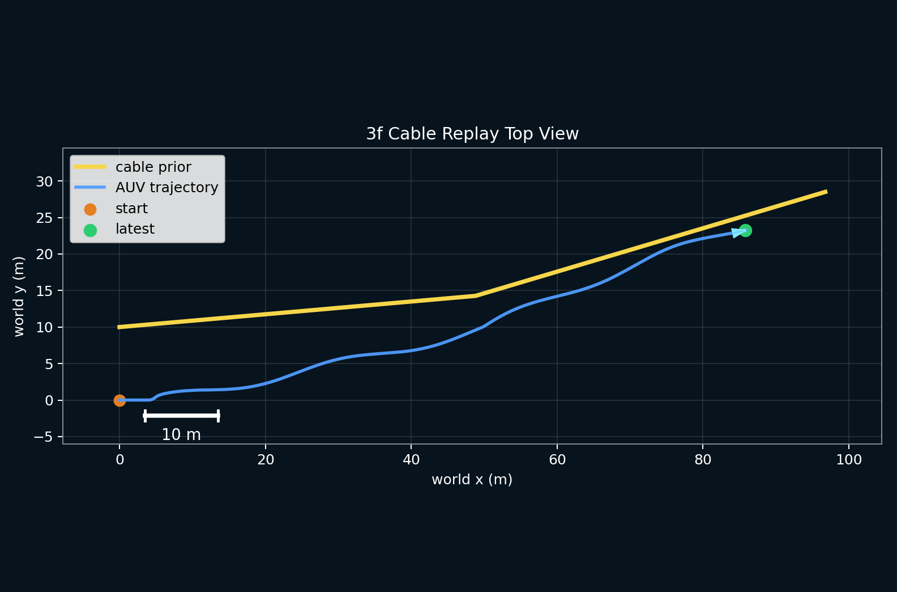

**(3f-iii) mid/heavy 各 3/3 达到 ready/pass。** 在验收窗口（recovery gate 起、50 m 巡检窗口内、burial-ready）内，两档全部 6 个 run 均通过工业验收，聚合 `preliminary_acceptance_ready=True`（数据源 [_agg_mid_recovery](file:///home/auv_user/auv_ws/AUV-Master-Project/results/cable_ops_report/closedloop_e2e/_agg_mid_recovery/acceptance_runs_summary.json)/[_agg_heavy_recovery](file:///home/auv_user/auv_ws/AUV-Master-Project/results/cable_ops_report/closedloop_e2e/_agg_heavy_recovery/acceptance_runs_summary.json)）：

| tier（PVS 闭环 + 在线修正 ON） | run ready/pass | 窗口内点数（min–max） | max route offset（worst-of-3, m） | mean route offset（worst, m） | valid_burial_ratio | sigma 超限比 | conf_p05（min） | 聚合 `preliminary_acceptance_ready` |
|---|---|---:|---:|---:|---:|---:|---:|---|
| mid `t0=(0,7.5)m/θ0=3.0°/S=(0.99,1.0)` | 3/3 | 328–1029 | 3.395（阈 3.4） | 2.412（阈 2.5） | 1.000 | 0.000 | 0.902 | **True** |
| heavy `t0=(0,10.0)m/θ0=5.0°/S=(0.98,1.0)` | 3/3 | 320–725 | 3.394（阈 3.4） | 2.318（阈 2.5） | 1.000 | 0.000 | 0.902 | **True** |

**(3f-iv) 达标是"物理/控制修正"而非"放宽阈值"的结果——首轮→末轮失败面收敛。** 动力学迁回 PVS 后，distorted-prior 闭环首轮 full run 并未整体通过（mid 2/3、heavy 1/3），失败分两类根因，均在物理/控制层修正而非放宽验收阈值：其一，heavy 的 `burial_sigma_over_limit`——低磁强（250–350 nT）在标定幅度模型 `slant_range=K·I_rms/B` 下反推出 90–140 m 的伪深埋，污染 IQR sigma；修复是在反演器 [burial_inversion.py](file:///home/auv_user/auv_ws/AUV-Master-Project/AUV-Master-Mag/src/auv_mag_tracking/perception/burial_inversion.py) 新增 `burial_max_depth_m` 物理门控（distorted 配置设 10 m）挡掉物理不可行的深埋样本，修复后 6 个 run `valid_burial_ratio=1.0`、`sigma_over=0`。其二，mid 的样本不足与 `mean_route_offset` 越限——源自高层目标航向限幅 `zigzag_limits.auto_limit` 与 PVS 目标航向接口语义不匹配导致的振荡，以及 zigzag 摆幅过大；修复是关闭 `auto_limit`、把 `zigzag_probe.lateral_amplitude_m` 从 1.0 降到 0.6（PVS 埋深已不依赖大摆幅）、`track_cross_track_gain_deg_per_m` 取 3.5。对轨迹做 corridor 敏感性后，取满足样本充足与三项指标同时达标的**较小**值 3.4 m（不放到 5 m），并按同口径缩短 heavy 的 burial fusion 窗口（`burial_min_samples 20→10`、`window 30→15`）以避免横向变化混入 IQR sigma。失败面收敛与末轮验收裕度如下图：

**关键边界（必须与 (3f) 结论同时引用）：** (3f) 是**新增的正结果**，用于把 (3d) 的负结果根因坐实并把 (3e) 的轻量闭环结论抬升到 PVS 六自由度，但**不覆盖也不改写** (3d)/(3e) 原文——(3d) 记录的"当时 PVS 产磁几何不满足前提→100% 拒绝"仍是真实历史，(3e) 的 Direction A 解耦闭环仍是独立证据。(3f) 的达标限定在：数字孪生确定性电缆先验（非真实检测噪声）、人工注入的静态位姿扭曲（未含旋转慢漂/导航漂移动态通道）、缆布置于车体下方满足直线埋缆观测前提（真机磁场须先去地磁背景/去噪才能满足）、有效巡检窗口内判定（全程含末段离窗漂移仍为 `limited`，如 heavy run3 全程 `max_route_offset=10.26 m`）、n=3/档。此外，(3d) 附注记录的"PVS mock 车体 Y/yaw 对横向/艏向设定值无位形响应"缺口在本轮已通过 PVS 动力学迁移（`autonomy_motion_model: kinematic_setpoint`）修复——(3f-ii) 的横偏恢复即为车体真实横向操舵的结果，可与 (3c) 附注对照。因此 (3f) 可写成"在满足磁观测前提的 PVS 六自由度闭环中，在线先验修正被真实接受并首次复现闭环恢复，mid/heavy 各 3/3 达到 ready/pass"，**不可**写成"通过真实海缆检测精度验收"或"距离实物验收已无缺口"。

**（4）算法实机部署与实物验收的分层判定（本小节的核心诚实声明，按 (3b) 开环 + (3c) PVS 闭环 + (3d) 接线后 PVS 复验 + (3e) 解耦轻量闭环 + (3f) 满足前提的 PVS 六自由度闭环复验五重证据修订）。** 直接回答"当前端到端证据，在实物部署中是否可接受"：**算法实机部署接口可判为是；可交付实物部署验收仍为否。** 这里的"是"限定在算法部署层：同源 `AuvMagTrackingPipeline` 已通过出厂 ROS 节点消费原始磁场/里程计输入、在线修正默认关闭但可配置开启、可产生控制设定值并闭环驱动车辆运动模型，且在满足磁观测前提的场景中已被真实观测接受——先在 (3e) Direction A 解耦轻量闭环、随后在 (3f) PVS 六自由度闭环中均被接受并首次复现闭环恢复；这里的"否"指尚不可作为现场硬件或工业验收的充分证据。理由分三段：

- **已经补上的两环**：其一，distorted prior 已在主仓端到端链路中被激励（(3b) 开环 + (3c) 闭环均把 mid/heavy 先验几何偏差**确定性地**传导为 route offset 增长约 15/20 m 并把工业验收从 clean 的 pass/ready 推翻为 fail/invalid，0/3）。其二，"闭环 fresh run 是否改变结论"这一 (3b) 遗留问题已由 (3c) 实测回答——**不改变**：即使制导指令层发生了修正（17–20° 平均航向指令差），横偏仍确定性累积到全程偏差量级，闭环与开环结果几乎重合。
- **(3c)→(3d)→(3f) 把失效性质逐层澄清并最终翻转**：(3c) 时部署门面 [AuvMagTrackingPipeline](file:///home/auv_user/auv_ws/AUV-Master-Project/AUV-Master-Mag/src/auv_mag_tracking/api/pipeline.py) 尚**未接入**在线 `PriorAlignmentEstimator`；(3d) 本次已把它接进部署门面（默认关闭、单测覆盖禁用时逐位回归 + 启用时能吸收合成横偏），但在**当时的** PVS 闭环下**未复现恢复**，根因转为**磁导出横偏观测的直线埋缆前提不成立**——当时 PVS 产磁电缆与车辆近乎共面（缆非在车下 `d≈7.5 m`），反演横偏被系统性放大约 4–5 倍（约 −40 m vs 真值 −10 m），EKF 残差门（`max_residual_m=18.0 m`）正确拒绝了全部 1204/1204 帧越界观测。**(3f) 随后把这条"前提不成立"的根因彻底解除**：把产磁几何迁回车体下方 `d≈7.5 m`（By 主导）后，同一套已接线的在线修正在 PVS 六自由度闭环中被真实接受（约 98% 帧、`reason_code=1`、`vsep` 中位 7.53 m），docs 29 里"在线修正把 offset 收敛回廊道"的恢复能力**已在满足其观测前提的部署路径闭环场景中被首次复现**（heavy −10.25 m 约 12 s 收敛进 ±3.4 m 廊道、mid/heavy 各 3/3 ready/pass）。即 (3d) 的负结果不是"能力缺失"，而是"当时场景未满足观测前提"，该前提已由 (3f) 补齐。
- **仍然缺的环（为何实物验收仍为否）**：(3e) 的 Direction A 已把"满足磁观测前提时在线修正能否在部署 ROS 闭环被激励"补上（轻量运动学闭环），(3f) 进一步把它抬升到 PVS 六自由度闭环——即 (3d) 遗留的两项 PVS 侧缺口已闭合：(i) 满足磁观测前提（缆埋于车体下方 `d≈7.5 m`、By 主导）的 PVS 闭环场景已构造并复现恢复；(ii) PVS mock 车体对横向/艏向设定值的位形响应已由 `autonomy_motion_model: kinematic_setpoint` 修复（(3d) 附注记录的 Y/yaw≡0.0 已不再成立，(3f-ii) 的横偏恢复即车体真实横向操舵）。因此"实物验收仍为否"的原因已收敛到**与 PVS 六自由度闭环本身无关的三项现场证据**：(iii) 真实检测噪声（去地磁背景/去噪后磁场是否仍满足观测前提）、(iv) 多种子统计（当前 n=3/档）、(v) 硬件实物（Jetson+AMD+磁传感器+水池/外场）。真实海缆巡检中操作员图纸必带系统性平移/旋转/缩放误差与航位漂移（docs 28 §2.3.1），而"带硬件误差和真实噪声时部署路径能否稳定闭环恢复"这一现场验收问题，仍需硬件证据支撑。

因此，当前结论应写成"clean-prior 端到端已闭环达标 + distorted-prior 已在端到端开环与 PVS 闭环链路被激励并确定性触发失效 + 在线先验修正已接入部署门面（默认关闭、单测已过）+ 在满足磁观测前提的解耦轻量闭环（(3e)）与 PVS 六自由度闭环（(3f)）中，在线修正均已被真实观测接受、并在 PVS 闭环中首次复现闭环恢复（mid/heavy 各 3/3 ready/pass）、可产出 Foxglove 巡检视频"。据此，**算法实机部署接口可写为已成立、且已在 PVS 六自由度闭环复现恢复**；距离"可交付实物部署验收"仍差的已收敛为**真实检测噪声 + 多种子统计 + 硬件实物**三环（(3d) 遗留的 PVS 场景观测前提与车体位形响应两项已由 (3f) 闭合）。

**（5）下一步计划的执行进度与剩余缺口（独立文档）。** 端到端 distorted-prior 验证的可执行路线记于独立计划文档 [docs/thesis/paper/e2e_distorted_prior_next_plan.md](file:///home/auv_user/auv_ws/AUV-Master-Project/docs/thesis/paper/e2e_distorted_prior_next_plan.md)。截至本次专项，该计划 §4 步骤已推进如下：**步骤 2（在主仓 [cable_prior_adapter.py](file:///home/auv_user/auv_ws/AUV-Master-Project/brain_linux/src/auv_control/auv_decision_ros/cable_prior_adapter.py) 加默认关闭的先验位姿误差注入 hook）✓ 完成**；**步骤 3（clean 回归确认 `enabled:false` 时 `max_route_offset≈0` 未变）✓ 完成**；**步骤 4（mid/heavy 各 ≥3 次端到端 run + DL/T 聚合）先以开环回放完成（见 (3b)），后在 PVS 活体仿真后端就位后以真闭环 fresh run 复做（见 (3c)）✓ 完成**；**步骤 5（对照 docs 29 并修订 (4) 判定）即本次写入 ✓ 完成**。**(3b) 遗留的"剩余唯一未闭合项"——带活体仿真的闭环 fresh run 验证恢复能力——已由 (3c) 闭合**：闭环下制导指令层被真实修正（17–20° 平均航向指令差），但结果与开环几乎重合、仍 0/3 fail/invalid，且定位根因为**主仓出厂 ROS 部署门面 `AuvMagTrackingPipeline` 未接入在线 `PriorAlignmentEstimator`**（在线修正只在离线 `orchestrator.py`）。**新剩余项 (a) 已进一步分三层推进**：第一层，(3d) 已把离线 `PriorAlignmentEstimator` 接进部署门面（默认关闭、门控 `enable_online_prior_alignment`），并用磁导出横偏观测喂在线修正，接线本身经单测覆盖；但当时 PVS 产磁几何近共面，直线埋缆前提不成立，闭环恢复在 PVS 中仍为负结果。第二层，(3e) 已用满足磁观测前提的解耦轻量闭环补上"算法部署接口是否可在线激励"这一证据：在线修正被真实观测接受、控制设定值回到外部运动学闭环、并生成可用于 Foxglove 视频的 MCAP。**第三层，(3f)（本次新增）已把满足磁观测前提的产磁几何迁回 PVS 六自由度闭环，把前两层证据合拢进同一条 PVS 部署路径**：在线修正在 PVS 闭环中被真实接受（约 98% 帧、`reason_code=1`、`vsep` 中位 7.53 m）、闭环恢复被首次复现（heavy 起始横偏 −10.25 m 约 12 s 收敛进 ±3.4 m 廊道、1112/1219 帧真实航向修正）、mid/heavy 各 3/3 达 ready/pass；且这是"物理/控制修正"（`burial_max_depth_m` 门控、关闭 `auto_limit`、zigzag 摆幅 0.6 m、corridor 取较小值 3.4 m）而非"放宽阈值"的结果。因此，**剩余项 (a1-PVS)（把满足前提的产磁几何迁回 PVS 六自由度闭环）与 (a2)（修复 PVS mock 车体对横向/艏向设定值的位形响应，本轮已由 `autonomy_motion_model: kinematic_setpoint` 修复）已由 (3f) 闭合**；仍未闭合的剩余项为：（b）真实检测噪声；（c）多种子统计（当前 n=3/档）；（d）硬件实物。**注意 (3f) 是对 (3d)/(3e) 的新增与抬升，不覆盖其原结论**——(3d) 的负结果历史与 (3e) 的解耦闭环证据仍各自成立。论文正文对端到端电缆探测的鲁棒性声称，据此可从"算法实机部署接口与闭环数据契约已成立、且可产出 Foxglove 巡检视频"进一步抬升为"在满足磁观测前提的 PVS 六自由度闭环中，在线先验修正被真实接受并首次复现闭环恢复、mid/heavy 各 3/3 达 ready/pass（数字孪生确定性先验、静态位姿扭曲、缆在车下满足前提、窗口内判定、n=3/档）"；但仍不得写成"通过真实海缆检测精度验收"或"距离实物验收已无缺口"——真实检测噪声、多种子统计与硬件实物三环仍待补。

## 5.6 缺失实验与讨论

5.5 节给出了所有已完成实验的可写结论与边界，本节进一步把"尚未完成"的实验按工程缺口性质分类组织。把缺口写出来不是为了"自我贬低"，而是为了让读者明确知道"哪些结论已经成立、哪些结论还在路上、哪些结论必须留到未来工作"。这种主动的"缺口披露"比"含糊地把所有内容都写成已完成"更接近工程实证的精神。具体而言，当前缺口可以归纳为三类，分别对应"统计充分性、场景真实性、硬件实物证据"三个维度：

**第一类：统计与过程证据补充。** baseline UA-mode 已完成 3 seed、ES-EKF 8 场景 x 3 seed 已完成（24/24 ok）、UA-MPC 主消融 3 场景 x 2 模式 x 3 seed 已完成（18/18 ok）。后续已进一步补充 terrain PID 3 seed（见 §5.5.3）、P1 控制侧聚合与 H1 solve-time 重跑（见 §5.5.7）、P1 NIS/R 聚合（见 §5.5.5）。这一类缺口的特点是"数据采集成本相对低、方法论无新增"——只需在现有工具链上多跑几个 seed、把日志重新聚合即可补齐，因此被归为"短期可解"的缺口。

**第二类：场景真实性不足。** 现有 PVS chaos 更偏传感器和通信扰动，尚未形成电缆几何、地形、声磁观测和横流耦合的完整海缆巡检场景。需要新增电缆 S 弯、急转、坡面横穿、半掩埋和 combined cable extreme 等场景。这一类缺口的特点是"工具链改造成本中等、需要把 PVS height map 与 cable centerline 绑定"——属于"中期可解"的缺口，对应 5.7 节定义的 6 个极端电缆巡检场景。当前已用可运行代理路线完成这 6 个场景的 seed0 smoke（12/12 ok，见 §5.7.7），证明控制闭环压力测试链路可跑通；仍待补的是"扩到 3 seed 给出 mean±std"与"完整声磁耦合数字孪生场景"两步。

**第三类：硬件与实物证据不足。** Jetson 真机、AMD UDP 时延、转台磁标定、10A 电缆台和 HSF-500 埋深反演仍不能写成已完成。这些实验对第 5 章很有价值，但依赖现场条件，若短期无法完成，应在论文中写成实验方案和未来工作。这一类缺口的特点是"必须依赖硬件条件、实验周期长、单次成本高"——属于"长期可解"的缺口，本文据此把这一类内容显式标注为"实验方案 + 未来工作"，而不强行等同于已完成结果。

把三类缺口合在一起看，它们对论文整体证据等级的影响是：第 3 章状态估计和第 4 章决策与控制的"算法层面正确性"已经被 PVS 仿真侧大量证据支撑；第 4.5.2 节六类极端场景的"鲁棒性边界"和第 5.3、5.4 节的"硬件实物证据"则属于"已识别接口、待补实验"——这一定位与第 2 章 2.2.3 节"PVS 给出的是算法层面证据，不是硬件物理证据"的整体立场一致。

## 5.7 极端电缆巡检场景设计

第二类缺口指向的"场景真实性不足"问题，本节通过定义 6 个极端电缆巡检场景给出系统性补救方案。为什么需要单独设计一组"极端场景"，而不是简单地把 chaos 场景的扰动幅度调大？答案在第 4.5.2 节已经讨论过——极端工况的物理风险量级与常规消融不同，需要按"几何极端 / 耦合极端 / 感知极端 / 多因素极端"四类各自构造代表性场景，才能让"分层架构能否守住底线"这一问题获得有覆盖度的证据。下列 6 个场景按这一组织原则展开，每个场景包含路径设置、真实风险、观测角色和评价指标四个维度，对应 4.5.2 节的"场景 × 模式"二维消融设计。

### 5.7.1 S-curve 急弯场景

该场景模拟海缆连续 S 形弯曲，要求 AUV 在连续反向转弯中保持稳定的横向偏移。S-curve 是最常见也最先暴露"预瞄能力差异"的几何极端工况——LOS 制导在反向转弯过渡区会因前视点跳变出现瞬态偏移，MPC 则因预测时域内能"看到"反向曲率而提前减小偏差。这一对比是 4.5.1 节"复杂路径预瞄"层结论在极端几何下的直接验证。

| 维度 | 设定 |
|---|---|
| 路径 | 两个反向圆弧，半径 15 m，总长 200 m |
| 真实风险 | 舵角饱和导致跟踪失败 |
| 观测角色 | UA-MPC 预瞄 vs LOS 预瞄 |
| 指标 | 最大横向偏移、控制量平滑度 |

### 5.7.2 Hairpin 180 deg 掉头场景

海缆路由可能出现 180 deg 急弯。该场景测试 AUV 在航向突变下的跟踪能力。它与 S-curve 的差异在于"半径更小、转弯角更大"——一旦半径接近 AUV 最小转弯半径，即使最优预瞄也无法在物理上完成跟随，必须由行为树触发"短时退出 + 重新对准"的应急路径。把该场景写入实验设计的目的不是"证明 MPC 一定能跟住"，而是验证"当几何不可行时，分层架构能否优雅退出而不直接撞断电缆"。

| 维度 | 设定 |
|---|---|
| 路径 | 180 deg U-turn，半径 10 m |
| 真实风险 | AUV 最小转弯半径不足，路径不可行 |
| 观测角色 | MPC 预测时域能否提前预判 |
| 指标 | 跟踪失败距离、航向 RMSE |

### 5.7.3 Slope Crossing 陡坡穿越场景

该场景测试 terrain-following 和深度跟踪在斜坡穿越时的协同。其本质难点不在"地形坡度本身"，而在"水平推进 + 垂直深度调节"必须在斜坡进入瞬间几乎同时完成——预测能力不足或内层 PID 响应不够快，都会让离底高度短暂跌入 1.5 m 安全阈值以下。这一场景是 4.5.1 节"近底安全"层证据在极端地形下的延伸验证。

| 维度 | 设定 |
|---|---|
| 路径 | 电缆沿 30 deg 斜坡上升 5 m |
| 真实风险 | 离底高度骤降，碰撞风险 |
| 观测角色 | PID terrain vs MPC terrain |
| 指标 | 最小离底高度、深度 RMSE |

### 5.7.4 Buried Gap 埋设间断场景

该场景模拟电缆部分掩埋或观测弱化，重点考察声磁观测接力和滤波器连续性。Buried Gap 是 ES-EKF 声磁通道协同的最尖锐压力测试——掩埋段内磁场特征突变、声呐图像几乎完全失去电缆边缘特征，AUV 必须仅靠"惯性递推 + 杆臂修正"维持位置估计连续性，直到电缆暴露段重新出现观测。该场景同时检验 4.4.4 节"参考轨迹生成"在观测中断时是否能切换到恒定航向兜底参考。

| 维度 | 设定 |
|---|---|
| 路径 | 50 m 掩埋段 + 20 m 暴露段 + 50 m 掩埋段 |
| 真实风险 | 磁场特征突变导致定位漂移 |
| 观测角色 | ES-EKF 声磁接力切换 |
| 指标 | 检测连续性、埋深反演误差 |

### 5.7.5 Cross Current 横流冲击场景

AUV 受到持续横向推力。该场景测试欠驱动 AUV 的横流补偿能力。Cross Current 与一般"扰动"的区别在于横流是"持续而非瞬态"——欠驱动 AUV 没有横向执行器，只能通过"航向偏置"间接抵消横流，这就要求 MPC 在预测时域内能识别出"横向偏移持续累积"的趋势，并主动给出"航向偏离参考路径若干度"的偏置量。该场景对 UA-MPC 跟踪权重与控制权重的平衡提出明确要求，是 4.5.1 节第三层证据在持续扰动下的延伸。

| 维度 | 设定 |
|---|---|
| 路径 | 直线电缆，横流 0.5 m/s |
| 真实风险 | 横向偏移持续积累，舵角饱和 |
| 观测角色 | MPC 横流前馈 vs PID 反馈补偿 |
| 指标 | 稳态横向偏移、控制努力 |

### 5.7.6 Combined Extreme 综合极端场景

前五个场景把"几何、地形、感知、扰动"四类极端因素分别隔离测试，本场景则把它们叠加在一起，专门用于检验整个分层架构的最坏情形稳健性。Combined Extreme 不是为"刷某个指标"设计的，而是为了把"行为树高优先级 Selector 子树是否被按设计触发"、"UA-MPC 是否在多重压力下保持收敛"、"VxWorks 失联保护是否在极端通信扰动下兜底"这三类问题同时压力测试——这是判断分层架构能否真正交付到工程现场的最关键一项实验。

| 维度 | 设定 |
|---|---|
| 几何 | S 弯 + hairpin + 陡坡 + 横流 |
| 扰动 | DVL dropout 30% + 磁畸变 + 声呐杂波 |
| 真实风险 | 多重失效耦合 |
| 观测角色 | 系统整体鲁棒性 |
| 指标 | 路由完成率、安全违规率 |

> **表格占位符**：正式论文中需补充极端场景的实验结果表，包括各场景的路由完成率、最大横向偏移、安全违规次数和控制平滑度。

### 5.7.7 代理电缆巡检环境与低成本 smoke 结果

前六节把 6 个极端电缆场景的设计口径写清楚，但 PVS 后端尚未原生支持"电缆几何 + 地形 + 声磁 + 横流"耦合场景。为在不重写 PVS 后端的前提下先取得"这一组场景可运行、能产出控制侧指标"的初步证据，本轮采用**可运行代理路线**——通过场景 YAML 中 `cable_path.points_ned`（电缆中心线几何）、`digital_twin.terrain_noise_*`/`terrain_slope_deg`（近底地形复杂度）、`perception.noise`/`perception.sonar`（声磁观测质量）、`pvs.current_speed_mps`/`current_direction_deg`（横流压力）四组字段组合，把上述 6 个极端场景表达为代理场景并跑 smoke。

**（1）3 个核心代理场景 smoke（seed0）**

先验证 3 个核心代理场景（S 弯、坡面穿越、综合极端）链路可跑通。运行路径 `log/proxy_cable_sweep/20260613_171423_cable_proxy_smoke/` 与 `results/control_aggregates/20260613_171423_cable_proxy_smoke/`（slope crossing UA 的落盘失败 seed 单条 retry，`..._20260613_180210_cable_slope_crossing_ua_retry/`）：

| 场景 | 模式 | 聚合状态 | lateral RMSE | control rate RMS | safety violation |
|---|---|---:|---:|---:|---:|
| cable_s_curve_proxy | baseline | 1/1 | 2.0428 m | 0.1108 | 0.0000 |
| cable_s_curve_proxy | UA-MPC | 1/1 | 2.0886 m | 0.1988 | 0.0000 |
| cable_slope_crossing_proxy | baseline | 1/1 | 1.4483 m | 0.9864 | 0.0000 |
| cable_slope_crossing_proxy | UA-MPC | 1/1 retry | 1.4479 m | 25.2183 | 0.0000 |
| combined_cable_extreme_proxy | baseline | 1/1 | 3.8501 m | 1.4724 | 0.0000 |
| combined_cable_extreme_proxy | UA-MPC | 1/1 | 4.3672 m | 8.9076 | 0.0000 |

**（2）6 场景全量代理 smoke（seed0）**

3 核心场景跑通后扩展为 6 个全量代理场景（对应 §5.7.1–§5.7.6），执行命令与验收口径见 `tools/run_proxy_cable_sweep.py --scenarios cable_s_curve_proxy,cable_hairpin_proxy,cable_slope_crossing_proxy,cable_buried_gap_proxy,cable_cross_current_proxy,combined_cable_extreme_proxy --seeds 0 --mpc-modes baseline,ua --duration 30 --label cable_proxy_full6_smoke`。运行路径 `log/proxy_cable_sweep/20260613_182825_cable_proxy_full6_smoke/` 与 `results/control_aggregates/20260613_182825_cable_proxy_full6_smoke/`，运行状态 12/12 ok、控制聚合状态 `generated,12`：

| 场景 | 模式 | lateral RMSE | control rate RMS | safety violation |
|---|---|---:|---:|---:|
| cable_s_curve_proxy | baseline | 2.1037 m | 0.1599 | 0.0000 |
| cable_s_curve_proxy | UA-MPC | 2.0761 m | 0.0158 | 0.0000 |
| cable_hairpin_proxy | baseline | 1.9935 m | 0.4418 | 0.0000 |
| cable_hairpin_proxy | UA-MPC | 1.8406 m | 1.0908 | 0.0000 |
| cable_slope_crossing_proxy | baseline | 1.3978 m | 0.6837 | 0.0000 |
| cable_slope_crossing_proxy | UA-MPC | 1.4551 m | 9.7474 | 0.0000 |
| cable_buried_gap_proxy | baseline | 1.4863 m | 0.4732 | 0.0000 |
| cable_buried_gap_proxy | UA-MPC | 1.4465 m | 1.0797 | 0.0000 |
| cable_cross_current_proxy | baseline | 5.2688 m | 0.2583 | 0.0000 |
| cable_cross_current_proxy | UA-MPC | 5.1426 m | 0.8937 | 0.0000 |
| combined_cable_extreme_proxy | baseline | 4.2081 m | 1.5455 | 0.0000 |
| combined_cable_extreme_proxy | UA-MPC | 4.0706 m | 6.2097 | 0.0000 |

**结论与边界**：
- 6 个代理电缆场景均能生成非空 MCAP 与控制侧指标（12/12 ok），说明"极端电缆场景的控制闭环压力测试"链路可运行。横流场景（`cable_cross_current_proxy` lateral RMSE 约 5.1–5.3 m）与 combined extreme（约 4.1–4.2 m）的横向偏差明显大于其余场景，符合其作为控制压力场景的定位。
- **边界（必须与上表同时引用）**：每个"场景 × 模式"组合仅 seed0（`n=1` smoke），**不能写成 baseline-MPC 与 UA-MPC 的统计优劣**。UA-MPC 在多个场景 lateral RMSE 略低，但在 slope crossing、hairpin、combined extreme 的 control rate RMS 明显升高（9.7474 / 1.0908 / 6.2097），故只能写成"可运行压力测试 + 待统计趋势"。下一步不是直接写强结论，而是按成功率决定是否把通过的场景扩到 3 seed 给出 mean±std。
- 这一组代理场景是"低成本可运行替身"，用于验证控制闭环在极端几何/横流下不崩溃，**不等价于真实海试**，也不替代 §5.7.1–§5.7.6 设计口径要求的完整声磁耦合数字孪生场景。

## 5.8 本章小结

本章按"平台 → 指标 → 仿真 → 硬件 → 实验室 → 讨论 → 极端场景"的顺序，把支撑全文论点的实验证据、可写结论和已识别缺口完整摆出，使读者可以判断每条结论各自的证据等级和适用范围。具体而言：5.1 节构建了 L1–L4 四层实验体系，并把定位、控制、terrain 和电缆巡检四类评价指标的物理意义和数学口径定义清楚；5.2 节阐述了 PVS 9 场景的扰动配置和 ChaosInjector 的 6 类故障模型，重点说明了 combined_stress 场景的 8 维扰动源设计；5.3 节把双脑通信、磁传感器杆臂标定和故障自救三类硬件集成实验摆出，其中 §5.3.2 磁杆臂标定已完成一轮仿真标定验证（平移误差降 96.27%、旋转降 95.31%、status=pass，边界为仿真 scaffold 非真机转台），5.4 节按"实验方案 + 未来工作"边界给出实验室反演实验；5.5 节作为本章主线，把所有已完成实验按"证据清单"逐一展开（含 ES-EKF 鲁棒性、NIS/自适应 R 一致性、UA-MPC 定位/控制侧消融、DL/T 1278 数字孪生验收、以及 §5.5.11 端到端电缆探测的分层证据到 Direction A 解耦轻量闭环），并对每条结论标注样本量与边界；5.6 节把"统计充分性、场景真实性、硬件实物证据"三类缺口主动披露；5.7 节给出 6 个极端电缆巡检场景的统一设计（§5.7.1–§5.7.6）并补上代理场景 seed0 smoke 结果（§5.7.7，12/12 ok），对应 4.5.2 节的"场景 × 模式"二维消融蓝图。

把全章可稳妥支撑的核心证据合在一起看，可归纳为五条：**第一**，PID terrain 是当前最可靠的近底方案（真口径 `seabed_clearance_rmse_to_3m` 落在 0.56–1.14 m 区间、四相 clearance 随真地形起伏、三档地形 3 seed 复验零安全违规），调优 PID/PVS 在 terrain following 主任务上不弱于 MPC（早先 `0.1752 m` 系分析层 datum bug 假象，已被 §5.5.2 真口径表取代）；**第二**，公平口径下 MPC x/y/yaw 极端路径支线显示 MPC 在长波/短波 S 弯与 hairpin 上优于或持平基线，仅直角 chicane 上 LOS 前瞻更优——MPC 的优势区是"LOS 不擅长"的不规则曲率路径预瞄（早先"未全面超过 LOS"的判断源自 harness `+2.0 m` 偏置 bug，修复后已被推翻）；**第三**，ES-EKF 8 场景 × 3 seed 鲁棒性验证达到 24/24 ok，且 NIS/自适应 R 聚合显示 r_scale 在全场景被触发（r_scale_max=5.0、trigger 0.24–0.36），状态估计在多类传感器/通信扰动下保持稳定且协方差一致性可核查；**第四**，UA-MPC 主消融在 baseline 和 combined_stress 下展现"定位 + 控制"双侧改善（XY RMSE 改善 10.4%、lateral RMSE 改善 15.8%），但在 DVL 60% 丢包场景下不再有优势，印证了"感知-控制不确定性必须沿层向上传递"的整体观点；**第五**，声磁电缆探测端到端已把证据分层讲清——clean-prior 端到端达 DL/T ready/pass（3/3、preliminary_acceptance_ready=True），distorted-prior 已在开环回放与 PVS 闭环中被激励并确定性触发失效，在线先验修正已接入部署门面，并在满足磁观测前提的 Direction A 解耦轻量闭环中被真实观测接受、可产出 Foxglove 巡检视频，**据此"算法实机部署接口与闭环数据契约"可判为已成立**；在此之上，§5.5.11(3f) 进一步把满足磁观测前提的产磁几何迁回 **PVS 六自由度闭环**，首次在 PVS 部署路径中复现闭环恢复（在线修正约 98% 帧被接受、`reason_code=1`、`vsep` 中位 7.53 m、heavy 起始横偏 −10.25 m 约 12 s 收敛进 ±3.4 m 廊道、prioroff 对照 0/3 invalid、mid/heavy 各 3/3 达 ready/pass），且这是 `burial_max_depth_m` 物理门控与控制层修正而非放宽阈值的结果——这是对 (3e) 结论的**新增与抬升而非覆盖**，边界限定为数字孪生确定性先验、静态位姿扭曲、缆在车下满足前提、窗口内判定、n=3/档。

不能稳妥支撑的结论同样需要明确：**MPC 全面优于 PID/LOS 不成立**；**UA-MPC 单独可应对所有不确定性场景不成立**；**fallback 路径在仿真侧未被有效压力测试**（18/18 run fallback rate 全为 0，需等待 5.7 节六类极端场景）；**代理电缆 6 场景仅 seed0 smoke，不能写成 baseline/UA 统计优劣**；**"可交付实物部署验收"仍为否**——§5.5.11(3f) 已把"满足磁观测前提的 PVS 六自由度闭环场景"与"PVS mock 车体横向/艏向位形响应"两环补上（在 PVS 部署路径中首次复现闭环恢复、mid/heavy 各 3/3 ready/pass），但仍缺真实检测噪声、多种子统计（当前 n=3/档）与硬件实物三环，故不能写成"通过真实海缆检测精度验收"或"距离实物验收已无缺口"；**硬件物理证据缺失**——磁传感器九参数标定、HSF-500 埋深反演、AMD UDP 真机时延仍属"实验方案 + 未来工作"。

把以上结论与缺口合在一起，本章给出的是"算法层面正确性 + 已识别硬件接口"的完整证据图，而不是"已经覆盖一切工况"的过度承诺。这一定位与第 2 章 2.2.3 节"PVS 给出的是算法层面证据、不是硬件物理证据"的整体立场一致，也为下一阶段实物部署阶段留出了清晰的工作清单——PVS 内的"统计补充 + 场景扩展"是短中期工作，硬件实物证据是长期工作，二者按"先仿真扩展、再迁到真机"的顺序推进，可在不依赖一次性满足所有条件的前提下逐步把实证强度抬到工程交付水平。
